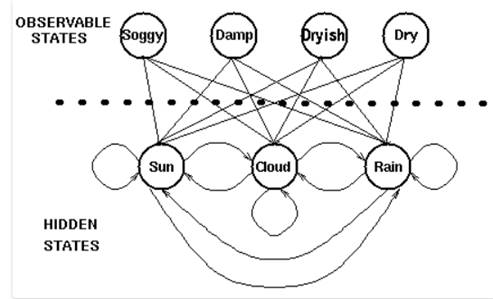
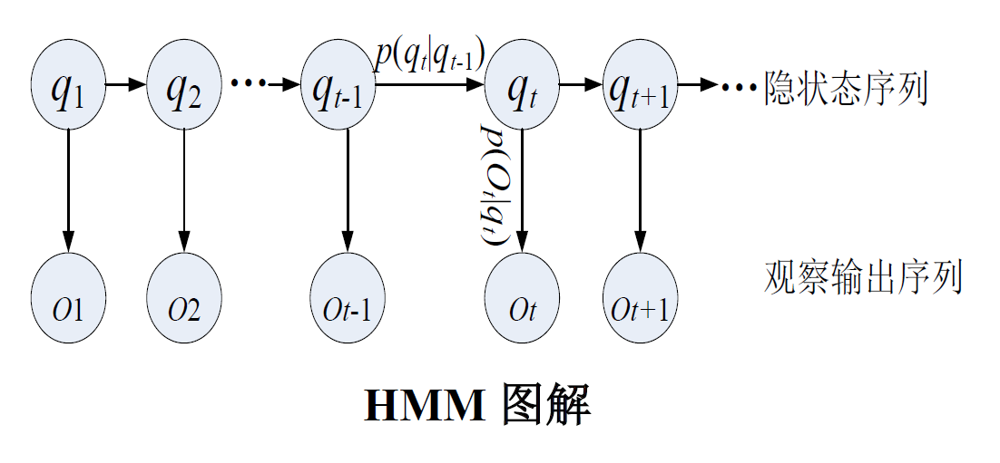
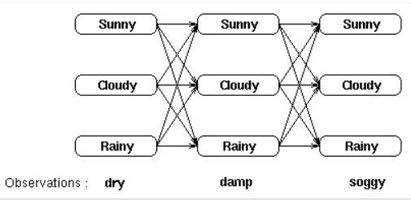
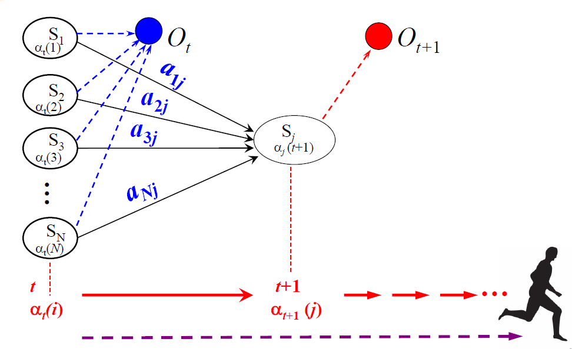
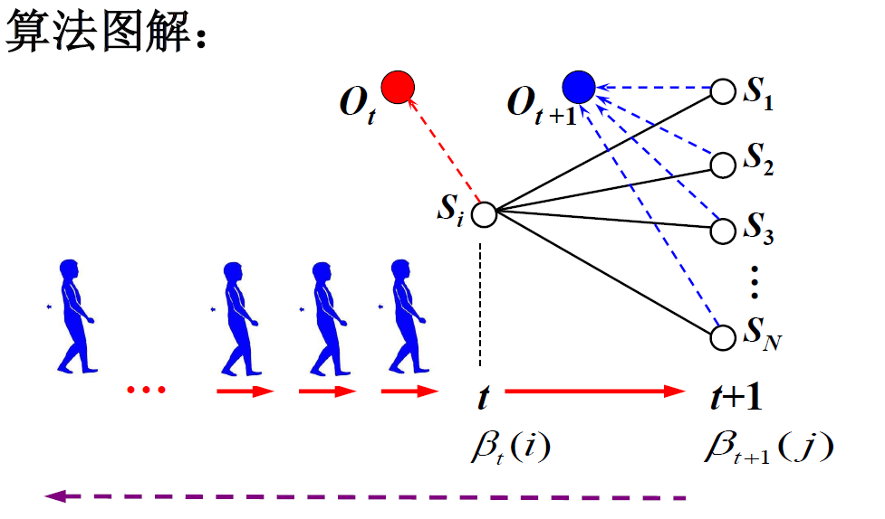
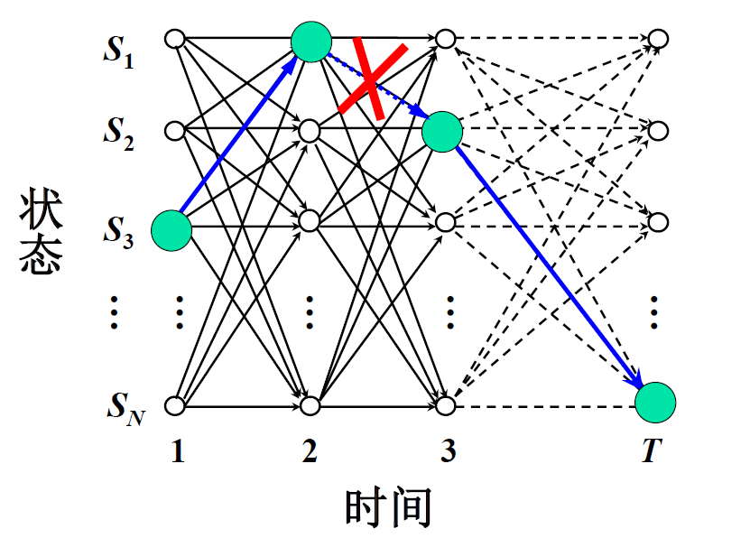
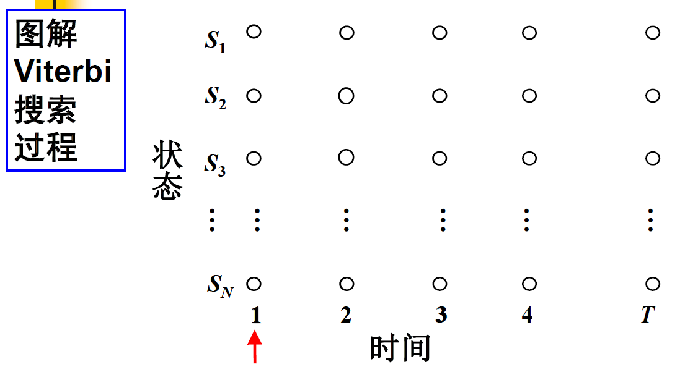
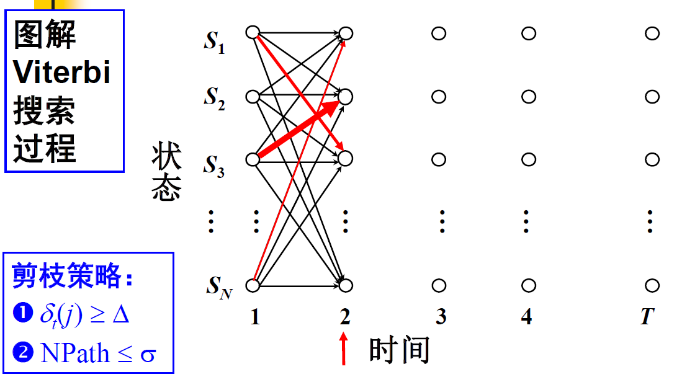
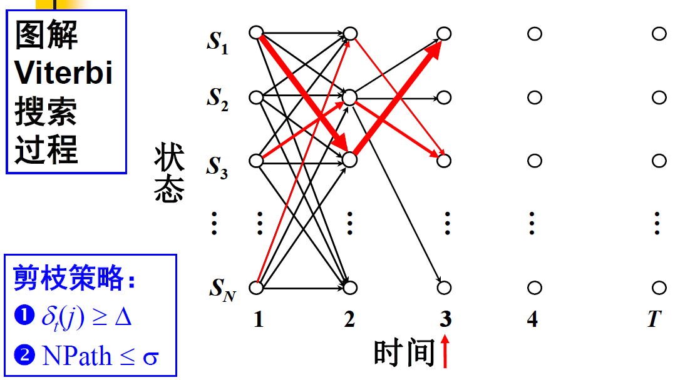
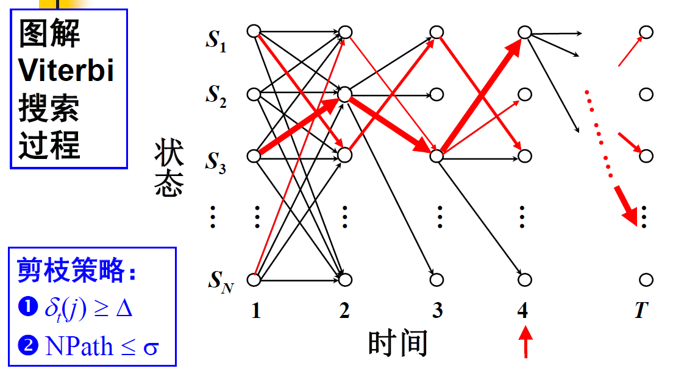

隐马尔可夫模型的详细版本，添加了实例与具体的公式，便于理解。

欢迎纠错~

[TOC]

### 马尔可夫模型

#### 概念导入

在某段时间内，交通信号灯的颜色变化序列是：红色 - 黄色 - 绿色 - 红色。

在某个星期天气的变化状态序列：晴朗 - 多云 - 雨天。

像交通信号灯一样，某一个状态只由前一个状态决定，这就是一个一阶马尔可夫模型。而像天气这样，天气状态间的转移仅依赖于前n天天气的状态，即状态间的转移仅依赖于前n个状态的过程。这个过程就称为**n阶马尔科夫模型**。

不通俗的讲，马尔可夫模型（Markovmodel）描述了一类重要的随机过程，随机过程又称随机函数，是随时间而随机变化的过程。

#### **马尔可夫模型定义**

存在一类重要的随机过程：如果一个系统有N个状态$S_1$,$S_2$,$S_3$..$S_N$ 随着时间的推移，该系统从某一状态转移到另一状态。如果用$q_t$ 表示系统在时间t的状态变量，那么 t 时刻的状态取值为$S_j$(1<=j<=N)的概率取决于前t-1 个时刻(1, 2, …, t-1)的状态，该概率为：
$$
p\left(q_{t}=S_{j} | q_{t-1}=S_{i}, q_{t-2}=S_{k}, \cdots\right)
$$

1. **假设一：**如果在特定情况下，系统在时间t 的状态只与其在时间t-1 的状态相关，则该系统构成一个**离散的一阶马尔可夫链**：

$$
p\left(q_{t}=S_{j} | q_{t-1}=S_{i}, q_{t-2}=S_{k}, \cdots\right)=p\left(q_{t}=S_{j} | q_{t-1}=S_{i}\right)
$$

1. **假设二：**如果只考虑独立于时间t的随机过程，状态与时间无关，那么
   $$
   p\left(q_{t}=S_{j} | q_{t-1}=S_{i}\right)=a_{i j}, \quad 1 \leq i, j \leq N
   $$
   即：t时刻状态的概率取决于前t-1 个时刻(1, 2, …, t-1)的状态,且状态的转换与时间无关，则**该随机过程**就是**马尔可夫模型**。

### 隐马尔可夫模型

#### 概念导入

在马尔可夫模型中，每个状态代表了一个可观察的事件，所以，马尔可夫模型有时又称作可视马尔可夫模型（visibleMarkovmodel，VMM），这在某种程度上限制了模型的适应性。

对于盲人来说也许不能够直接获取到天气的观察情况，但是他可以通过触摸树叶通过树叶的干燥程度判断天气的状态。于是天气就是一个隐藏的状态，树叶的干燥程度是一个可观察的状态，于是我们就有了两组状态，一个是不可观察、隐藏的状态（天气），一个是可观察的状态（树叶），我们希望设计一种算法，在不能够直接观察天气的情况下，通过树叶和马尔可夫假设来预测天气。

以此为例，一个一阶的马尔可夫过程描述：  

 

在隐马尔可夫模型（HMM）中，我们**不知道模型具体的状态序列**，**只知道状态转移的概率**，即模型的状态转换过程是不可观察的。

因此，该模型是一个**双重随机过程**，包括**模型的状态转换**和**特定状态下可观察事件的随机**。

#### HMM的组成

例如，N个袋子，每个袋子中有M种不同颜色的球。选择一个袋子，取出一个球，得到球的颜色。

1. 状态数为N(袋子的数量)
2. 每个状态可能的符号数M(不同颜色球的数目)
3. 状态转移概率矩阵A＝$a_{ij}$(从一只袋子(状态Si) 转向另一只袋子(状态Sj ) 取球的概率)
4. 从状态Sj 观察到某一特定符号vk 的概率分布矩阵为：$B=b_j(k)$  (从第j个袋子中取出第k种颜色的球的概率)
5. 初始状态的概率分布为：$\pi=\pi_{i}$

**一般将一个隐马尔可夫模型记为：$λ=[π, A,B]$**

需要确定以下三方面内容（三要素）：

1. 初始状态概率π: 模型在初始时刻各状态出现的概率，通常记为$π=(π_1,π_2,...,π_N)$，$π_i$表示模型的初始状态为$S_i$的概率.
2. 状态转移概率A: 模型在各个状态间转换的概率，通常记为矩阵A[$a_{ij}$]，其中$a_{ij}$表示在任意时刻t，若状态为Si，则在下一时刻状态为Sj的概率.
3. 输出观测概率B: 模型根据当前状态获得各个观测值的概率通常记为矩阵
   B=[$(b_{ij})$]。其中，$b_{ij}$表示在任意时刻t，若状态为$S_j$，则观测值$O_j$被获取的概率.

 

相对于马尔可夫模型，隐马尔可夫只是多了一个各状态的观测概率

给定隐马尔可夫模型λ=[A，B，π]，它按如下过程产生观测序列{X1,X2，...,Xn}:

(1)  设置t=1，并根据初始状态概率π选择初始状态$Y_1$;

(2)  根据状态值和输出观测概率B选择观测变量取值$X_t$ ;

(3)  根据状态值和状态转移矩阵A转移模型状态，即确定$Y_{t+1}$;

 

#### 三个问题

一旦一个系统可以作为HMM被描述，就可以用来解决三个基本问题。

**1.**  **评估（Evaluation）**

给定HMM，即$\mu=[π, A,B]$，求某个观察序列的概率。

例如：给定一个天气的隐马尔可夫模型，包括第一天的天气概率分布，天气转移概率矩阵，特定天气下树叶的湿度概率分布。**求第一天湿度为1，第二天湿度为2，第三天湿度为3的概率。**

 

**2.**  **解码（ Decoding）**

给定HMM，即$\mu=[π, A,B]$，以及某个观察序列，求得天气的序列。

例如：给定一个天气的隐马尔可夫模型，包括第一天的天气概率分布，天气转移概率矩阵，特定天气下树叶的湿度概率分布。并且已知第一天湿度为1，第二天湿度为2，第三天湿度为3。**求得这三天的天气情况**。

 即：发现“最优”状态序列能够“最好地解释”观察序列

 

**3.**  **学习（Learning）**

给定一个观察序列，得到一个隐马尔可夫模型。

例如：已知第一天湿度为1，第二天湿度为2，第三天湿度为3。**求得一个天气的隐马尔可夫模型**，包括第一天的天气，天气转移概率矩阵，特定天气下树叶的湿度概率分布。

#### 前向算法

**对于评估问题（Evaluation）**

给定HMM，即$\mu=[π, A,B]$，求某个观察序列的概率。

例如：给定一个天气的隐马尔可夫模型，包括第一天的天气概率分布，天气转移概率矩阵，特定天气下树叶的湿度概率分布。**求第一天湿度为1，第二天湿度为2，第三天湿度为3的概率。**

**思路一：找到所有状态序列，得到各状态概率，得到每种状态概率对应的观察概率，求和。** 

即：找到每一个可能的隐藏状态，并且将这些隐藏状态下的观察序列概率相加。

对于上面那个（天气）例子，将有3^3 = 27种不同的天气序列可能性，因此，观察序列的概率是：Pr(dry,damp,soggy | HMM) = Pr(dry,damp,soggy | sunny,sunny,sunny) + Pr(dry,damp,soggy | sunny,sunny ,cloudy) + Pr(dry,damp,soggy | sunny,sunny ,rainy) + . . . . Pr(dry,damp,soggy | rainy,rainy ,rainy)

用这种方式计算观察序列概率极为昂贵，特别对于大的模型或较长的序列，因此我们可以利用这些概率的时间不变性来减少问题的复杂度。

**思路二：采用动态规划——前向算法**

 

 基本思想：定义前向变量$α_t(i)$  ：t时刻状态为$S_i$且观察状态为$O_t$ 的概率
$$
\alpha_{t}(i)=p\left(O_{1} O_{2} \cdots \underline{O_{t}}, q_{t}=S_{i} | \mu\right)
$$
 如果可以高效地计算$α_t(i)$，就可以高效地求得$p(O|\mu)$。

 

蓝色部分是：从t时刻的各个状态$S_i$得到t时刻的观察状态$O_t$的概率

黑色部分是：从t时刻的各个状态$S_i$得到t+1时刻的各个状态

 即：

1. 初始化：$\alpha_{1}(i)=\pi_{i} b_{i}\left(O_{1}\right), \quad 1 \leq i \leq N$
2. 循环计算：$\alpha_{t+1}(j)=\left[\sum_{i=1}^{N} \alpha_{t}(i) a_{i j}\right] \times b_{j}\left(O_{t+1}\right), \quad 1 \leq t \leq T-1$
3. 结束，输出：$p(O | \mu)=\sum_{i=1}^{N} \alpha_{T}(i)$

#### 后向算法

定义后向变量$\beta_t(i)$是在给定了模型 $\mu=[π, A,B]$和假定在时间t 状态为$S_i$的条件下，模型输出
观察序列$O_{t+1} O_{t+2} \cdots {O_{T}}$ 的概率：
$$
\beta_{t}(i)=p\left(O_{t+1} O_{t+2} \cdots O_{T} | q_{t}=S_{i}, \mu\right)
$$

蓝色部分是：从t+1时刻的各个状态$S_i$得到t+1时刻的观察状态$O_t$的概率

黑色部分是：从t+1时刻的各个状态$S_i$得到t时刻的各个状态

 即：

1. 初始化：$\beta_{T}(i)=1, \quad 1 \leq i \leq N$
2. 循环计算：$\beta_{t}(i)=\sum_{j=1}^{N} a_{i j} b_{j}\left(O_{t+1}\right) \times \beta_{t+1}(j), \quad T-1 \geq t \geq 1, \quad 1 \leq i \leq N$
3. 结束，输出：$p(O | \mu)=\sum_{i=1}^{N} \beta_{1}(i) \times \pi_{i} \times b_{i}\left(O_{1}\right)$

#### Viterbi 搜索算法

**对于解码问题（ Decoding）**

给定HMM，即$\mu=[π, A,B]$，以及某个观察序列，求得天气的序列。

例如，给定一个天气的隐马尔可夫模型，包括第一天的天气，天气转移概率矩阵，特定天气下树叶的湿度概率分布。并且已知第一天湿度为1，第二天湿度为2，第三天湿度为3。求得这三天的天气情况。

 即：发现“最优”状态序列能够“最好地解释”观察序列

 

#### 如何理解“最优”的状态序列？

解释(1)：

状态序列中的每个状态都单独地具有概率，对于每个时刻$t(1 \leq t \leq T)$, 寻找$q_t$ 使得$\gamma_{t}(i)=p\left(q_{t}=S_{i} | O, \mu\right)$最大。——**近似算法**

问题：每一个状态单独最优不一定使整体的状态序列最优，两个最优的状态之间的转移概率可能为0

解释(2)：在给定模型$\mu$和观察序列O的条件下求概率最大的状态序列**——Viterbi 算法: 动态搜索最优状态序**
$$
\widehat{Q}=\underset{Q}{\arg \max } p(Q | O, \mu)
$$

#### **Viterbi 搜索算法**

搜索过程大概如下：

每个时刻都求得每个状态的概率，并求得最大概率对应的上一时刻的状态。

**算法描述**

1. 初始化：$\delta_{1}(i)=\pi_{i} b_{i}\left(O_{1}\right), \quad 1 \leq i \leq N$

   概率最大的路径变量：$\psi_{1}(i)=0$

2. 递推计算：

   $\delta_{t}(j)=\max _{1 \leq i \leq N}\left[\delta_{t-1}(i) \cdot a_{i j}\right] \cdot b_{j}\left(O_{t}\right), \quad 2 \leq t \leq T, \quad 1 \leq j \leq N$

   $\psi_{t}(j)=\underset{1 \leq i \leq N}{\arg \max }\left[\delta_{t-1}(i) \cdot a_{i j}\right] \cdot b_{j}\left(O_{t}\right), 2 \leq t \leq T, 1 \leq i \leq N$

3. 结束：

   $\widehat{Q}_{T}=\underset{1 \leq i \leq N}{\operatorname{argmax}}\left[\delta_{T}(i)\right], \quad \widehat{p}\left(\widehat{Q}_{T}\right)=\max _{1 \leq i \leq N} \delta_{T}(i)$

4. 通过回溯得到路径（状态序列）：

   $\widehat{q}_{t}=\psi_{t+1}\left(\widehat{q}_{t+1}\right), \quad t=T-1, T-2, \cdots, 1$

#### 参数学习

**对于学习问题（Learning）**

给定一个观察序列，得到一个隐马尔可夫模型。

已知第一天湿度为1，第二天湿度为2，第三天湿度为3。求得一个天气的隐马尔可夫模型，包括第一天的天气，天气转移概率矩阵，特定天气下树叶的湿度概率分布。

 

如果产生观察序列O的状态已知(即存在大量标注的样本), 可以用最大似然估计来计算$\mu$ 的参数：Baum-Welch 算法(前向后向算法)描述

如果不存在大量标注的样本：期望值最大化算法(Expectation-Maximization, EM) 

### HMM应用

#### 中文分词问题

如果有标注语料，则问题的解决过程：

1. 计算初始状态概率分布
2. 计算转移概率矩阵
3. 计算输出概率矩阵
4. 使用Viterbi算法解码

如果没有标注语料，则问题的解决过程：

1. 获取词的个数
2. 确定状态的个数
3. 参数学习（利用EM迭代算法获取初始状态概率、状态转移概率和输出概率）
4. 使用Viterbi算法解码

### 参考文献

宗成庆：《自然语言处理》讲义

《统计学习方法》

其他网络资料（侵删）

