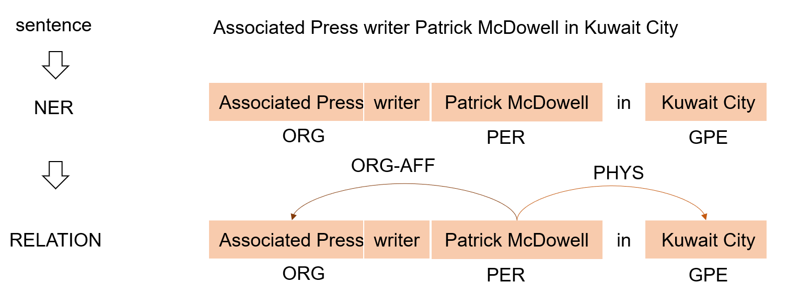
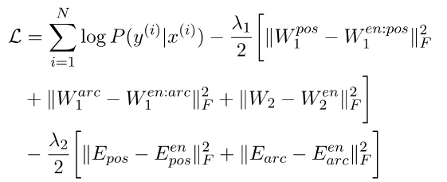

# NLP中的联合建模与多任务学习

[TOC]

## 1 介绍

### 1.1 多任务场景分类

自然语言处理有很多种任务，中文分词、依存分析、命名实体识别、关系抽取、对话生成等等。这些任务大多都可以通过一种端到端的单模型的方法来解决。

当然，有时候也会同时解决多个任务，例如一些相似或者相关的任务。

一些非常相似的NLP任务，比如：

1. 词性标注、句子分块、命名实体识别

   

2. Constituents and named entities ——成分划分和命名实体
   一个是确定句子中各个词的语法成分，一个是确定句子中的各个词是否属于某个命名实体的一部分。

例如一些任务是比较相关的，需要进行流水线工作的，比如：

1. 词性标注——分词+标注
   

2. 实体关系抽取——命名实体识别 + 关系分类
   

3. 情感分析——命名实体识别 + 命名实体的情感分类

   

当想要解决NLP领域的某种任务时，会发现有一些或相似或相关的其他任务，通过多个任务的联合建模，可以帮助提高目标任务的效果。

这些多任务的场景，根据已经了解的一部分工作，目前总结如下：

1. 比较相似的多个任务
   例如，词性标注和中文分词。可以通过相似任务的促进，提高任务的效果。

2. 具有Pipeline关系的多个任务
   例如，实体识别和关系抽取。可以通过上游或者下游的任务互相促进。
   Pipeline关系的几个子任务也可以看做是几个相似的任务

3. 具有辅助关系的任务
   例如自监督的辅助任务，可以帮助目标任务学习原任务不容易学到的特征等

4. 具有对抗关系的或者相反的任务
   例如，不同评估标准的中文分词任务。可以通过对抗训练帮助多任务学习

5. 类似迁移学习的多任务
   例如，辅助资源匮乏的任务，语言建模的预训练。

   

### 1.2 联合建模方法分类

当面临着解决多种任务的时候，最一般的解决想法：

- 看做几个独立的子任务。
  他们单独训练，单独预测。
  缺点：这样就浪费了他们的相关性，消费n倍的成本去解决n个问题，信息在任务之间没有交换，任务是互相隔离的，任务之间没有关系更没有相互促进。

因此就有了联合建模的说法，联合建模就允许信息在任务间交换，让任务互相促进提升效果。

Joint models需要进行两个选择：1. 各个模型间是否共享参数、联合学习；2. 各个模型得出的结果是否互相影响。

 

因此就出现了不同的组合：

1. Joint Learning & Joint Search
2. Separate Learning & Joint Search
3. Joint Learning & Separate Search

至于Separate Learning & Separate Search，很明显不属于Joint model的范畴。

### 

接下来就是现有的各类任务的一些工作介绍了。

## 2 相似关系——多任务学习

### 2.1 多任务学习方法分类

多任务学习一般属于：Joint Learning & Separate Search。

一般通过参数共享的方式互相促进，参数共享有两种形式：

- Hard参数共享：目前应用最为广泛的共享机制，通过在所有任务之间共享底部的隐藏层，同时保留几个特定任务的输出层来实现。适合处理有较强相关性的任务，但遇到弱相关任务时常常表现很差。
  
- Soft参数共享：每个任务都有自己的参数，模型参数之间通过一定的限制（例如正则化）来鼓励参数相似化，每个任务的网络都可以访问其他任务对应网络中的信息，例如表示、梯度等。软共享机制非常灵活，不需要对任务相关性做任何假设，但是由于为每个任务分配一个网络，常常需要增加很多参数。

* 分层共享：在网络的低层做较简单的任务，在高层做较困难的任务。分层共享比硬共享要更灵活，同时所需的参数又比软共享少，但是为多个任务设计高效的分层结构依赖专家经验。

  

* 其他共享方式，例如论文[30]中的稀疏共享，为每个任务生成子网络，多任务子网络联合训练。

### 2.2 相似任务的一些工作

论文[8]不太容易找，附上链接：http://www.jmlr.org/papers/volume12/collobert11a/collobert11a.pdf

模型解决各种任务，包括Tagging, Chunking and NER。

解决方案是多任务学习，其中lookup table参数共享、first linear layers参数共享。

论文[10]的背景是：在之前有关深度多任务学习的工作中，所有任务监督都在同一（最外）层上。
论文提出了一种具有深层双向RNN的多任务学习体系结构，可以在不同的层进行不同的任务监督。

论文[11] 是语义角色标注SRL和Parser的任务

总之，就是embedding层共享了参数而已

论文[19] 是机器翻译任务，他使用一个调度的多任务框架来帮助改善翻译质量：

论文[21] 采用标准的多任务学习的方法，解决音译的问题。（采用了多种音译的数据）

## 3 Pipeline关系的任务

当面临着解决pipeline任务的时候，最一般的解决想法：

- 看做几个独立的子任务。他们单独训练，单独预测。用上游任务的结果作为下游任务的输入。
  缺点：任务之间有误差的传递，任务越多，Error影响越大； 这样也浪费了他们的相关性，信息在任务之间没有交换，任务是互相隔离的，任务之间没有关系更没有相互促进。

对pipeline上的这些子任务任务进行联合建模，就是为了力图减少Error propagation，提升效果。

Pipeline关系有三方面的解决方案，其中Joint Learning & Separate Search 与相似任务的解决方式基本类似。

Joint Learning & Joint Search 方面一般是训练单个模型然后联合解码；

Separate Learning & Joint Search方面一般是训练两个独立的模型然后联合解码

### 2.1 Joint Learning & Joint Search

论文[2]中讨论了 Chinese part-of-speech tagging 任务中 One-at-a-time or all-at-once?  

中文词性标注为每个词语分配一个POS标签。 但是，由于中文句子中未划分单词，因此中文POS标签需要以中文分词为前提。 

可以严格在分词之后再进行词性标注（one-at-a-time），或者同时进行分词和POS标签这两种方法（all-at once）

论文发现，虽然基于字符的all-at once方法是最好的方法，但是基于字符的one-at-a-time方法却是一个值得折衷的方法，在准确性方面仅稍差一些，但训练和测试时间却更短。 （略有提升，差别不大）

论文[6]的任务是：词性标注。

以往的pipeline是：分词+pos。论文提出一个Joint Segmentation and Tagging Model。

模型的输入是：预定义了两个特征模板

然后通过一个decoding算法来得到最后的联合结果：

论文 [7] 任务是：自动内容提取：Automatic Content Extraction。包括实体识别和关系抽取。

解决方案也是：单模型+Decoding算法

论文[12]的任务是实体关系抽取

先抽取实体，再进行关系分类。实体抽取模型和关系分类模型分别是一个字序列LSTM和一个依赖树结构的LSTM。

其中word embedding 和实体抽取模型得到的label embedding都用于关系分类模型的输入中。关系分类模型和实体抽取模型的隐藏层共享训练参数。

还做了消融实验：

论文[13] 

任务也是实体关系抽取

维护一个表，使用Beamsearch的方式来得到一个全局最优的序列

这个全局序列，就是通过$h_T$得到的。

使用LSTM学习全局上下文表示。使用三种基本的LSTM结构：1)从左到右的单词LSTM；2)从右到左的单词LSTM；3)从左到右的实体边界标签LSTM

然后两个上层的模块采用不同的输入，得到序列：实体检测的特征表示。首先，从三个基本的LSTM中提取六个特征向量。关系分类的特征表示，与实体检测类似，12个特征。

论文[20]是实体抽取+情感分类任务。

两种解决方案：pipeline(joint ) or collapsed。

论文的integrat的策略就不重点关注了。

论文[38]是方面情感分析的工作

通常以流水线方式完成此任务，首先执行aspect term提取，然后对提取的方面项进行情感预测。

论文提出的模型美其名曰“交互式”多任务学习，本质就是不共享参数的部分连来连去的。

### 2.2 Separate Learning & Joint Search

论文[4] 也是词性标注任务：分词 + 标注。

联合训练不被使用时因为当时训练成本昂贵。

论文使用了两个独立的CRF来训练，得到字符级别的分词的序列标注，和字符级别的词性序列标注。

然后构造了一个概率的框架，找到各自的最适合的最终结果。具体怎么概率的，就不care了，领悟Separate Learning & Joint Search比较重要！~

论文[5]任务——观点提取：观点实体提取+观点关系分类

Opinion expressions: OOpinion targets: T；Opinion holders: H

解决方案：

1. 将意见实体识别任务表示为一个序列标记问题，利用CRF学习序列赋值的概率;

2. 将关系抽取问题作为两个二元分类问题的组合，利用逻辑回归训练分类器

3. loss函数被定义为一个线性组合，用不同的预测参数 λ 来平衡这两个模型的损失
   $$
   Score= λ∙Score_{entity}  +(1-λ)∙Score_{relation}
   $$

## 4 辅助关系的多任务学习

通过引入其他任务来帮助主要任务的效果提升。其他任务的数据来源大多是自身，即源数据的其他任务标签或者一些自监督的方法。

论文[9] 的任务是：在序列标注任务中，只有部分相关标签。

为了让模型充分利用数据，加入了语言模型的任务——学习预测序列中的下一个词，不依赖任何注释。这样能让模型学习更多语言特征，提高性能。

预测前一个字和后一个字都放在一个非线性映射后的softmax中：

论文[14] 通过键盘敲击的延时来帮助 syntactic chunking、CCG supertagging 组合范畴语法超标注等任务；

模型也是很简单的，共同享有的3层LSTM，再加上两个任务，这两个任务是随机选一个来train的。

论文[31] 是对话生成的任务

对话模型与一个Auto-Encoder模型共享Decoder部分的参数。一方面是改善对话数据不够用的问题，一方面提高对话生成的效果。

论文[32] 也是对话生成的任务。

提出了一个SPACEFUSION模型，共同优化多样性和相关性。该模型通过利用新颖的正则化项实质上融合了序列到序列模型和Auto-Encoder模型的潜在空间。

论文[33] 也是对话任务。

主要任务是，对话生成，如下图右半部分。辅助任务是，通过context得到 Author profiles，下图左半部分。

Author profile是建模得来的用户特征，age, gender, education, and location。这四个任务可以视为四个多分类任务，其中每个分类器将上下文作为输入以预测文本序列所属的类别。

Encoder部分是共享参数的，这也是多任务所在，简单的硬参数共享。

Decoder部分，预测得到的用户特征是直接作为额外输入加入进去的，另外经过用户特征转化过的context embedding 是作为decoder的初始状态的。

论文[34] 是神经机器翻译问题，神经机器翻译（NMT）在纯净的域内文本上实现了卓越的性能，但是当面对充满错别字，语法错误和其他杂音的文本时，性能会急剧下降。 

任务主要是针对法语到英语的翻译。其中英语都是纯净数据，法语有clean的有noisy的。

多任务学习模型包括三部分输入，noisy source sentence、clean source sentence、target translation。通过这种加入了脏数据的多任务学习，提高翻译的效果，相当于加了一些噪声吧。

论文中涉及了一些关于这些平行语料的挑选、生成、筛选等，有兴趣可以去看看。

论文[36] 是语篇连贯评估任务。

论文提出了一个多任务训练的层次神经网络，利用两个任务之间的归纳迁移，学习预测文档级连贯性得分(在网络的顶层)和词级语法角色(在底层)。

单任务在于文档整体语篇连贯性的分数，看似是个pipeline然而重点不在这里。这里的多任务在于优化了一个底层的二级任务，word-level的标签：语法结构。

## 5 对抗多任务学习

对抗任务一般是应对 具有不同输入的多任务学习。

通过对抗任务，使参数共享的部分包含更多公共信息，并减少特定任务的信息。

论文[25]提出了一种用于POS的**跨语言**迁移学习模型。

蓝色模块共享所有语言的参数，红色模块具有不同语言的参数。 紫色圆圈表示目标标签，这些目标标签针对不同的语言使用不同的参数预测，其输入是公共BLSTM和私有BLSTM的输出总和。 用三个用红色框表示的目标训练模型。

对抗训练在于梯度反转那里，让蓝色部分的参数尽量与语言无关。

中文分词有许多不同的分词标准。 现有的大多数方法都专注于提高每个标准的性能。
论文[27]集成来自多个异构细分标准的共享知识，为CWS提出对抗性多标准学习。 8个标准。**跨语料**

灰色方框是私有的LSTM layer，黄色方框是参数共享的LSTM layer。

对抗训练使得黄色的LSTM与输入无关，对抗训练的目标函数是确定是哪个criteria任务。

论文[28] 

用于情感分析的训练数据在多个领域中都很丰富，而在其他领域则很少。 

将每个领域的描述符向量与句子一起输入进模型。描述符向量用于对抗训练。

基础模型，所有domain共享一套参数：

多任务学习模型，共享一部分参数：

最终模型，右上角进行对抗训练，左上角进行特定领域的情感分析。**跨领域**

论文[37] 联合建模了Recognizing Question Entailment (RQE)and medical Question Answering (QA) 两个任务。**跨任务**

对抗训练是为了使共享表示包含更多公共信息并减少特定任务的信息的混合。

原话是：an adversarial training strategy is introduced to separate the private features of each task from the shared representations. 

论文[35] 是**多方言**的POS任务，论文的主体模型也是额外的很常见的对抗训练。

论文[39] 是标题生成的领域适应任务。**跨领域**

源域标注数据多，目标域数据少。

训练流程：1. 源域的标记数据经过encoder、decoder进行反向传播；2. 源域、目标域的数据经过encoder、domain classifier进行反向传播。（这个图画的真是反人类）

## 6 迁移学习的多任务

论文[15]是为了解决“predict RST discourse trees”任务，RST( Rhetorical Structure Theory)训练数据少，因此使用了相关任务or可选的views的数据。

这个任务主要是说文档内句子之间都是有关系的，比如a中有条件关系，b中有MANNER-MEANS关系。

a. [The gain on the sale couldn’t be estimated] [until the “tax treatment has been determined.”]
b. [On Friday, Datuk Daim added spice to an otherwise unremarkable address on Malaysia’s proposed budget for 1990] [by ordering the Kuala Lumpur Stock Exchange “to take appropriate action immediately” to cut its links with the Stock Exchange of Singapore.]

利用的数据和任务，整体模型：

与之前类似，共享训练参数，上层更改task类型。

论文[16]是中文分词模型，对模块进行多种任务的预训练，提升效果。

模型是基于transition的方法，整体如下：

使用一些其他任务来进行一个pre-training，保存了一部分模型的参数：

论文[17] 提出了一种通用的无监督学习方法，以提高seq2seq的准确性。 论文使用两个语言模型的预训练权重初始化seq2seq的编码器和解码器的权重，然后使用标记的数据进行微调。

两个语言模型在各自语言语料上独自训练。

论文[18]是著名的ELMO，通过预训练的方式来完成多种任务，近年也不少了，还有BERT等。

论文[22] 是依存分析任务，为了解决低资源问题，采用多任务学习的方式。

使用软参数共享的方法，两个模型都有自己的参数，并不共享，只需要在模型中修改loss加入关于两模型参数差别的正则化项，以使得参数相似化。

一定程度少减少数据缺失的问题：

论文[23] 任务是训一个新加坡语的parser。

通过英语的parser为基础，使用新加坡语料得到。

论文中也完成了新加坡语POS的任务，通过的是一样的思路。

论文[24] 任务是神经机器翻译，seq2seq框架在大型数据场景中已显示有效，但在资源匮乏的语言中却没有那么有效。 

论文提出一种迁移学习方法，关键思想是首先训练一个高资源语言对（父模型），然后将一些学习到的参数传递给低资源语言对（子模型）以初始化和约束训练。

论文[26]是用标准的多任务学习来实现迁移学习。

使用具有大量标注的原任务（Penn Treebank上的POS标记）来改善目标任务的可用注释较少的性能（POS标记用于 微博）

## Reference

[1] Zhang Y. Joint models for NLP[C]//Proceedings of the 2018 Conference on Empirical Methods in Natural Language Processing: Tutorial Abstracts. 2018.

[2] Ng, Hwee Tou, and Jin Kiat Low."Chinese part-of-speech tagging: One-at-a-time or all-at-once? word-basedor character-based?." *EMNLP*.2004.

[3] Finkel, Jenny Rose, and Christopher D. Manning. "Joint parsing and named entity recognition." *Proceedings of Human Language Technologies: The 2009 Annual Conference of the North American Chapter of the Association for Computational Linguistics*. Association for Computational Linguistics, 2009.

[4] Shi, Yanxin, and Mengqiu Wang. "A Dual-layer CRFs Based Joint Decoding Method for Cascaded Segmentation and Labeling Tasks." *IJcAI*. 2007.

[5] Yang B, Cardie C. Joint inference for fine-grained opinion extraction[C]//Proceedings of the 51st Annual Meeting of the Association for Computational Linguistics (Volume 1: Long Papers). 2013: 1640-1649.

[6] Zhang Y, Clark S. Joint word segmentation and POS tagging using a single perceptron[C]//Proceedings of ACL-08: HLT. 2008: 888-896.

[7] Li Q, Ji H. Incremental joint extraction of entity mentions and relations[C]//Proceedings of the 52nd Annual Meeting of the Association for Computational Linguistics (Volume 1: Long Papers). 2014: 402-412.

[8] Collobert R, Weston J, Bottou L, et al. Natural language processing (almost) from scratch[J]. Journal of machine learning research, 2011, 12(Aug): 2493-2537.  不太容易找，附上链接：http://www.jmlr.org/papers/volume12/collobert11a/collobert11a.pdf

[9] Rei, Marek. “Semi-supervised Multitask Learning for Sequence Labeling.”, In proceedings of ACL (2017).

[10] Søgaard A, Goldberg Y. Deep multi-task learning with low level tasks supervised at lower layers[C]//Proceedings of the 54th Annual Meeting of the Association for Computational Linguistics (Volume 2: Short Papers). 2016: 231-235.

[11] Shi P, Teng Z, Zhang Y. Exploiting mutual benefits between syntax and semantic roles using neural network[C]//Proceedings of the 2016 Conference on Empirical Methods in Natural Language Processing. 2016: 968-974.

[12] Miwa M, Bansal M. End-to-end relation extraction using lstms on sequences and tree structures[J]. arXiv preprint arXiv:1601.00770, 2016.

[13] Zhang M, Zhang Y, Fu G. End-to-end neural relation extraction with global optimization[C]//Proceedings of the 2017 Conference on Empirical Methods in Natural Language Processing. 2017: 1730-1740.

[14] Plank B. Keystroke dynamics as signal for shallow syntactic parsing[J]. arXiv preprint arXiv:1610.03321, 2016.

[15] Braud C, Plank B, Søgaard A. Multi-view and multi-task training of RST discourse parsers[C]. 2016.

[16] Yang J, Zhang Y, Dong F. Neural word segmentation with rich pretraining[J]. arXiv preprint arXiv:1704.08960, 2017.

[17] Ramachandran P, Liu P J, Le Q V. Unsupervised pretraining for sequence to sequence learning[J]. arXiv preprint arXiv:1611.02683, 2016.

[18] Peters M E, Neumann M, Iyyer M, et al. Deep contextualized word representations[J]. arXiv preprint arXiv:1802.05365, 2018.

[19] Kiperwasser E, Ballesteros M. Scheduled multi-task learning: From syntax to translation[J]. Transactions of the Association for Computational Linguistics, 2018, 6: 225-240.

[20] Zhang M, Zhang Y, Vo D T. Neural networks for open domain targeted sentiment[C]//Proceedings of the 2015 Conference on Empirical Methods in Natural Language Processing. 2015: 612-621.

[21] Kunchukuttan A, Khapra M, Singh G, et al. Leveraging orthographic similarity for multilingual neural transliteration[J]. Transactions of the Association for Computational Linguistics, 2018, 6: 303-316.

[22] Duong L, Cohn T, Bird S, et al. Low resource dependency parsing: Cross-lingual parameter sharing in a neural network parser[C]//Proceedings of the 53rd Annual Meeting of the Association for Computational Linguistics and the 7th International Joint Conference on Natural Language Processing (Volume 2: Short Papers). 2015: 845-850.

[23] Wang H, Zhang Y, Chan G Y L, et al. Universal dependencies parsing for colloquial singaporean english[J]. arXiv preprint arXiv:1705.06463, 2017.

[24] Zoph B, Yuret D, May J, et al. Transfer learning for low-resource neural machine translation[J]. arXiv preprint arXiv:1604.02201, 2016.

[25] Kim J K, Kim Y B, Sarikaya R, et al. Cross-lingual transfer learning for pos tagging without cross-lingual resources[C]//Proceedings of the 2017 conference on empirical methods in natural language processing. 2017: 2832-2838.

[26] Yang Z, Salakhutdinov R, Cohen W W. Transfer learning for sequence tagging with hierarchical recurrent networks[J]. arXiv preprint arXiv:1703.06345, 2017.

[27] Chen X, Shi Z, Qiu X, et al. Adversarial multi-criteria learning for chinese word segmentation[J]. arXiv preprint arXiv:1704.07556, 2017.

[28] Liu Q, Zhang Y, Liu J. Learning domain representation for multi-domain sentiment classification[C]//Proceedings of the 2018 Conference of the North American Chapter of the Association for Computational Linguistics: Human Language Technologies, Volume 1 (Long Papers). 2018: 541-550.

[29] Ganin Y, Lempitsky V. Unsupervised domain adaptation by backpropagation[J]. arXiv preprint arXiv:1409.7495, 2014.

[30] Sun T, Shao Y, Li X, et al. Learning Sparse Sharing Architectures for Multiple Tasks[J]. arXiv preprint arXiv:1911.05034, 2019.

[31] Luan Y, Brockett C, Dolan B, et al. Multi-task learning for speaker-role adaptation in neural conversation models[J]. arXiv preprint arXiv:1710.07388, 2017.

[32] Gao X, Lee S, Zhang Y, et al. Jointly optimizing diversity and relevance in neural response generation[J]. arXiv preprint arXiv:1902.11205, 2019.

[33] Yang M, Huang W, Tu W, et al. Multitask Learning and Reinforcement Learning for Personalized Dialog Generation: An Empirical Study[J]. IEEE Transactions on Neural Networks and Learning Systems, 2020.

[34] Zhou H, Li X, Yao W, et al. DUT-NLP at MEDIQA 2019: An Adversarial Multi-Task Network to Jointly Model Recognizing Question Entailment and Question Answering[C]//Proceedings of the 18th BioNLP Workshop and Shared Task. 2019: 437-445.

[35] Zalmout N, Habash N. Adversarial Multitask Learning for Joint Multi-Feature and Multi-Dialect Morphological Modeling[J]. arXiv preprint arXiv:1910.12702, 2019.

[36] Chen F, Chen Y Y. Adversarial Domain Adaptation Using Artificial Titles for Abstractive Title Generation[C]//Proceedings of the 57th Annual Meeting of the Association for Computational Linguistics. 2019: 2197-2203.

[37] Zhou S, Zeng X, Zhou Y, et al. Improving Robustness of Neural Machine Translation with Multi-task Learning[C]//Proceedings of the Fourth Conference on Machine Translation (Volume 2: Shared Task Papers, Day 1). 2019: 565-571.

[38] He R, Lee W S, Ng H T, et al. An interactive multi-task learning network for end-to-end aspect-based sentiment analysis[J]. arXiv preprint arXiv:1906.06906, 2019.

[39] Farag Y, Yannakoudakis H. Multi-Task Learning for Coherence Modeling[J]. arXiv preprint arXiv:1907.02427, 2019.

# End

