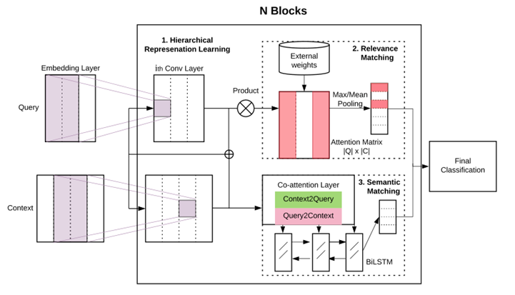
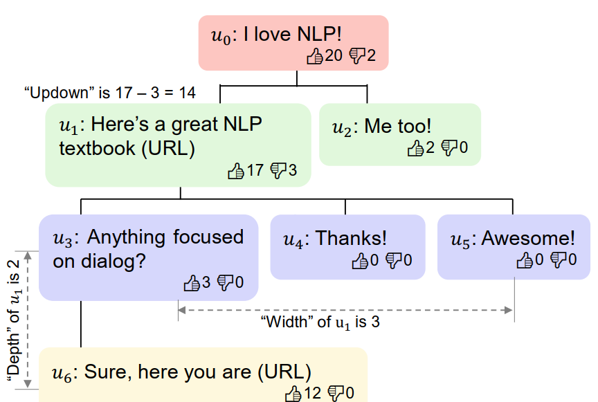

## 1 深度文本匹配

### 1.1 方法概述

**传统文本匹配方法**

传统的文本匹配技术有BoW、VSM、TF-IDF、 BM25、Jaccord、SimHash等算法，如BM25算法通过网络字段对查询字段的覆盖程度来计算两者间的匹配得分，得分越高的网页与查询的匹配度更好。主要解决词汇层面的匹配问题，或者说词汇层面的相似度问题。

**深度语义匹配模型**

* representation-based method 表示型方法
* interaction-based method  交互型方法

**representation-based method**

* 将待匹配的两个对象通过深度学习模型进行表示
* 计算这两个表示之间的相似度便可输出两个对象的匹配度

侧重表示层的构建

匹配度函数：相似度度量函数 or  可学习的匹配度打分模型

**interaction-based method**

* 首先基于表示层采用与词位置对应的词向量
* 然后对两个句子按词对应交互，由此构建两段文本之间的 matching pattern，这里面包括了更细致更局部的文本交互信息
* 基于该匹配矩阵，可以进一步使用DNN等来提取更高层次的匹配特征，最后计算得到最终匹配得分。

该方式更强调待匹配的两个句子得到更充分的交互，以及交互后的匹配。

Interaction-based 方法匹配建模更加细致、充分，一般来说效果更好，但计算成本增加，更加适合一些效果精度要求高但对计算性能要求不高的场景。

### 1.2 深度文本匹配的一些应用

**QA系统的分类**

* 知识领域分类
  * 面向限定领域的问答系统
  * 面向开放领域的问答系统
  * 面向常用问题集的问答系统（ Frequently Asked Questions, FAQ ）

* 答案来源
  * 基于结构化数据，例如KBQA（Knowledge Base Question Answering）
  * 基于自由文本，如机器阅读理解
  * 基于问答对的问答系统，如FAQ问答

* 答案反馈机制
  * 基于检索式的问答系统
  * 基于生成式的问答系统
  
  

**检索任务的分类**

* ad hoc 检索（关键词检索）
* CQA（社区问答 )
* response retrieval（依赖上下文语义）

例子

* response retrieval      Q：你吃了吗   A：没有
* CQA       Q：心情不好的时候吃什么水果？   A：很多水果都有缓解抑郁的功能，比如。。。
* response retrieval更依赖语义上的联系，上下句之间可能连overlap的词都没有
  CQA的话相比ad hoc retrieval，query里面的语义信息更丰富，查询的目的也可能更模糊一些

**FAQ**

FAQ：Frequently Asked Questions

FAQ问答系统看做一个特殊的信息检索系统，问题为查询语句（query），根据query去FAQ知识库中找到最合适的答案

具体流程：

1. 线上收到用户 query 后，初步召回一批候选集作为粗排结果传入下一模块进行进一步精确排序；
2. 利用matching模型计算用户query和FAQ知识库中问题或答案的匹配程度；
3. 利用ranking 模型对候选集做 rerank 并返回 topk个候选答案。

可以看出，FAQ问答系统的核心任务可以抽象为文本匹配任务。

**基本策略**

FAQ有两种解决思路

* 相似问题匹配：对比用户问题与现有FAQ知识库中问题的相似度，返回用户问题对应的最准确的答案
* 问题答案对匹配：对比用户问题与FAQ知识库中答案的匹配度，返回用户问题对应的最准确的答案

## 2 文本匹配任务与数据集

* 中文数据集

  * 语义文本相似度
    * LCQMC  - http://icrc.hitsz.edu.cn/info/1037/1146.htm
    * AFQMC（无测试集）: https://github.com/CLUEbenchmark/CLUE
    * BQ Corpus  - 银行领域  - http://icrc.hitsz.edu.cn/Article/show/175.html
  * 文本蕴含
    * SNLI：
    * XNLI： https://github.com/facebookresearch/XNLI
    * OCNLI: https://github.com/CLUEbenchmark/CLUE
    * CMNLI: https://github.com/CLUEbenchmark/CLUE

  

* 英文数据集 (https://github.com/nyu-mll/GLUE-baselines/edit/master/download_glue_data.py)
  * 语义文本相似度
    * QQP-Quora（glue没有测试集，有一篇工作《Bilateral Multi-Perspective Matching for Natural Language Sentences》进行了划分：arxiv.org/pdf/1702.03814.pdf ）（https://zhiguowang.github.io/#services 数据集链接）
    * The Microsoft Research Paraphrase dataset (MSRP) （微软官方可下载带标签的训练集和测试集，glue将训练集分割划分一部分为验证集但是其测试集没有标签）（使用glue的训练集和验证集，使用官方的测试集）
    * TwitterURL
  * 文本蕴含
    * SciTail   
    * XNLI： https://github.com/facebookresearch/XNLI （多语言）
* Answer Selection
  
    * TrecQ 
    * The SemEval CQA dataset 
    * WikiQA  

* 检索 - 排序
  * Tweet Search  
    * TREC Microblog  2013–2014  [1]
  * 对话
    * the Neurips ConvAI2 competition  [9]
    * DSTC7 challenge, Track 1   [9]
  * IR
    * Ubuntu V2 corpus   [9]
    * Wikipedia Article Search task    [9]
  
  

## 3 现状分析

深度文本匹配的调研现状

* 有关联的任务极其之多，相关方向非常多且混乱

* 不同任务之间可借鉴的工作较多

* 各个方向极度内卷，例如文本匹配中的交互匹配工作非常多

  

目前将近几年的现有工作划分成以下几类：

1. 从新的角度来提高文本匹配性能（ACL2019 结合语义匹配和相关性匹配、ACL2020 将子词信息融入匹配框架、SIGIR2020针对FAQ问题将候选答案辅助query和候选问题的匹配...）
2. 从新的模型角度提高文本匹配模型（搭更好看或者说更复杂的积木）
3. **基于预训练模型的匹配方法**（tBERT结合主题信息和BERT做语义相似性检测、DC-BERT 和ColBERT 采用双BERT做交互匹配做检索...）
4. 训练方式优化（针对匹配、检索任务训练方式的局限性，进行训练相关包括方式数据等的调优）（RocketQA）
5. 结合辅助信息（结合用户反馈提高对话检索、使用知识图谱增强匹配模型...）

策略：

* 1、2 搭老款积木意义不大，3搭新款积木或许也得多考虑老方法
* 5 辅助信息严重依赖数据，结合实用场景暂时没有合适的

更有意义：基于预训练模型的方法来更好的解决问题

优势：任务明确，实用性强；相关工作都在近几年，好上手；可以顺便接触前沿预训练语言模型

## 4 深度文本匹配论文记录

### 4.1 任务特性探索

这一类大致是利用匹配任务的性质or特性，或者说从新的角度去提升匹配任务的性能

* **[1] Bridging the Gap Between Relevance Matching and Semantic Matching for Short Text Similarity Modeling     ACL 2019 -code py2.7+tf**  

动机：相关性匹配和语义匹配的gap，两者信息融合提升效果

* IR中的相关性匹配看重关键词的匹配，NLP中的语义匹配看重词汇信息和语句的组成结构
* 相关性匹配采用基于交互的设计，从相似性矩阵上进行操作；语义匹配则需要更多的语义理解和上下文推理

贡献点：

* 讨论了相关性匹配和语义匹配的区别（模型之间是否适配，关联性和语义匹配的信号是否互补）
* 提出一个新的交互式的模型（一个RM一个SM，和一个结合的）
* 3个NLP任务和2个IR数据集上进行实验；关联性和语义匹配信号在许多问题上互补

* **[2] FAQ Retrieval Using Attentive Matching 2019 SIGIR短文 **

解决的问题：FAQ

贡献点：提出了针对FAQ检索设计的多种结构，将query-question和query-answer结合；证明了注意力机制在汇总两者时明显优于其他汇总方法

* **[3] Match²: A Matching over Matching Model for Similar Question Identification SIGIR 2020**

CQA问题，利用答案的方式

提出了一种相似问题的二次匹配模型，将 archived question 的回答作为连接二者的桥梁，辅助判定 archived question 是否与 user question 相似

* **[4] Neural Graph Matching Networks for Chinese Short Text Matching ACL 2020** 

中文短文本匹配问题

动机：通常使用分词后的序列，分词造成误差

方法：神经图匹配网络，处理多粒度输入信息的匹配框架。

* **[5] FAQ Retrieval using Query-Question Similarity and BERT-Based Query-Answer Relevance SIGIR 2019 短文**

* **[6] Unsupervised FAQ Retrieval with Question Generation and BERT ACL 2020** 

FAQ检索任务 无监督的方法

query和QA对的监督信号基本不可得

此篇文章 使用远程监督，使用BM25对初始池排序，利用FAQ对训练两个BERT，分别将query和Q和A进行匹配。

自动生成问题复述来克服缺数据的问题，然后使用无监督的融合方法结合三种方法的结果。

### 4.2 深度匹配模型

也是从新的角度去提高匹配性能，但是更专注于匹配模型结构

**[7] Simple and Effective Text Matching with Richer Alignment Features. ACL 2019 - code-tf+py**

动机：推理速度快，性能ok的文本匹配方法

贡献点：三个任务中的四个数据集达到与SOTA相当的水平；最少的参数数量和最快的推理速度；消融实验和替代方案对比

模型组成：一个encoder；一个增强的残差连接；一个对齐层；一个融合层

**[8] Leveraging Entanglement Entropy for Deep Understanding of Attention Matrix in Text Matching**      2020ICLR reviewing

神经网络和量子力学？？？？！

quantum many-body 系统中的entanglement entropy(纠缠熵？)可以为任务指导网络结构和参数的设计。

动机：目前还没有在两个对象的匹配（问题-答案 对）中的充分研究；匹配矩阵的指数增长导致的不饿能定性计算纠缠熵

先放放，先放放

**[9] Poly-encoders: architectures and pre-trainingstrategies for fast and accurate multi-sentence scoring ICLR 2020 **

动机：Cross-encoders方法相比于Bi-encoders效果好但是慢；

贡献：提出Poly-encoders，详细比较三种方法，包括与预训练和微调策略的比较等；更先进且更快。

模型核心思想：对每一个query用多个attention模块获取 query 中一词多义或切词带来的不同语义信息

* **[10] Rationalizing Text Matching:Learning Sparse Alignments via Optimal Transport ACL 2020 摘要都看不懂系列** 

文本匹配可解释性

文本匹配选择性合理化，

基本原理用来进行联合建模和优化

在所选基本原理之间产生可解释的对齐方式

任务特性：

显性的：将两个句子的对齐方式明确为M*N的矩阵

稀疏的、可信的

使用optimal transport（OT）的优化目标进行文本匹配任务的词对齐

* **[11] Distilling Knowledge for Fast Retrieval-based Chat-bots SIGIR 2020** 

对话检索

cross-encoders+attention 相比  bi-encoders，前者好但是慢

提出一种新的cross-encoders结构，将知识从cross-encoders蒸馏到bi-encoders

### 4.3 基于预训练模型的改进

利用预训练模型进行各种任务上的改进，包括效率、性能等

#### 4.3.1 基于预训练模型的改进

**[9] Poly-encoders: architectures and pre-trainingstrategies for fast and accurate multi-sentence scoring ICLR 2020 **

动机：Cross-encoders方法相比于Bi-encoders效果好但是慢；

贡献：提出Poly-encoders，详细比较三种方法，包括与预训练和微调策略的比较等；更先进且更快。

模型核心思想：对每一个query用多个attention模块获取 query 中一词多义或切词带来的不同语义信息

* **[12] Sentence-BERT: Sentence Embeddings using Siamese BERT-Networks.  2019 EMNLP - code**

动机：BERT和RoBERTa导致了巨大的计算开销（需要将比较的两个句子都传入模型中计算）

贡献：提出sentence-BERT，效率++

核心思想：通过SBERT模型获取到的句子embedding，可以直接通过cos相似度计算两个句子的相似度，大大减少了计算量

可以重点借鉴的：微调结构、微调任务

主要涉及的任务：大规模的语义相似度比较，聚类，通过语义搜索的信息检索。

出现的问题：大规模检索中，求得一个问题的检索答案需要：N(N-1)/2；聚类任务和语义搜索中，BERT映射成的向量效果一般

* **[18] DC-BERT: Decoupling Question and Document for Efficient Contextual Encoding SIGIR2020**

解决问题：将问题和检索到的每个文档进行拼接作为 BERT 的输入，这需要对大量检索文档进行重编码，非常耗时

核心思想： DC-BERT 提出具有双重 BERT 模型的解耦上下文编码框架：在线的 BERT 只对问题进行一次编码，而离线的 BERT 对所有文档进行预编码并缓存它们的编码。

效果：DC-BERT 在文档检索上实现了 10 倍的加速，同时与最先进的开放域 QA 方法相比，保留了大部分(约98%)的 QA 问答性能。

* **[19] ColBERT: Efficient and Effective Passage Search via Contextualized Late Interaction over BERT SIGIR2020**

解决的问题：匹配模型的双塔结构，加query和doc的交互

核心思想：一种新颖的后期交互范式，兼顾匹配的效率和doc中的上下文信息，基于上下文的后期交互的排序模型。

贡献：新的后期的交互体系结构，效果好，检索速度快。

* **[20] Enhancing Pre-trained Chinese Character Representation with Word-aligned Attention ACL 2020 - code model**

动机：中文预训练模型中以字符为基本单位，而忽略了词的语义。

贡献：提出一种词对齐注意机制，显式利用词的信息

关键问题：如何将分词信息无缝集成到预训练模型中的基于字符的attention模块；分词工具带来的cascading(级联)噪声

本质上：字符级别的表示模型，进行了包括6个数据集的5个任务。

* **[15] tBERT: Topic Models and BERT Joining Forcesf or Semantic Similarity Detection ACL 2020** 

解决的任务：语义相似性检测

核心思想：融合了主题模型和BERT，基于BERT的上下文与主题信息结合

* **SKEP: Sentiment Knowledge Enhanced Pre-training for Sentiment Analysis**  **ACL 2020 -code-tf**

情感分析方法中广泛使用了情感知识，但在预训练过程中却忽略了他们。

借助自动挖掘的知识，构建了三个情感知识预测目标，将单词、极性、方面情感分析嵌入到预训练模型的情感表示中。

通过无监督点互信息（PMI）的方式标记情感词及情感词的极性，mask掉情感词来进行预测；mask掉属性词-情感词对 进行预测。

知识获取：情感词集合；属性词-情感词 对（情感词附近不超过3距离的名词）

mask内容：mask句子中的属性词-情感词对；mask句子中的情感词；如果前两者mask掉的词不超过10%，再随机mask句子中的词。

预测内容：Sentiment Word（x9）；Word Polarity（x6 x9）；Aspect-Sentiment pairs（x1 CLS）

#### 4.3.2 基于预训练模型改进-检索

* **[13] Context-Aware Document Term Weighting for Ad-Hoc Search WWW 2020 **

检索第一阶段的初筛任务。

词袋文档表示在现代搜索引擎中起着基本作用，但其功能受到基于浅频率的术语加权方案的限制。 

贡献：文章提出了HDCT，基于上下文的文本词项权重生成方法，对初步检索具有较大意义；文章解决BERT的长文档问题：文档切割成段落+预测之后融合。

核心思想：通过BERT得到段落级词项权重，然后聚合各段落，使用多个弱监督方法构建标签（文本内容信号、相关性信号和伪反馈信号作为标签）训练模型。

* **[14] Context-Aware Term Weighting For First Stage Passage Retrieval SIGIR 2020短文 ** 

检索第一阶段的初筛任务。

词频(TF)是一种用于识别文档中术语重要性的常用方法。 但是术语频率忽略了术语与其文本上下文的交互方式，这是估计特定于文档的术语权重的关键。 

本文提出了一个深度上下文术语权重框架（DeepCT），该框架将BERT的上下文术语表示映射到上下文感知术语权重以进行段落检索。 可以将新的深项权重存储在普通的反向索引中，以进行有效检索。

* **[17] Unsupervised FAQ Retrieval with Question Generation and BERT ACL 2020** 

FAQ检索任务 无监督的方法

query和QA对的监督信号基本不可得

此篇文章 使用远程监督，使用BM25对初始池排序，利用FAQ对训练两个BERT，分别将query和Q和A进行匹配。

自动生成问题复述来克服缺数据的问题，然后使用无监督的融合方法结合三种方法的结果。

### 4.4 训练方式优化

针对匹配、检索任务训练方式的局限性，进行训练相关包括方式数据等的调优

* **[26] RocketQA: An Optimized Training Approach to Dense Passage Retrievalfor Open-Domain Question Answering**  

动机：开放域QA中，双编码器体系结构的诸多问题：训练(某个候选被选中的概率)和推理(全部候选中选择positive)之间的差异、大量无标注的正例、有限的训练数据。（这些应该是更多出现在第一阶段检索）

贡献：一种优化的训练方法RocketQA，三项主要技术贡献：cross-batch random negatives；排名靠前的结果去除假阴性；无监督数据进行数据扩充（伪标签），效率低下但有效

* **[27] Approximate Nearest Neighbor Negative ContrastiveLearning for Dense Text Retrieval**   

第一阶段检索任务

端到端学习的dense retrieval有很多优点，但是通常不如word-base的sparse retrieval？？（在第一阶段检索）

贡献：密集检索的学习瓶颈是由于局部采样的非信息性负数占主导；提出近似最近邻居负面对比学习方法（一种训练 学习机制）

**[28] SentPWNet: A Unified Sentence Pair Weighting Network forTask-specific Sentence Embedding**

动机：pair-based 指标学习中，采样的句子偏离所有句子对的真实分布时，句子表示可能会有偏差。

贡献：提出一个统一的局部加权和学习框架。

**[29] Strategy of the Negative Sampling for Training Retrieval-Based Dialogue Systems.  PerCom Workshops 2019**

**[30] Generating Natural Language Adversarial Examples through Probability Weighted Word Saliency 2019ACL**

文本分类的对抗样本问题

### 4.5 结合辅助信息

* [31] Dialogue Response Ranking Training with Large-Scale Human Feedback Data EMNLP 2020 https://arxiv.org/pdf/2009.06978.pdf

  用户反馈提高对话检索

  

* [32] https://mp.weixin.qq.com/s/y4n6Ufh8PvSzXyftsXWw1g 引入知识图谱相关信息

* [33] FAQ-based Question Answering via Knowledge Anchors NLPCC2020 https://arxiv.org/pdf/1911.05930.pdf  

  

### 4.6 其他

* 数据集相关   [35] Selection Bias Explorations and Debias Methods for Natural Language Sentence Matching Datasets https://arxiv.org/pdf/1905.06221.pdf

## Reference

[基于深度学习的FAQ问答系统](https://mp.weixin.qq.com/s?__biz=MzI0NTg1MTI1NQ==&amp;amp;mid=2247484166&amp;amp;idx=1&amp;amp;sn=99e78d78013092e6b712d5a4e5efd487&amp;amp;chksm=e949761ede3eff080f381dfb5b618282d76a2349c1b3d664d05a1d39878e5d1f744219e6cd7e&amp;amp;mpshare=1&amp;amp;scene=23&amp;amp;srcid=1022VqCPD7HGFwpBSOtBqvWe&amp;amp;sharer_sharetime=1603375088507&amp;amp;sharer_shareid=59332ea7c33ee752808701f0287171ae#rd )

文本匹配技术前沿研究进展调研 - zhiqliu

文本匹配前沿研究文献阅读 - Yangwei

 