## 1 深度文本匹配

### 1.1 任务概述

文本匹配是一项非常基础且重要的自然语言处理任务。

文本匹配大多是判断句对是否具有语义相似的关系，例如paraphrase检测，语义文本相似度、问答系统中的问题对匹配、信息检索（query和doc）。

另外，一些其他句子关系建模的任务与文本匹配比较相关，最主要的关联是任务形式相近或者可以用相似的方法解决，比如文本蕴含、问题答案对匹配等句子对分类任务。

传统的文本匹配技术例如有TF-IDF、 BM25、Jaccord、SimHash等算法，如BM25算法通过候选句子的字段对qurey字段的覆盖程度来计算两者间的匹配得分，得分越高的候选项与query的匹配度更好。主要解决词汇层面的匹配问题，或者说词汇层面的相似度问题。

深度文本匹配在过去若干年内，经历了若干阶段的变化，具体的演变这里就不瞎说了，本篇着重讨论匹配任务的前沿进展。

### 1. 2 匹配数据集

其实对句子关系建模的数据集都可以和文本匹配沾边：判断句子匹配标签的、计算语义相似度的、判断句子是否有蕴含关系的、QA数据等等

* 中文数据集

  * 文本匹配强相关
    * LCQMC - 通用句对匹配 26w pair（倾向意图匹配而不是paraphrase） http://icrc.hitsz.edu.cn/info/1037/1146.htm
    * AFQMC - 蚂蚁金服金融 4w pair: https://github.com/CLUEbenchmark/CLUE
    * BQ Corpus  - 银行领域  12w pair - http://icrc.hitsz.edu.cn/Article/show/175.html
  * 文本蕴含
    * OCNLI: https://github.com/CLUEbenchmark/CLUE
    * CMNLI: https://github.com/CLUEbenchmark/CLUE
    * XNLI： https://github.com/facebookresearch/XNLI (多语言)

  

* 英文数据集

  * 文本匹配强相关
    * Quora （QQP）（GLUE）
    * The Microsoft Research Paraphrase dataset (MRPC) （GLUE）
    * STS-B （语义文本相似度）（GLUE）
    * SemEval STS 系列（无监督的测试数据，STS任务常用）
  * 文本蕴含
    * SciTail ： https://allenai.org/data/scitail
    * SNLI：https://nlp.stanford.edu/projects/snli/
    * XNLI： https://github.com/facebookresearch/XNLI (多语言)
    * MNLI（GLUE）
    * QNLI（GLUE）
    * RTE（GLUE）
  * Answer Selection 

    * TrecQ 5.6w问答对
    * The SemEval CQA dataset 
    * WikiQA   1w问答对

## 2 学术前沿论文分类！

1. 专注新颖的角度
   提出有趣的观点，提出novel的方法论（讲更好听的故事）
2. 权衡性能与效率
   对交互式模型的性能、表示层模型的效率 做一个平衡
3. 专注模型结构与性能
   从模型设计方面提高匹配任务的性能（搭更好看或者说更复杂的积木）
   1. 交互型深度匹配模型 - 有监督
      1. 传统交互型深度匹配模型（少） 
      2. 致力于语言模型的预训练（多） :  预训练得到预训练语言模型，将其作为交互式的模型进行finetune
   2. 双塔型深度匹配模型 - 无监督&有监督
      1. 传统表示型模型（少） 
      2. 致力于句子表示模型（多） : 预训练得到预训练句子表示模型，将其作为单个句子的表示模型，得到句子表示用来相似度计算
4. 特定应用场景或特性
   基于特定的场景或任务的特性，对匹配任务进行优化

**传统的深度匹配模型分类：**

1. **representation-based method 表示型方法/双塔式方法**

* 将待匹配的两个对象通过深度学习模型进行表示
* 计算这两个表示之间的相似度，便可输出两个对象的匹配度

侧重表示层的构建，匹配度函数一般固定参数的相似度度量函数 or  可学习的匹配度打分模型 。

2. **interaction-based method 交互型方法** 

* 首先基于表示层采用与词位置对应的词向量 
* 然后对两个句子按词对应交互，由此构建两段文本之间的 matching pattern，这里面包括了更细致更局部的文本交互信息
* 基于该匹配矩阵，可以进一步使用DNN等来提取更高层次的匹配特征，最后计算得到最终匹配得分。

该方式更强调待匹配的两个句子得到更充分的交互，以及交互后的匹配。

对比：

* 表示型的方式侧重于表示层的构建，由于可以离线计算，效率更高；
* 交互型方式建模更加细致、充分，一般来说效果更好，但计算成本增加，更加适合一些效果精度要求高但对计算性能要求不高的场景。

## 3 专注新颖的角度

**[1] Bridging the Gap Between Relevance Matching and Semantic Matching for Short Text Similarity Modeling     ACL 2019 ** 

* 动机：相关性匹配和语义匹配的gap，两者信息融合提升效果

  * IR中的相关性匹配注重关键词的匹配，看重两者的相关性
  * 语义匹配通过词汇信息和语句的组成结构，强调整体“含义”的相似关系
  * 以往的工作证明，NLP中文本相似性建模对于IR任务可能会产生较差的结果，反之亦然。
* 模型结构：
  * 混合的encoder模块，包括deep、wide和contextual
    * Deep Encoder：堆叠多层的卷积层，表示向量经过多层的卷积来得到高层的表示
    * Wide Encoder：并行的将表示向量通过拥有不同卷积核的卷积层，分别得到每一层对应的表示向量
    * Contextual Encoder：使用双向的LSTM来获取长程依赖特征
  * 相关性模块，两者的表示进行矩阵相乘（内积），得到一个相似性得分矩阵，引入idf权重，做池化
  * 语义匹配：使用了Co-Attention来计算查询向量和文本向量之间的注意力，将其编码后过LSTM作为语义匹配得分
* 贡献点：
  * 讨论了相关性匹配和语义匹配的区别（模型之间是否适配，相关性和语义匹配的标签关系）
  * 提出一个新的交互式的模型（一个RM一个SM，和一个结合的）
  * 3个NLP任务和2个IR数据集上进行实验；关联性和语义匹配信号在许多问题上互补

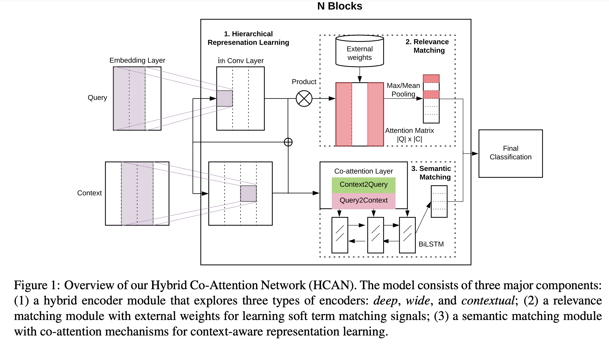

* **[2] Neural Graph Matching Networks for Chinese Short Text Matching ACL 2020** 

中文短文本匹配问题

动机：基于词的匹配模型，可能会因为中文分词的错误、模糊或不一致，损害最终的匹配性能。

方法：提出了一种用于中文短文本匹配的神经图匹配方法(GMN)。保留所有可能的分词结果，形成一个lattice图神经图匹配网络，处理多粒度输入信息的匹配框架。

模型结构：上下文节点嵌入模块(通过BERT得到节点表示)、图匹配模块和关系分类器。

新颖点：在匹配任务上，引入GNN来解决分词带来的误差，提升匹配任务的性能。

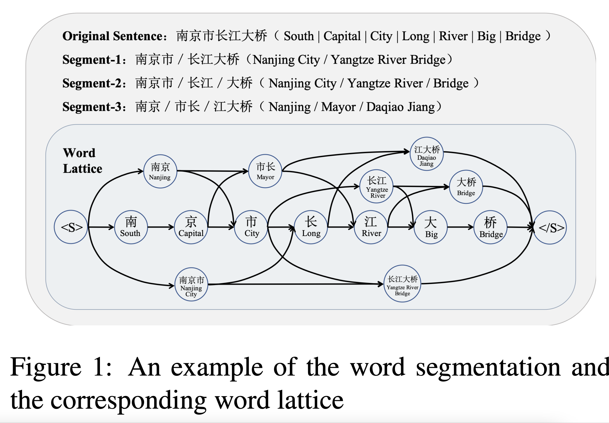

* **[3] tBERT: Topic Models and BERT Joining Forcesf or Semantic Similarity Detection ACL 2020** 

解决的任务：语义相似性检测

核心思想：融合了主题模型和BERT，基于BERT的上下文与主题信息结合

模型：用基础的BERT对两个句子编码，得到句子对的表示。根据主题模型得到两个句子的文档主题。
通过主题模型给句子中每一个单词分配一个主题然后取平均得到单词主题矩阵W。最后一起送到FC

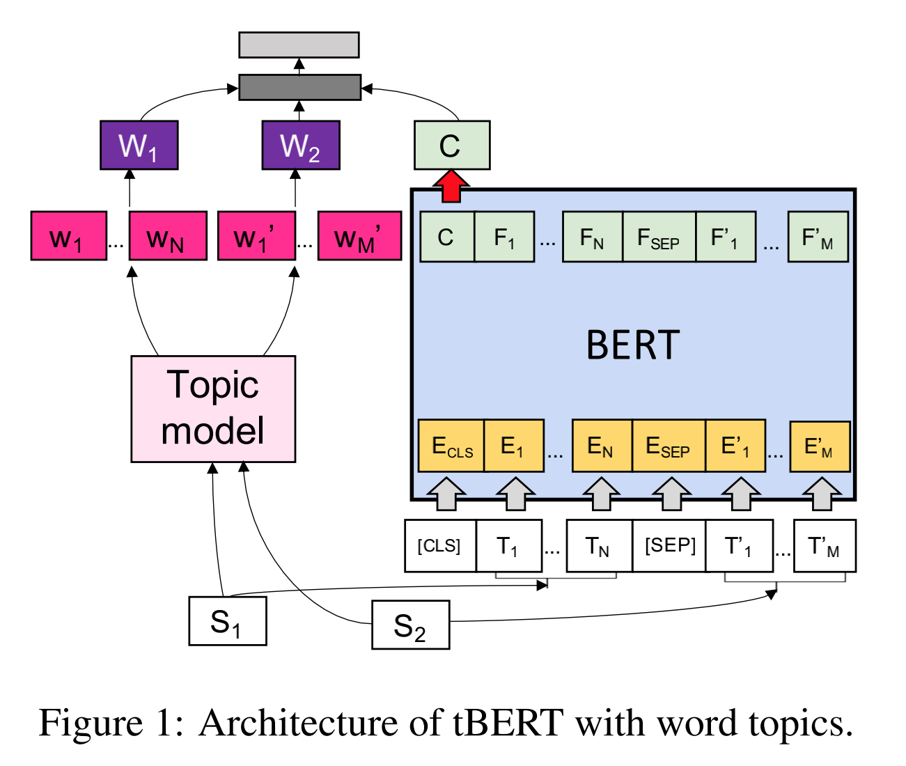

## 4 权衡性能与效率

* **[4] Sentence-BERT: Sentence Embeddings using Siamese BERT-Networks.  2019 EMNLP**

动机：BERT和RoBERTa用于匹配任务需要将比较的两个句子都传入模型中计算，导致了巨大的计算开销（大规模相似度检索中，求得一个问题的检索答案需要：N(N-1)/2）；聚类任务和语义搜索中，BERT映射成的向量效果一般。

核心思想：训练时通过有监督训练上层的分类函数，推断时通过SBERT模型获取到的句子embedding，可以直接通过cos相似度计算两个句子的相似度，大大减少了计算量

贡献：提出sentence-BERT，性能不低，效率++。

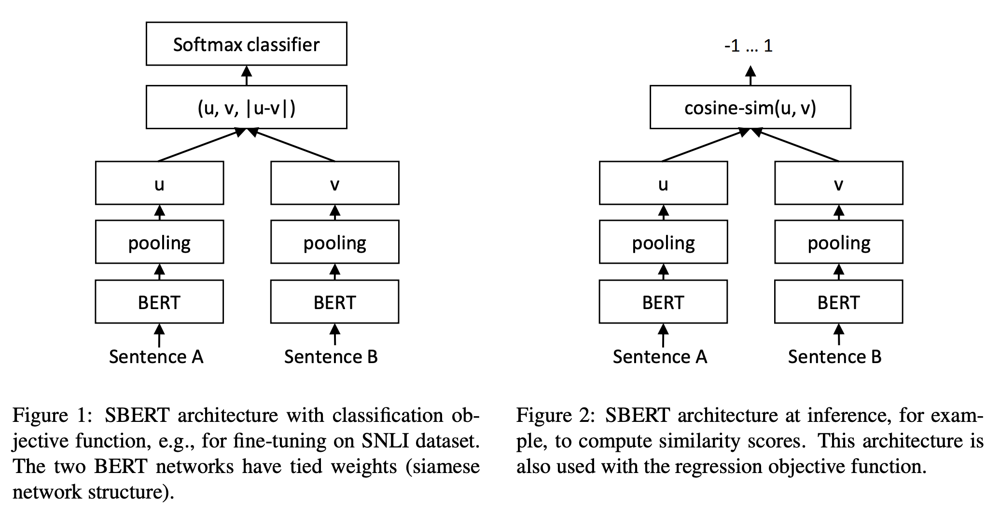

**[5] Poly-encoders: architectures and pre-trainingstrategies for fast and accurate multi-sentence scoring ICLR 2020 **

动机：Cross-encoders方法相比于Bi-encoders效果好但是慢；

贡献：提出Poly-encoders，详细比较三种方法的性能和速度，做了一个折中。

模型核心思想：用多个attention模块获取 query 中一词多义或切词带来的不同语义信息，使得双塔表示进行充分的交互

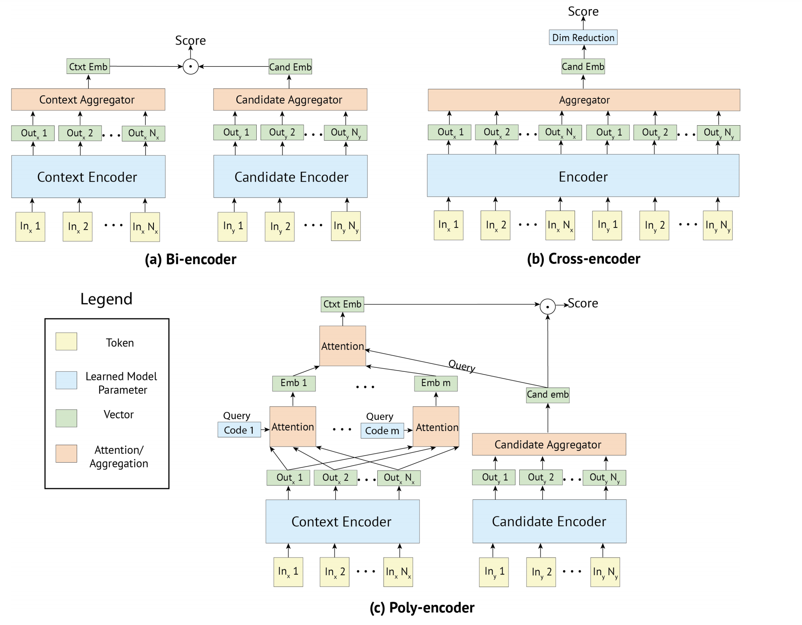

**[6] DC-BERT: Decoupling Question and Document for Efficient Contextual Encoding. SIGIR2020**

* 动机：开放域 QA，reRank的基本操作是将问题和检索到的每个文档进行拼接作为 BERT 的输入，输出相关性 score。每一个问题都需要与 retrieve 模块检索出的每一个文档进行拼接，这需要对大量检索文档进行重编码，非常耗时。
* 贡献：为了解决效率问题，DC-BERT 提出具有双重 BERT 模型的解耦上下文编码框架：在线的 BERT 只对问题进行一次编码，而离线的 BERT 对所有文档进行预编码并缓存它们的编码。DC-BERT 在文档检索上实现了 10 倍的加速，同时与最先进的开放域 QA 方法相比，保留了大部分(约98%)的 QA 问答性能。

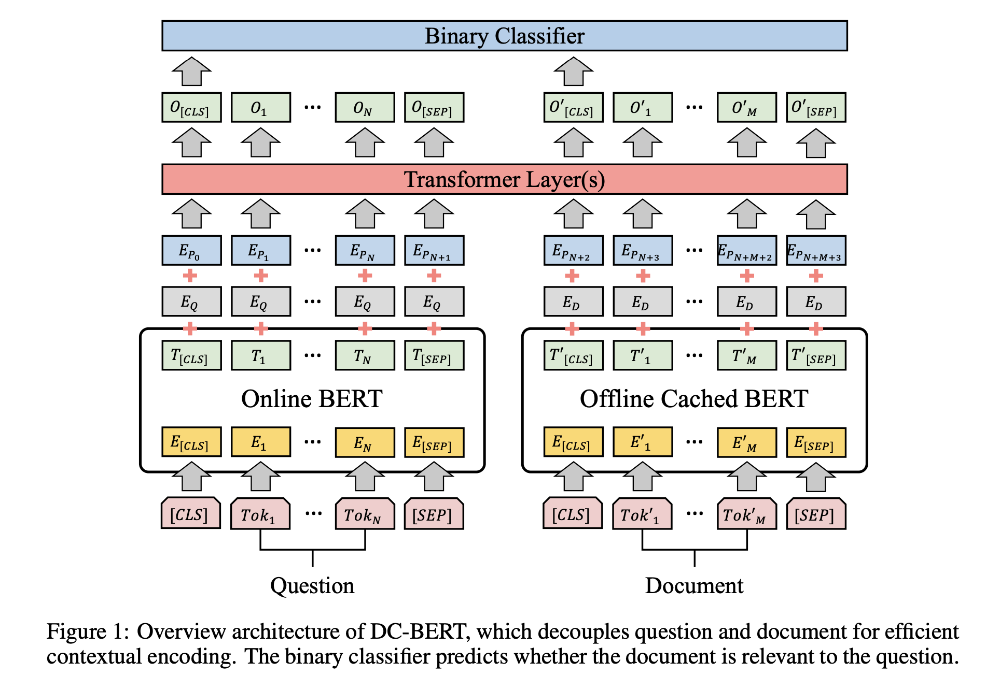

**[17] ColBERT: Efficient and Effective Passage Search via Contextualized Late Interaction over BERT  SIGIR 2020** 

* 动机：bi-encoder的效率问题
* 贡献：ColBERT 提出了一种新颖的后期交互范式，用于估计查询 query 和文档 doc 之间的相关性。query 和doc 分别通过各自的 encoder 编码，得到两组 token level 的 embedding 集合；然后，评估 query 和 doc 中的每个 item 的关联，得到快速排序的目的。
* 模型结构：ColBERT 的模型结构整体还是类似于 Siamese 结构，分为 Query 端和 Doc 端，最后在进行交互计算文本分相似度。模型主体上分为 Query Encoder  、Document Encoder   、以及之后的 Late Interaction 部分。

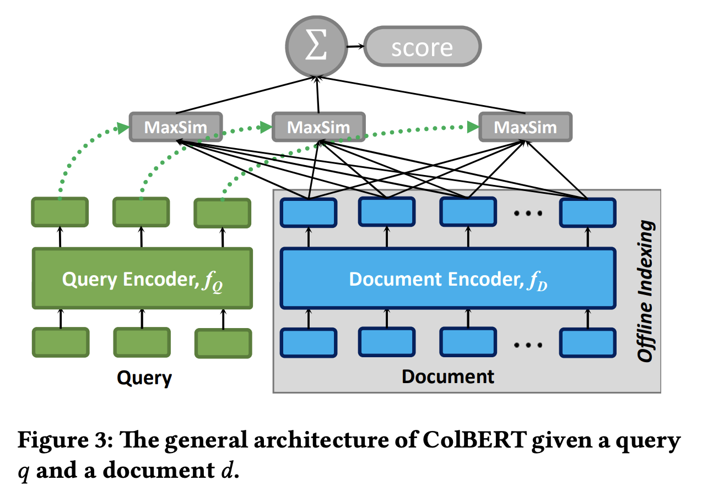

**[7] Simple and Effective Text Matching with Richer Alignment Features. ACL 2019**

动机：少参数量，更快的推理速度，但是效果也并没有很低的模型

贡献点：他的主要设计理念就是一切从简，embedding只有word embedding, 主干网络采用了CNN，作者尽可能的减少了参数和运算量。一个encoder。三个任务中的四个数据集达到与SOTA相当的水平；最少的参数数量和最快的推理速度；消融实验和替代方案对比

模型：embedding(1)与上一模块的输出(2)一起扔进Encoder，(1)与(2)与Encoder(3)的输出扔进Attention，(1)与(2)与(3)与Attention(4)的结果一起fusion，然后池化后扔进分类器。

## 5 专注模型结构与性能

### 5.1 交互型深度匹配模型

#### 5.1.1 传统交互型深度匹配模型

**[1] Bridging the Gap Between Relevance Matching and Semantic Matching for Short Text Similarity Modeling     ACL 2019 ** 

动机：相关性匹配和语义匹配的gap，两者信息融合提升效果

* IR中的相关性匹配注重关键词的匹配，看重两者的相关性
* 语义匹配通过词汇信息和语句的组成结构，强调整体“含义”的相似关系
* 以往的工作证明，NLP中文本相似性建模对于IR任务可能会产生较差的结果，反之亦然。

模型结构：

* 混合的encoder模块，包括deep、wide和contextual
  * Deep Encoder：堆叠多层的卷积层，表示向量经过多层的卷积来得到高层的表示
  * Wide Encoder：并行的将表示向量通过拥有不同卷积核的卷积层，分别得到每一层对应的表示向量
  * Contextual Encoder：使用双向的LSTM来获取长程依赖特征
* 相关性模块，两者的表示进行矩阵相乘（内积），得到一个相似性得分矩阵，引入idf权重，做池化
* 语义匹配：使用了Co-Attention来计算查询向量和文本向量之间的注意力，将其编码后过LSTM作为语义匹配得分

贡献点：

* 讨论了相关性匹配和语义匹配的区别（模型之间是否适配，相关性和语义匹配的标签关系）
* 提出一个新的交互式的模型（一个RM一个SM，和一个结合的）
* 3个NLP任务和2个IR数据集上进行实验；关联性和语义匹配信号在许多问题上互补

#### 5.1.2 基于pretrain+finetune的句子表示建模

* **[8] Enhancing Pre-trained Chinese Character Representation with Word-aligned Attention ACL 2020**

动机：中文预训练模型中以字符为基本单位而忽略了词的语义，以往工作将词信息融入到文本表示显示有效果

关键问题：如何将分词信息集成到预训练模型中；分词工具带来的cascading(级联)噪声。

贡献：提出一种词对齐注意机制，显式利用词的信息。进行了包括6个数据集的5个任务。

模型：实质上就是在实验看有什么办法去各种拐着弯儿向 character-level 的表示模型融入词信息，并减轻外部分词器引入的分词噪声。1. 通过字符序列和分词序列的attention，得到按词划分的（word-based）字级别（character-level）的 attention 权重组合。然后pooling后和原向量乘到一块。2. 集成了多种分词工具的结果，以减少分词噪声

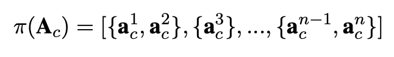

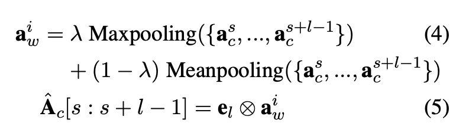

**[9] Cross-Thought for Sentence Encoder Pre-training. EMNLP-2020** 

https://mp.weixin.qq.com/s/S03iGgtsXj2cy37F8yjCfg

动机：针对CLS的定向建模。目前主流的语言模型预训练任务，都采用序列的第一个特殊符号（如：[CLS]）作为句子的表示，但是预训练任务的目标都没有损失直接作用在这个特殊符号上，这样就导致在这个特殊符号上学出来的句子表示很难包含充分的信息。

主流的预训练都作用在非常长的序列上（比如512），使得模型在恢复被mask的token时，可以直接获取到周边句子的信息。这对于学习有效的上下文token表示很有用，但对于学习句子表示则效率较低，因为信息不会主动聚集到[CLS]符号上。

贡献：本文提出了Cross-Thought，它将输入文本切分成许多短句，使得恢复某个短句中被mask掉token的信息较难出现在同一个短句中，而不得不依赖于其上下文其它短句的信息。

模型：
预训练：长句子切分为M个短句子，每个短句子前添加N个特殊的token，编码后特殊token处的向量有M\*N个，N列的特殊token向量做attention得到加权表示，M\*N与M个句子的编码结果分别扔进cross-transformer来预测mask token。
finetune：M\*N个特殊token表示的attention分数得到ranking loss来排序，或者是M\*N个特殊token表示扔到分类器

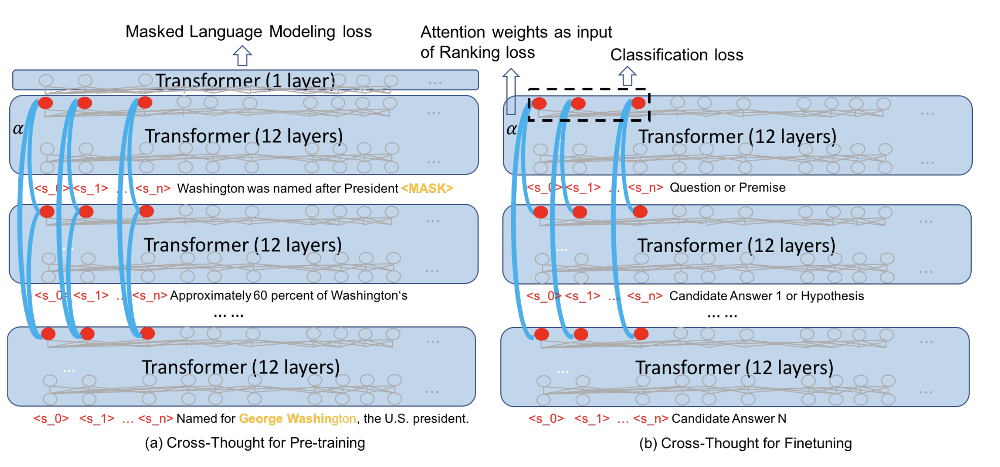

### 5.2 双塔型深度匹配模型

#### 5.2.1 传统双塔型匹配模型

**[10] Siamese Recurrent Architectures for Learning Sentence Similarity 2016 AAAI**

用共享权重的LSTM编码，取最后一步的输出作为表示，使用了Manhattan距离计算损失

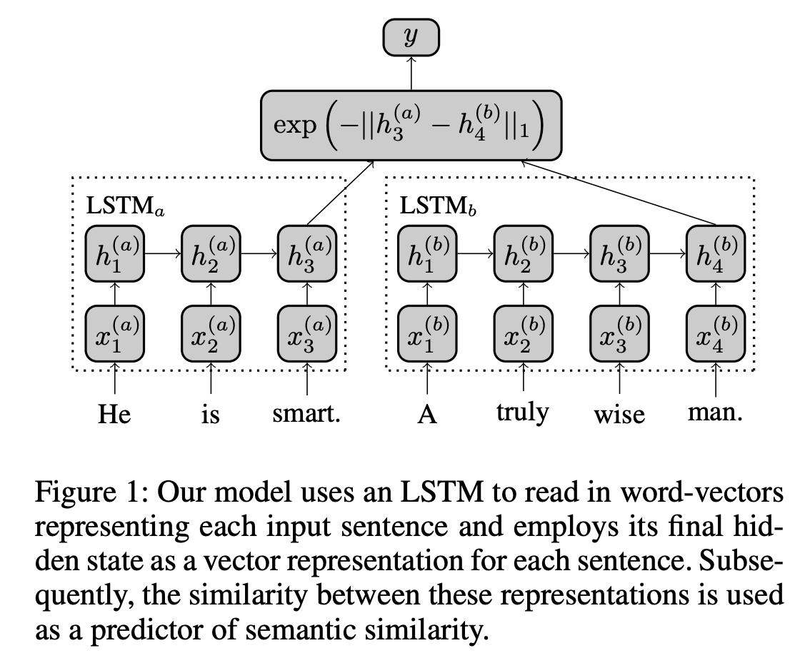

#### 5.2.2 基于pretrain+finetune的句子表示建模

偏向句子表示，无监督的匹配

- **[11] BERT-flow: On the Sentence Embeddings from Pre-trained Language Models  EMNLP-2020**

动机：没有经过微调，直接由BERT得到的句子表示在语义文本相似性方面明显薄弱，甚至会弱于GloVe得到的表示。

模型：探究发现，词频影响向量分布：1. 高频词更接近原点；2. 低频词更稀疏。总之：BERT总是将句子映射为一个非光滑的各向异性语义空间中的向量。于是将BERT embedding映射到一个标准高斯隐空间（因为一些此分布听起来高大上的特性：平滑的、各向同性的）

贡献：一种BERT的句子表示增强方法。

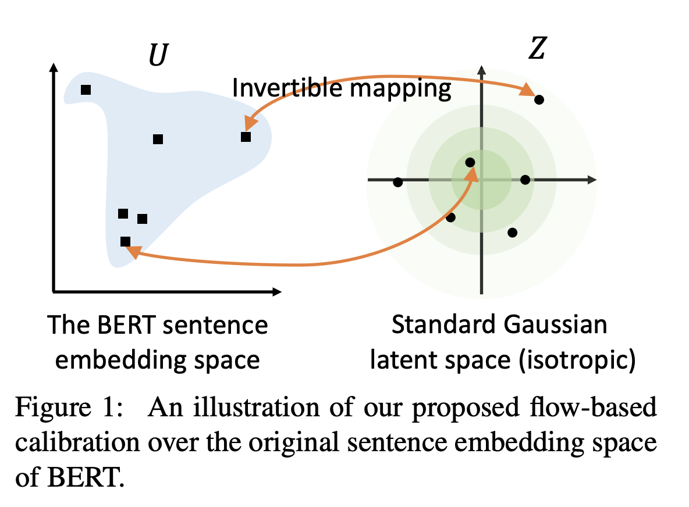

- **[12] BERT-whitening: Whitening Sentence Representations for Better Semantics and Faster Retrieval   arxiv-2021**

  BERT-whitening可看成是[BERT-flow](https://arxiv.org/abs/2011.05864)的最简单实现，这样简单的实现足以媲美一般的BERT-flow模型

  - BERT-whitening的思路很简单，就是在得到每个句子的句向量后，对这些矩阵进行一个白化（也就是PCA），使得每个维度的均值为0、协方差矩阵为单位阵，然后保留k个主成分

  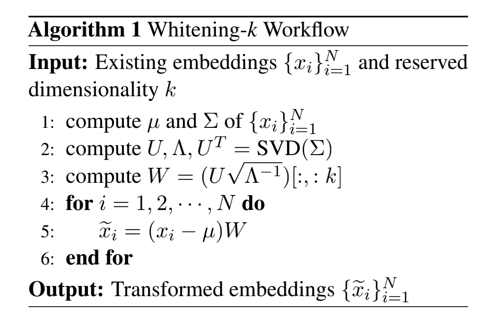

- **[13] SimCSE: Simple Contrastive Learning of Sentence Embeddings   arxiv-2021**

  - 动机：更好的句子表示，将对比学习的思想引入了SBERT
  - 方法：对比学习的本质就是构建正负样本，SimCSE最大的贡献就是提出一种构造正样本的方法。本质上来说就是<样本A的一种表示, 样本A的另一种表示>作为正例、<样本A的一种表示, 样本B的一种表示>作为负例来训练对比学习模型。怎么得到自己的两种表示：两次经过带Dropout的Encoder，两次随机Dropout，得到两次表示

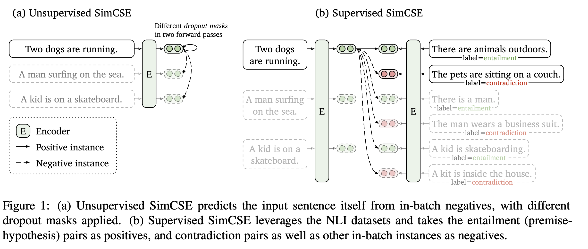

**[14] ConSERT: A Contrastive Framework for Self-Supervised Sentence Representation Transfer  ACL-2021**

- 动机：给定一个类似BERT的预训练语言模型M，以及从目标领域数据分布中收集的无标签文本语料库D，我们希望通过构建自监督任务在D上对M进行Fine-tune，使得Fine-tune后的模型能够在目标任务（用于文本语义匹配的句子表示）上表现最好。

- 提出了一种基于对比学习的句子表示迁移框架ConSERT。一个Batch内的N条样本，通过数据增强，得到2N条，同一个句子得到的两个样本为正样本对，batch内其他的句子作为负样本对。

- 探究了若干数据增强方法。显性的：回译（翻译两遍）、CBERT（mask后补全）、意译（paraphrase模型）；隐性的：对抗攻击（有监督场景）、shuffle（Position Ids进行Shuffle）、裁剪（embedding或token置为0）、dropout（同SimCSE）

  

- 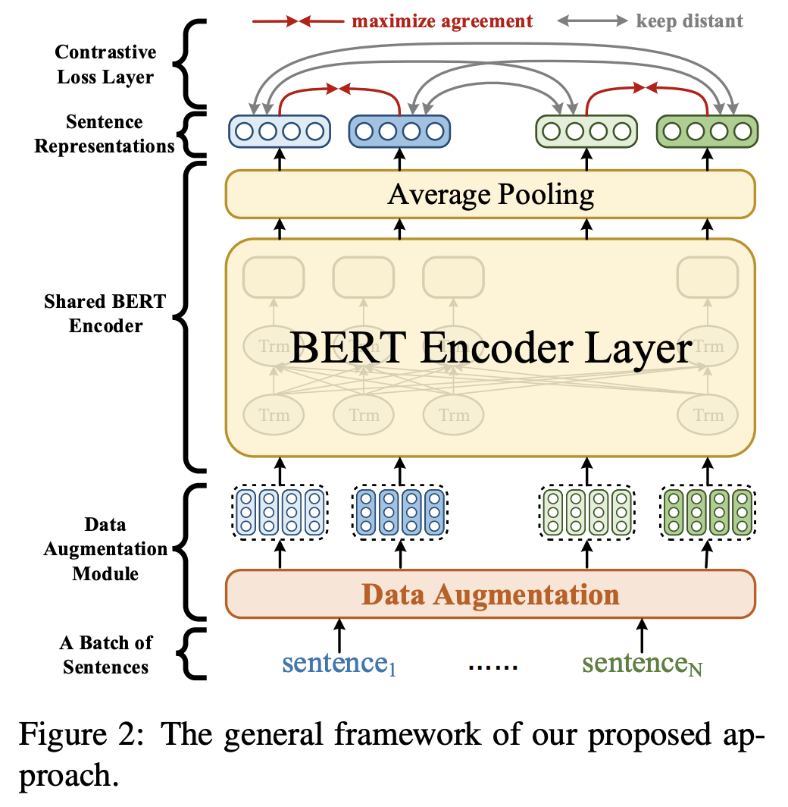

**Meta-Embeddings: Sentence Meta-Embeddings for Unsupervised Semantic Textual Similarity. ACL-2020**

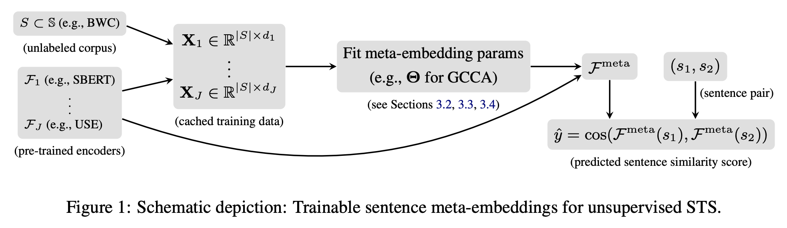

## 6 特定场景或特性

**[15] Match²: A Matching over Matching Model for Similar Question Identification SIGIR 2020**

动机：CQA问题，提出了一种相似问题的二次匹配模型，将待匹配问句对应的回答作为连接二者的桥梁，辅助判定待匹配问句是否与 用户问句相似

模型：第一模块是 Matching Pattern Layer，该模块分别计算两个问题与答案直接的相似性表示。第二模块是 Pattern Similarity Layer，该模块计算以上两种匹配模式之间的相似性  作为两个问题的相似性表示。第三模块是 Compression Layer，将 Pattern Similarity和QQ相似度一起做分类

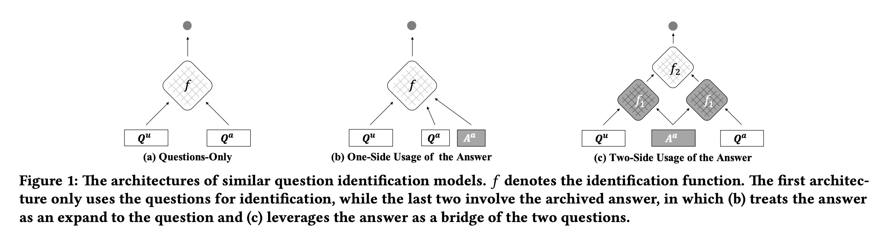

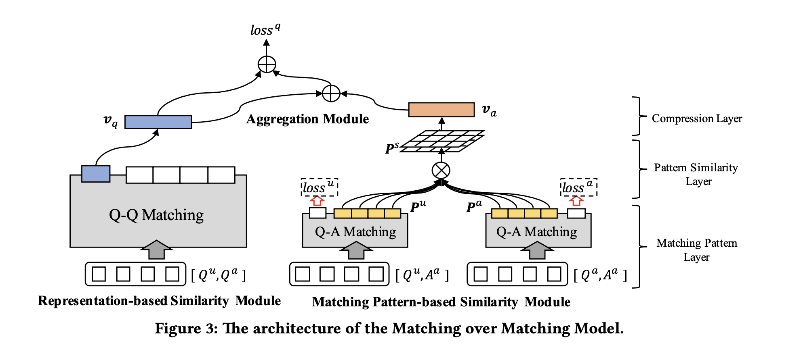

匹配模型的少样本迁移 EMNLP-2020

[16] 《MultiCQA: Zero-Shot Transfer of Self-Supervised Text Matching Models on a Massive Scale》

非对称域文本匹配 EMNLP-2020

[18] Wasserstein Distance Regularized Sequence Representation for Text Matching in Asymmetrical Domains

- 动机：随着训练的进行，从不同域投影的特征向量往往难以区分。

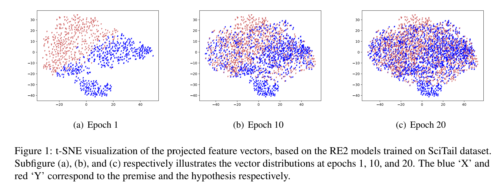

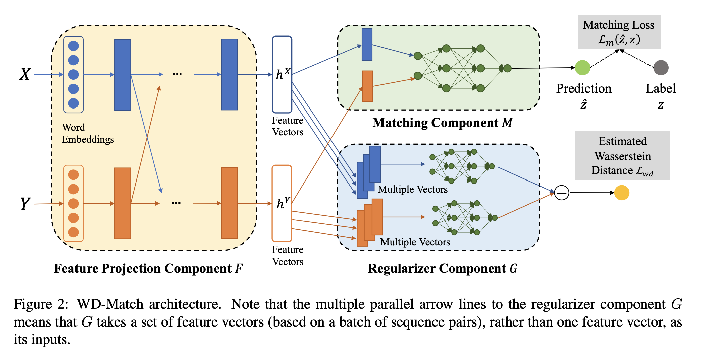

## Reference

[基于深度学习的FAQ问答系统](https://mp.weixin.qq.com/s?__biz=MzI0NTg1MTI1NQ==&amp;amp;mid=2247484166&amp;amp;idx=1&amp;amp;sn=99e78d78013092e6b712d5a4e5efd487&amp;amp;chksm=e949761ede3eff080f381dfb5b618282d76a2349c1b3d664d05a1d39878e5d1f744219e6cd7e&amp;amp;mpshare=1&amp;amp;scene=23&amp;amp;srcid=1022VqCPD7HGFwpBSOtBqvWe&amp;amp;sharer_sharetime=1603375088507&amp;amp;sharer_shareid=59332ea7c33ee752808701f0287171ae#rd )

[21个经典深度学习句间关系模型｜代码&技巧](https://zhuanlan.zhihu.com/p/357864974 )

https://blog.csdn.net/iin729/article/details/111942096

https://mp.weixin.qq.com/s/S03iGgtsXj2cy37F8yjCfg

https://blog.csdn.net/Forlogen/article/details/103610766

https://blog.csdn.net/qq_43390809/article/details/114077216

https://blog.csdn.net/xixiaoyaoww/article/details/108525940

https://blog.csdn.net/qq_22472047/article/details/109175911

 https://mp.weixin.qq.com/s/S03iGgtsXj2cy37F8yjCfg

https://kexue.fm/archives/8321 

[ACL2021｜美团提出基于对比学习的文本表示模型，效果相比BERT-flow提升8%](https://km.sankuai.com/page/856931405)