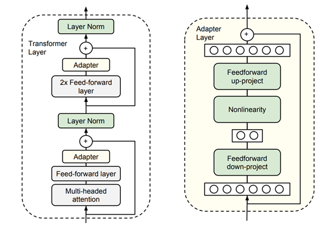
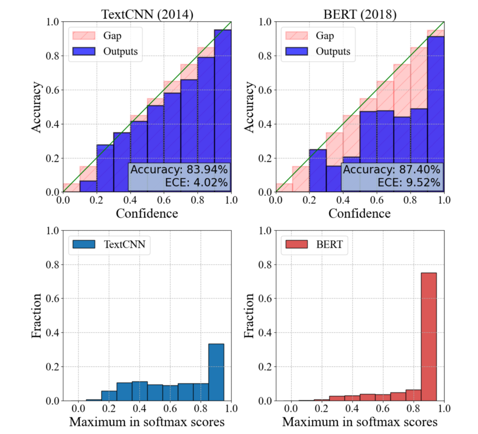
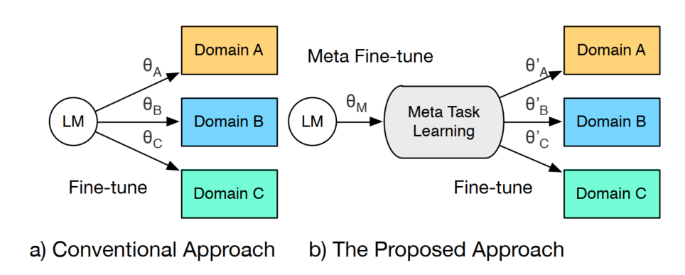
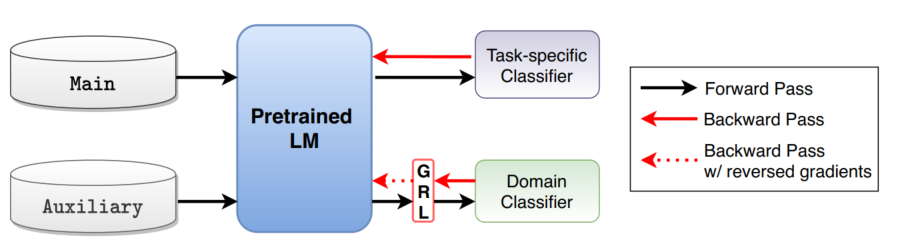

## 1 Fine-Tuning

预训练语言模型的微调，本质上是迁移学习的一种应用。

将先进的语言模型在大规模语料上进行预训练后，在下游任务上进行微调，使得预训练语言模型迁移并充分适应下游任务。

1. 针对微调技巧本身 or 从不同角度对微调做优化
2. 根据任务特性做优化
3. 对微调过程或微调后的模型进行分析

## 2 专注微调技巧

###  2020 ACL [SMART](https://www.aclweb.org/anthology/2020.acl-main.197.pdf)

SMART: Robust and Efficient Fine-Tuning for Pre-trained Natural Language Models through Principled Regularized Optimization

动机：下游任务的数据资源有限，并且预训练模型的复杂性极高，主动微调通常会导致微调模型过度适合下游任务的训练数据，而无法推广到看不见的数据。 为了解决这个问题，提出了一个新的学习框架，对预训练模型进行健壮和高效的微调，以获得更好的泛化性能。

具体方法：所提出的框架包含两个重要成分：1.平滑度诱导正则化，可有效管理模型的复杂性；  2. Bregman近点优化，它是trustregion方法的一个实例，可以防止主动更新。 

应用的任务：GLUE, SNLI, SciTail and ANLI等通用benchmark

### 2020 EMNLP [Recall and Learn](https://www.aclweb.org/anthology/2020.emnlp-main.634.pdf)

[Recall and Learn: Fine-tuning Deep Pretrained Language Models with Less Forgetting](https://www.aclweb.org/anthology/2020.emnlp-main.634.pdf)

动机：微调过程中导致了灾难性遗忘问题，为了减少遗忘，文章提出一种recall and learn 机制

具体方法：多任务学习共同学习预训练任务和下游任务

应用的任务：GLUE基准

### 2019 ICML Adapter BERT 

Parameter-Efficient Transfer Learning for NLP 

存在大量下游任务时，微调的参数效率低，每个任务都需要一个全新的模型。

论文提出加入adapter模块进行传输，这样每个任务仅添加了一个适配器模块。把最后的
task-special layer 放到模型中间，然后冻住预训练模型参数。

### 2018 ULMFiT 判别式微调

Universal language model fine-tuning for text classification. 

### 2020 Mixout

Mixout: Effective regularization to finetune large-scale pretrained language models. 

## 3 根据任务特性微调优化

### * 2020 ACL [Adversarial and Domain-Aware BERT](https://www.aclweb.org/anthology/2020.acl-main.370.pdf)

[Adversarial and Domain-Aware BERT for Cross-Domain Sentiment Analysis](https://www.aclweb.org/anthology/2020.acl-main.370.pdf)

解决跨域情感分析，即从源域学到的情感分类器，来预测目标领域的句子情感极性。

设计了一个post-training方法

pre-training 任务，MaskLM任务+领域区分。鼓励BERT提取特定领域的特征，利用了无标记数据。

通过对抗训练提升finetuning。

应用的任务：Amazon reviews benchmark

### 2020 EMNLP  [In- and Out-of-Distribution Data](https://www.aclweb.org/anthology/2020.emnlp-main.102.pdf)

Calibrated Language Model Fine-Tuning for In- and Out-of-Distribution Data

动机：由于**过度参数化**（微调过程中少量标记数据的过拟合），针对分布内和分布外（OOD）数据，经过微调的预训练语言模型可能会遭受严重的失调。

失调的表现：对分布内数据预测的reliability diagrams不均匀，分布外数据预测的高置信度分布占比更大

具体方法：引入了两种类型的正则化以进行更好的校准：（1）流形正则化，它通过在数据流形内进行插值生成伪流形样本。 使用这些伪样本进行增强训练会进行平滑度正则化，以改善分布内校准。  （2）非流形正则化，这鼓励模型输出伪非流形样本的均匀分布，以解决OOD数据的过分置信问题。 

应用的任务：根据多分类任务数据，构建了分布内训练集、分布内测试集、分布外测试集，在六个数据集上的预期校准误差，误分类检测和OOD检测方面均优于现有的文本分类校准方法。

### 2020 EMNLP [Meta Fine-Tuning](https://www.aclweb.org/anthology/2020.emnlp-main.250.pdf)

[Meta Fine-Tuning Neural Language Models for Multi-Domain Text Mining](https://www.aclweb.org/anthology/2020.emnlp-main.250.pdf)

动机：微调过程忽略了不同领域中相似NLP任务的相互关联，文章提出一种学习程序MFT，解决一组类似的NLP任务

具体方法：多数据集的多任务学习、获取高度可转移的知识、优化领域corruption loss?

应用的任务：多个领域的文本挖掘任务（句对分类-蕴含任务、评论检测-分类任务、词对分类）

###  * 2020 Findings [Domain Adversarial Fine-Tuning](https://www.aclweb.org/anthology/2020.findings-emnlp.278.pdf)

[Domain Adversarial Fine-Tuning as an Effective Regularizer](https://www.aclweb.org/anthology/2020.findings-emnlp.278.pdf)   短文

动机：标准微调会降低预训练期间捕获的通用领域的表示。文章引入一种新的正则化技术作为调节器

具体方法：不同领域样本的对抗训练，外接一个领域分类器，让这个分类器搞不懂sample来源于哪个领域，以提升鲁棒性。**寻求对主任务具有区分性且对域分类器不具有区分性的表示形式。**

应用的任务：部分GLUE基准：CoLA SST-2 MRPC RTE

还没搞懂：两个规模不一致数据集的pipeline

### 2020 COLING [Fine-tuning BERT for Low-Resource NLU](https://www.aclweb.org/anthology/2020.coling-main.100.pdf)

[Fine-tuning BERT for Low-Resource Natural Language Understanding via Active Learning](https://www.aclweb.org/anthology/2020.coling-main.100.pdf)

动机：低资源（训练数据<1000）的finetune

具体方法：最大化近似知识获取balabala，分析了微调过程中冻结语言模型层的好处

应用的任务：GLUE的四个任务

### 2020 Findings [Tri-Train](https://www.aclweb.org/anthology/2020.findings-emnlp.429.pdf)

[Tri-Train: Automatic Pre-Fine Tuning between Pre-Training and Fine-Tuning for SciNER](https://www.aclweb.org/anthology/2020.findings-emnlp.429.pdf)

动机：NER 任务，pretrain-finetune 的模式取决于数据领域和任务之间的相关性。目标领域较小时就不行了。

具体方法：文章在预训练和微调之间加入 预微调 步骤

应用的任务：NER的七个基准

### 其他

2020 COLING

[Unsupervised Fine-tuning for Text Clustering](https://www.aclweb.org/anthology/2020.coling-main.482.pdf)

**2020Findings** 

[Towards Zero-Shot Conditional Summarization with Adaptive Multi-Task Fine-Tuning](https://www.aclweb.org/anthology/2020.findings-emnlp.289.pdf)

条件摘要、zero-shot、多任务学习

[Mapping Local News Coverage: Precise location extraction in textual news content using fine-tuned BERT based language model](https://www.aclweb.org/anthology/2020.nlpcss-1.17.pdf)

[Two-Phase Cross-Lingual Language Model Fine-Tuning for Machine Translation Quality Estimation](https://www.aclweb.org/anthology/2020.wmt-1.118.pdf)

[Fine-Tuning MT systems for Robustness to Second-Language Speaker Variations](https://www.aclweb.org/anthology/2020.wnut-1.20.pdf)

2020 EMNLP

 [Pronoun-Targeted Fine-tuning for NMT](https://www.aclweb.org/anthology/2020.emnlp-main.177.pdf)

一类条件生成-区分混合损失，用于微调训练有素的机器翻译模型。 

通过微调改善代词翻译，在代词基准测试集上测试

## 4 微调过程分析-相关工作

### 2020 ACL  [BERT’s attention change](https://www.aclweb.org/anthology/2020.acl-main.429.pdf)

How does BERT’s attention change when you fine-tune? An analysis methodology and a case study in negation scope

动机：预训练模型在finetune后如何决策的解释依然很困难，文章提出一个程序和分析方法，该方法关于transformer系列的模型如何编码语义现象提出了假设并进行了验证。

### 2020 ACL [Automated Essay Scoring?](https://www.aclweb.org/anthology/2020.bea-1.15.pdf)

Should You Fine-Tune BERT for Automated Essay Scoring?

动机：分析预训练语言模型是否是自动作文评分的合适技术选择

### 2020 EMNLP [A Rigorous Study on NER](https://www.aclweb.org/anthology/2020.emnlp-main.592.pdf)

**A Rigorous Study on Named Entity Recognition: Can Fine-tuning Pretrained Model Lead to the Promised Land?**

动机：微调PLM已经在标准NER基准上性能不错，但是开放状态就不行了，也没有这方面数据集。文章建议对标准基准进行随机测试。

结论：NER任务的一些结论

### 2020 Findings [Enhancing Automated Essay Scoring Performance ](https://www.aclweb.org/anthology/2020.findings-emnlp.141.pdf)

[Enhancing Automated Essay Scoring Performance via Fine-tuning Pre-trained Language Models with Combination of Regression and Ranking](https://www.aclweb.org/anthology/2020.findings-emnlp.141.pdf)

动机：AES(Automated Essay Scoring) 在最近的工作中，通过各种方法微调并使用浅层神经网络来进行文章表示，捕获文本深层语义较差。文章提出一种新方法来微调AES任务。

**2020 EMNLP workshop**

[What Happens To BERT Embeddings During Fine-tuning?](https://www.aclweb.org/anthology/2020.blackboxnlp-1.4.pdf)

[On the Interplay Between Fine-tuning and Sentence-Level Probing for Linguistic Knowledge in Pre-Trained Transformers](https://www.aclweb.org/anthology/2020.blackboxnlp-1.7.pdf)

## Reference

