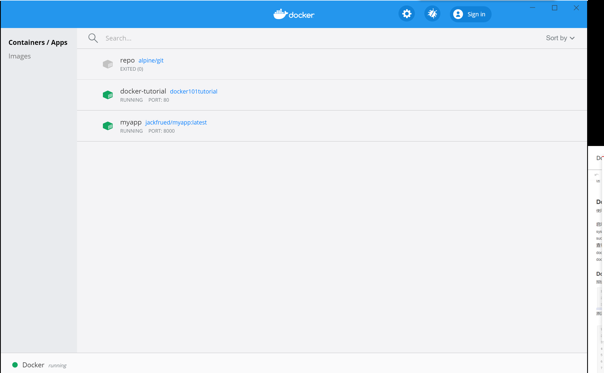
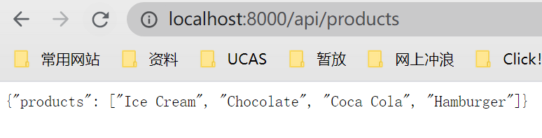

云笔记里还有一些后续补充：待搬运

## 1 Docker 概念扫盲

Docker技术的三大核心概念，分别是：

- 镜像（Image）   装有某软件的模板

- 容器（Container）  镜像创建的应用实例

- 仓库（Repository） 存放镜像文件的仓库

  

从仓库（一般为DockerHub）下载（pull）一个镜像，Docker执行run方法得到一个容器，用户在容器里执行各种操作。Docker执行commit方法将一个容器转化为镜像。Docker利用login、push等命令将本地镜像推送（push）到仓库。其他机器或服务器上就可以使用该镜像去生成容器，进而运行相应的应用程序了。


## 2 Docker 安装

### 2.1 Docker for linux安装

使用安装脚本自动安装

```
curl -fsSL https://get.docker.com | bash -s docker --mirror Aliyun
```

启动Docker服务

```
systemctl start docker
sudo systemctl restart docker
```

查看Docker版本和信息

```
docker version 
docker info
```

### 2.2 Docker for windows安装

windows端这边使用了Docker Desktop for Windows，体验尚可。




## 3 Docker for Linux 配置

### 3.1 内网代理服务器的docker设置

服务器是内网，之前的想法是通过配置内网代理来进行各种docker的pull和push的操作。

流程为：

1. 内网代理配置，windows端可以使用CCproxy，注意：设置/高级/网络 处取消勾选'禁止局域网外部用户'

   ```
   vim ~/.bashrc
   添加如下：（10.61.3.208为可外网的主机IP）
   export http_proxy=http://10.61.3.208:808
   export https_proxy=http://10.61.3.208:808
   然后
   source  ~/.bashrc
   测试
   wget baidu.com
   ```

   

2. 设置docker代理

   不设置的话会出现

   ```
   [dcy@localhost docker_about]$ docker pull nginx
   Using default tag: latest
   Error response from daemon: Get https://registry-1.docker.io/v2/: net/http: request canceled while waiting for connection (Client.Timeout exceeded while awaiting headers)
   ```

   设置方法

   ```
   sudo mkdir -p /etc/systemd/system/docker.service.d
   vim /etc/systemd/system/docker.service.d/http-proxy.conf
   添加：
   目前是这个：（）
   [Service]
   Environment="HTTP_PROXY=http://10.61.3.208:808/" "HTTPS_PROXY=https://10.61.3.208:80/" 
   
   重启生效
   sudo systemctl daemon-reload
   sudo systemctl restart docker
   systemctl show --property=Environment docker
   ```

3. 镜像源
   配置完还是报错

   ```
   [dcy@localhost docker_about]$ docker pull nginx
   Using default tag: latest
   Error response from daemon: Get https://registry-1.docker.io/v2/: proxyconnect tcp: net/http: TLS handshake timeout
   ```

   修改镜像源

   ```
   daocloud官网上有自动脚本
   curl -sSL https://get.daocloud.io/daotools/set_mirror.sh | sh -s http://f1361db2.m.daocloud.io
   阿里云官网上也有
   ```

4. 继续配置

   还是报错

   ```
   [dcy@localhost docker_about]$ docker pull nginx
   Using default tag: latest
   latest: Pulling from library/nginx
   Image docker.io/library/nginx:latest uses outdated schema1 manifest format. Please upgrade to a schema2 image for better future compatibility. More information at https://docs.docker.com/registry/spec/deprecated-schema-v1/
   bb79b6b2107f: Retrying in 16 seconds 
   111447d5894d: Retrying in 16 seconds 
   a95689b8e6cb: Retrying in 16 seconds 
   1a0022e444c2: Waiting 
   32b7488a3833: Waiting 
   ```

   修改

   ```
   vim /etc/resolv.conf
   nameserver 8.8.8.8 #添加一条这个
   ```

   报的错不一样了

   ```
   [dcy@localhost docker_about]$ sudo docker pull nginx
   Using default tag: latest
   latest: Pulling from library/nginx
   bb79b6b2107f: Pulling fs layer 
   111447d5894d: Pulling fs layer 
   a95689b8e6cb: Pulling fs layer 
   1a0022e444c2: Waiting 
   32b7488a3833: Waiting 
   Get https://registry-1.docker.io/v2/: proxyconnect tcp: net/http: TLS handshake timeout
   没有error前缀了呢。。。
   ```

整体流程没错的，目测是服务器的原因吧。。。


### 3.2 内网harbor

放弃挣扎了，使用harbor管理docker镜像（内网就可以访问，甚至都不需要代理了。

步骤：本地host，docker tar包，注册账号，login，pull


## 4 Linux操作

### 4.1 操作简记


```
docker search centos  # 查看centos镜像是否存在
docker pull centos     # 利用pull命令获取镜像
docker images    # 查看当前系统中的images信息
```


利用镜像启动容器后修改后再提交

```
[root@xxx ~]# docker run -it centos:latest /bin/bash    # 启动一个容器
[root@72f1a8a0e394 /]#    # 这里命令行形式变了，表示已经进入了一个新环境
[root@72f1a8a0e394 /]# git --version    # 此时的容器中没有git
bash: git: command not found
[root@72f1a8a0e394 /]# yum install git    # 利用yum安装git
......
[root@72f1a8a0e394 /]# git --version   # 此时的容器中已经装有git了
git version 1.8.3.1

exit
docker ps -a
# 将容器转化为一个镜像，即执行commit操作，完成后可使用docker images查看：
# -m 说明   -a 用户账号 容器id   目标镜像的用户名仓库名和tag
docker commit -m "centosbal" -a "qixianhu" 72f1a8a0e394 xianhu/centos:git

docker images

此时Docker引擎中就有了我们新建的镜像xianhu/centos:git，此镜像和原有的CentOS镜像区别在于多了个Git工具。此时我们利用新镜像创建的容器，本身就自带git了。
[root@xxx ~]# docker run -it xianhu/centos:git /bin/bash
[root@520afc596c51 /]# git --version
git version 1.8.3.1
[root@520afc596c51 /]# exit
```


### 4.2 python部署的一个demo


Dockerfile 

```
# 指定基础镜像
FROM python:3.7
# 指定镜像的维护者
MAINTAINER jackfrued "jackfrued@126.com"
# 设置工作目录
WORKDIR /root
# 从版本控制克隆代码
RUN git clone https://gitee.com/jackfrued/apidemo.git
# 设置工作目录
WORKDIR /root/apidemo
# 安装项目依赖项
RUN pip install -r requirements.txt -i https://pypi.doubanio.com/simple/
# 为启动脚本添加执行权限
RUN chmod 755 start.sh
# 容器启动时要执行的命令
ENTRYPOINT ["./start.sh"]
# 暴露端口
EXPOSE 8000
```


build

```
docker build -t "jackfrued/myapp" .
```


部署

```
docker run -d -p 8000:8000 --name myapp jackfrued/myapp:latest
```


效果




## Reference 

https://www.runoob.com/docker/centos-docker-install.html

https://www.cnblogs.com/wangkun122/p/13036432.html

https://www.runoob.com/docker/centos-docker-install.html


