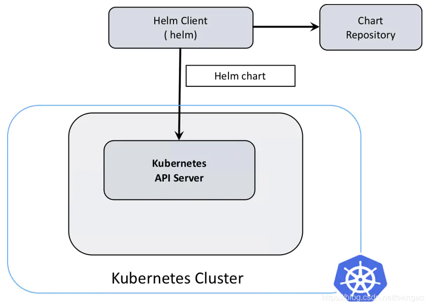
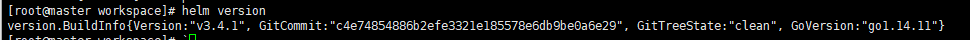
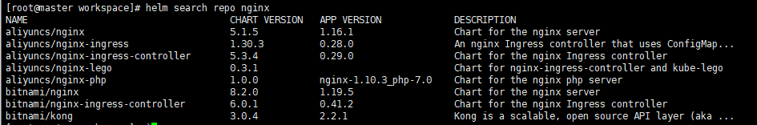
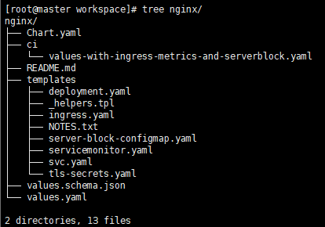
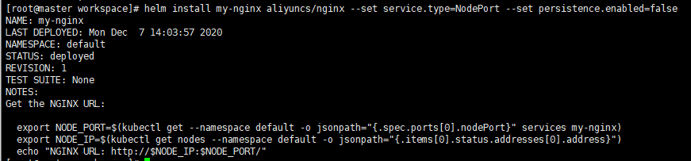
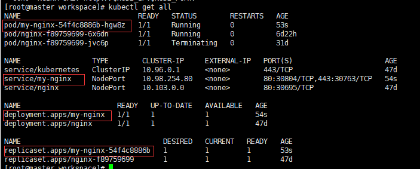
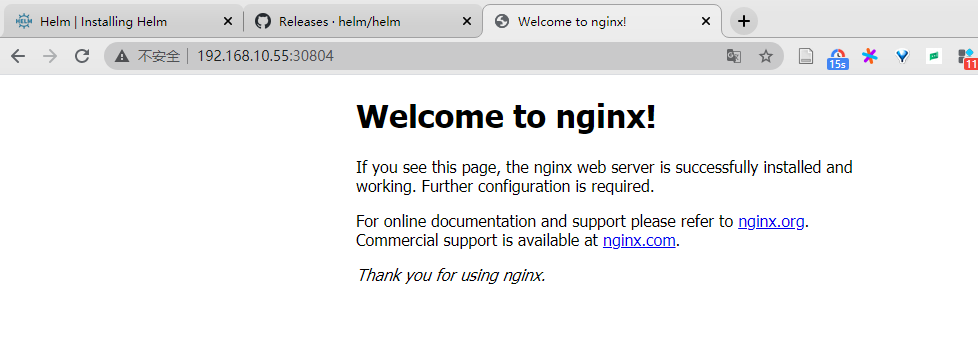

## 1 K8S编排工具——Helm

Helm 是 Kubernetes 的软件包管理工具，类似于Python的pip centos的yum,主要用来管理 Charts

Helm Chart是用来封装Kubernetes原生应用程序的一系列YAML文件。可以在你部署应用的时候自定义应用程序的一些Metadata，以便于应用程序的分发。


对于应用发布者而言，可以通过Helm打包应用、管理应用依赖关系、管理应用版本并发布应用到软件仓库。

以便于应用程序的分发。对于应用发布者而言，可以通过Helm打包应用、管理应用依赖关系、管理应用版本并发布应用到软件仓库。


Helm2 由客户端组件 helm 和服务端组件 Tiller 组成, 能够将一组K8S资源打包统一管理, 是查找、共享和使用为Kubernetes构建的软件的最佳方式。

Helm3 移除 Tiller（Helm 2 是一种 Client-Server 结构，客户端称为 Helm，服务器称为 Tiller）。

Helm 3 只有客户端结构，客户端仍称为 Helm。客户端直接与 Kubernetes API 服务器交互,去除Tiller后关系图如下:




### 1.1 Helm解决的问题

在 Kubernetes中部署一个可以使用的应用，需要涉及到很多的 Kubernetes 资源的共同协作。

Helm是一个用于kubernetes的包管理器。每个包称为一个Chart，一个Chart是一个目录（一般情况下会将目录进行打包压缩，形成name-version.tgz格式的单一文件，方便传输和存储）。

对于应用发布者而言，可以通过Helm打包应用，管理应用依赖关系，管理应用版本并发布应用到软件仓库。

对于使用者而言，使用Helm后不用需要了解Kubernetes的Yaml语法并编写应用部署文件，可以通过Helm下载并在kubernetes上安装需要的应用。

除此以外，Helm还提供了kubernetes上的软件部署，删除，升级，回滚应用的强大功能。


### 1.2 Helm相关组件

Helm三个主要部件：Chart、Repoistory、Release

* Chart：为Kubernetes中应用程序所需要的资源的定义。所谓chart就是一系列文件, 它描述了一组相关的 k8s 集群资源
* Repoistory：Helm chart 的仓库，Helm 客户端通过 HTTP 协议来访问存储库中 chart 的索引文件和压缩包
* Release： Kubernetes中运行的chart实例，每个chart可多次安装，每次安装都是一个新版本；使用 helm install 命令在 Kubernetes 集群中部署的 Chart 称为 Release


## 2 Helm 安装部署

### 2.1 安装

​	两种安装方式，一种是手动安装，一种是一键安装脚本（官方公布脚本链接失效了）

1. Download desired version](https://github.com/helm/helm/releases)
2. Unpack it (`tar -zxvf helm-v3.0.0-linux-amd64.tar.gz`)
3. Find the `helm` binary in the unpacked directory, and move it to its desired destination (`mv linux-amd64/helm /usr/local/bin/helm`)

安装完成后：




### 2.2 部署deployment

先添加常用的chart源

```csharp
helm repo add stable https://kubernetes-charts.storage.googleapis.com
helm repo add incubator https://kubernetes-charts-incubator.storage.googleapis.com  
helm repo add bitnami https://charts.bitnami.com/bitnami   目前只有这2个用上了
helm repo add aliyuncs https://apphub.aliyuncs.com     目前只有这2个用上了
```


使用nginx作为例子，查看有哪些版本提供




选择aliyuncs/nginx 的chart包 下载chart包

```
helm pull aliyuncs/nginx --untar #将nginx包从创库拉到当前目录
```




安装nginx到我们的k8s集群中：

````
helm install my-nginx aliyuncs/nginx --set service.type=NodePort --set persistence.enabled=false
# 将tomcat的service对外暴露端口的方式改为NodePort
# 不启用持久化存储卷
````



查看是否安装成功

```
kubectl get all
```



部署完毕，节点IP:端口查看： 192.168.10.55:30804



### 2.3 发布 Helm Chart

使用heml创建chart

使用 helm package 命令对Chart 文件夹进行打包归档

创建 INDEX 文件

推送到harbor中

helm repo list


## 目前的问题

当前虚拟机环境可以create & push chart，也可以pull chart。

但是服务器离线环境无法联阿里源，当前实验室的harbor还没测试是否支持chart，待测试。


## Reference

https://helm.sh/docs/intro/install/

https://www.jianshu.com/p/b6ebf8fc72f7