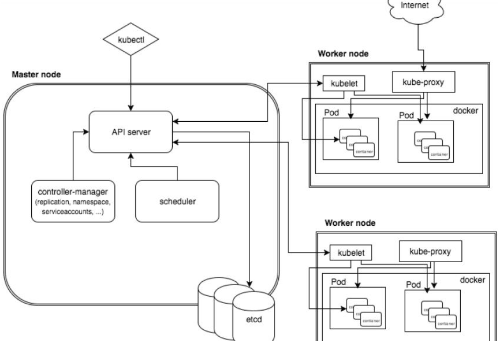
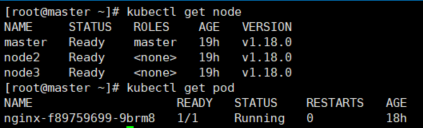
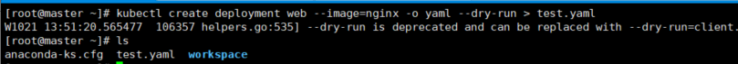

## 1 K8S

### 1.1 前置内容

* Linux操作
* Docker

推荐上手顺序

* 概念与架构扫盲
* 从零搭建简单的K8S集群
  * 基于客户端工具kubeadm
  * 基于二进制包方式

* 核心概念
  * Pod、Controller、service、ingress
  * RABC、Helm等

* 搭建集群监控平台系统
* 搭建高可用K8S集群
* 在集群环境部署项目


### 1.2 概述和特性

kubernetes， 简称 K8s， 是用 8 代替 8 个字符“ubernete” 而成的缩写。  

 

传统的应用部署：插件和脚本安装应用，应用与当前操作系统绑定

新的方式：部署容器，容器之间互相隔离，容器与底层设施解耦

K8S 使部署容器化应用更加简洁和高效，自动化部署和管理应用的多个实例


K8S特性

* 自动装箱：自动化部署应用容器
* 自我修复：容器失败时会对容器进行重启；所部署的 Node 节点有问题时， 会对容器进行重新部署和重新调度 ；当容器未通过监控检查时， 会关闭此容器直到容器正常运行时， 才会对外提供服务  
* 水平扩展：对应用容器规模扩大和缩小
* 服务发现（负载均衡）：节点的调度和分配等
* 滚动更新：例如加新应用时，要更新功能：当检测到可用时才会更新
* 版本回退
* 密钥和配置管理  
* 存储编排  
* 批处理  


### 1.3 架构组件

* Master  主控节点
  * API server：集群统一入口（以restful方式，交给etcd存储）
  * controler-manager：处理集群中的常规后台任务，一个资源对应一个控制器
  * scheduler：节点的调度
  * etcd：存储系统，保存集群中的相关数据（pod数据等）
* Node  工作节点
  * kebelet：master派到node的代表，管理节点中容器相关的部分
  * kube-proxy：提供网络代理，用于负载均衡等操作




### 1.4 核心概念

Service统一入口进行访问，由controller创建pod进行部署

* Pod
  * 最小部署单元，一组容器的集合，容器共享网络，短暂生命周期
* Controller
  * 确定预期的pod副本数量
  * 有状态应用部署（依赖网络，需要存储），无状态应用部署
  * 确保所有node运行同一个pod
* Service
  * 定义一组pod的访问规则


## 2 搭建K8S集群

平台规划

* 单master，master直接管理多个node节点
* 多master，master和node之间多一个负载均衡组件（高可用）

硬件配置要求

* 测试环境：master-2核4G20G，node-4核8G40G

集群部署方式

* kubeadm：一个K8S部署工具

  * 创建一个Master节点： kubeadm init
  * 将node节点加入到当前集群中： kubeadm join <Master的IP和端口>
  * 快速部署，但屏蔽了很多细节，遇到问题较难排查。

* 二进制包

  * 二进制包，手动部署每个组件
  * 手动部署非常麻烦，更可控，也利于维护


详细搭建步骤见另一篇。


## 3 命令行工具 kubectl  

基本语法： 

```
$ kubectl [command] [TYPE] [NAME] [flags]
command: 对资源执行的操作create get等
TYPE： 资源类型例如 node pod等
NAME: 资源名称，不指定则显示全部
flags: 可选参数 例如 -s 指定kubernetes API server的地址和端口
$ kubectl --help 查看帮助文档
```




## 4 资源编排 YAML文件

**资源清单文件**： 把资源对象的操作编辑到 YAML 格式文件中

资源管理和资源对象编排部署，都可以通过声明样式（ YAML） 文件来解决

通过 kubectl 命令直接使用资源清单文件，就可以对大量资源对象进行编排部署


* 语法格式： 键值对的集合
  * 通过缩进控制格式（空格可以tab不行）
  * 字符后要缩进一个空格
  * ‘---’ 代表新的yaml文件
  * ‘#’ 代表注释
* 文件组成部分
  * 控制器定义
  * 被控制对象


* 快速编写yaml文件

  * 使用kubectl create 命令生成yaml文件，然后进行修改

    ```
    # 不执行，输出yaml文件
    kubectl create deployment web --image=nginx -o yaml --dry-run > test.yaml
    ```

    

  * 针对部署好的项目，导出yaml文件

    ```
    kubectl get deploy nginx -o=yaml --export >test2.yaml
    ```

  

## 5 核心技术的应用

### 5.1 Pod

* 基本概念
  1. 最小部署单元
  2. 包含多个容器（一组容器的集合）
  3. 一个pod中容器共享网络命名空间
  4. 短暂的
* Pod概念思考
  * 每个 Pod 都是应用的一个实例， 有专用的 IP  
  * 一个 Pod 可以有多个容器， 彼此间共享网络和存储资源， 每个 Pod 中有一个 Pause 容器保存所有的容器状态， 通过管理 pause 容器， 达到管理 pod 中所有容器的效果  
  * 同一个 Pod 中的容器总会被调度到相同 Node 节点， 不同节点间 Pod 的通信基于虚拟二层网络技术实现  
* pod存在的意义
  1. 创建容器使用docker，一个docker对应一个容器，一个容器有进程，一个容器运行一个应用程序
  2. docker单进程，pod运行多个容器、也是多个应用程序、多进程
  3. pod的存在是为了亲密性应用
     1. 应用之间有交互
     2. 网络之间调用（不再需要ip，而是localhost + socket）
* Pod实现机制
  * 共享网络
    * 每个pod都会创建一个根容器（Pause）
    * 每次创建业务容器就会加入到pause容器中（？），从而让所有业务容器放在同一个命名空间中
  * 共享存储 
    * pod持久化存储数据（例如日志和业务数据等）
    * 引入数据卷概念Volumn，使用数据卷进行持久化存储
* Pod镜像拉取策略：IfNotPresent  Always  Never
* 资源限制：设置能使用的计算资源限额 - CPU和Memory
* Pod重启策略：Always  OnFailure Never
* 健康检查：检查容器 - 存活检查 就绪检查
* 调度策略
  * 调度过程（API server、 etcd存储、Scheduler、kubelet、 Docker）
    * master的调度过程
    * node节点的调度过程
  * 影响到调度的属性 - 调度到哪个node
    * pod资源的限制
    * 节点选择器的标签

### 5.2 Controller

在集群上管理和运行容器的对象

pod和controller的关系：pod通过controller实现应用的运维，通过label标签建立关系（pod是抽象的，deployment是真实存在的对象）

* deployment应用场景(更多的是无状态应用：web、微服务等)
  * 部署无状态应用
  * 管理pod和replicaSet
  * 部署，滚动升级等功能

* 升级回滚

  ```
  应用升级
  $ kubectl set image deployment web nginx=nginx:1.15
  查看升级状态
  $ kubectl rollout status deployment web
  查看升级版本
  $ kubectl rollout history deployment web
  回滚到上一版本
  $ kubectl rollout undo deployment web
  回滚到特定版本
  $ kubectl rollout undo deployment web --to-revision=2
  ```

* 弹性伸缩

  ```
  kubectl scale deployment web --replicas=10
  ```


### 5.3 Service

服务发现：防止pod失联

负载均衡：定义一组pod访问策略

常用service类型：ClusterIP（集群内部使用）、NodePort（外部）、LocalBalancer（外部，公有云）


### 5.4 部署有状态应用

部署无状态应用：pod都一样、没有顺序要求、不用考虑在哪个node上运行、随意进行伸缩和扩展

部署有状态应用：考虑无状态的这些因素：每个pod都是独立的、保持pod启动顺序和唯一性（唯一的网络标识符，持久存储；有序的）


无头service：ClusterIP的值为None

使用StatefulSet部署有状态应用

查看pod时，每个pod都有唯一的名称

查看service时，ClusterIP 是 None

每个pod的唯一域名：主机名称.service名称.名称空间.svc.cluster.local


部署守护进程：让所有Node在同一个Pod中运行 

DaemonSet


一次性任务或定时任务


### 5.5 Secret

作用：加密数据存在etcd中，让pod容器以挂载volume方式进行访问


## 6 高可用的K8S搭建

多node与多master。涉及master的负载均衡。

master1需要部署的：

1. keepalived
2. haproxy
3. 初始化操作
4. 安装docker和网络插件

master2需要部署的：

1. keepalived
2. haproxy
3. 添加master2节点到集群
4. 安装docker和网络插件

node需要部署的：

1. 加入到集群中
2. 安装docker和网络插件


详细搭建步骤见另一篇。


## 7 在K8S中部署项目


1. 开发代码阶段
   1. 编写代码
   2. 测试
   3. 编写DockerFile文件
2. 持续交付/集成
   1. 代码编译打包
   2. 制作镜像
   3. 上传镜像仓库
3. 应用部署
   1. 环境准备
   2. 部署项目
4. 运维
   1. 监控
   2. 故障排查
   3. 升级优化


K8S部署项目流程

1. 制作镜像（DockerFile）
2. 推送镜像仓库
3. 通过控制器Deployment部署镜像
4. 对外暴露应用（service、ingress）
5. 运维 


## Reference

https://www.bilibili.com/video/BV1GT4y1A756?p=2


```

```