## 1 技术栈总结

### 1.1 之前的技术栈

JavaSE（servlet tomcat)

mysql + jdbc

html + css +jquery + 框架

javaweb: 原始的MVC三层架构的网站

SSM: Spring + Spring MVC + MyBatis

war包：tomcat运行


Spring 再简化： SpringBoot；微服务架构

jar包：内嵌tomcat


服务越来越多：springcloud


### 1.2 学习路线

* springBoot
  * 是什么
  * 配置如何编写，yaml
  * 自动装配原理（重要）
  * 集成web开发：业务的核心
  * 集成数据库 Druid
  * 分布式开发：Dubbo（RPC） +  zookeeper
  * swagger：接口文档
  * 任务调度
  * springSecurity: shiro
* springBoot 部署

* springcloud
  * 微服务
  * springcloud入门
  * Restful（调用接口）
  * Eureka（服务注册中心)
  * Ribbon or Feign（负载均衡）
  * HtStrix（服务容灾）
  * Zuul（路由网关）
  * SpringCloud config ~git

  

Spring 是为了解决企业级应用开发的复杂性而创建的，简化开发。

集成第三方框架，开箱即用

maven，spring，springmvc，springboot


## 2 开始搭建

### 2.1 环境

实际版本

```
jdk: 1.8
maven 3.6.3
```

配置jdk和maven

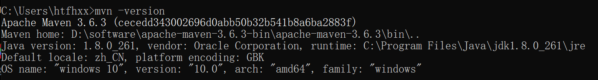


### 2.2 创建一个spring boot项目

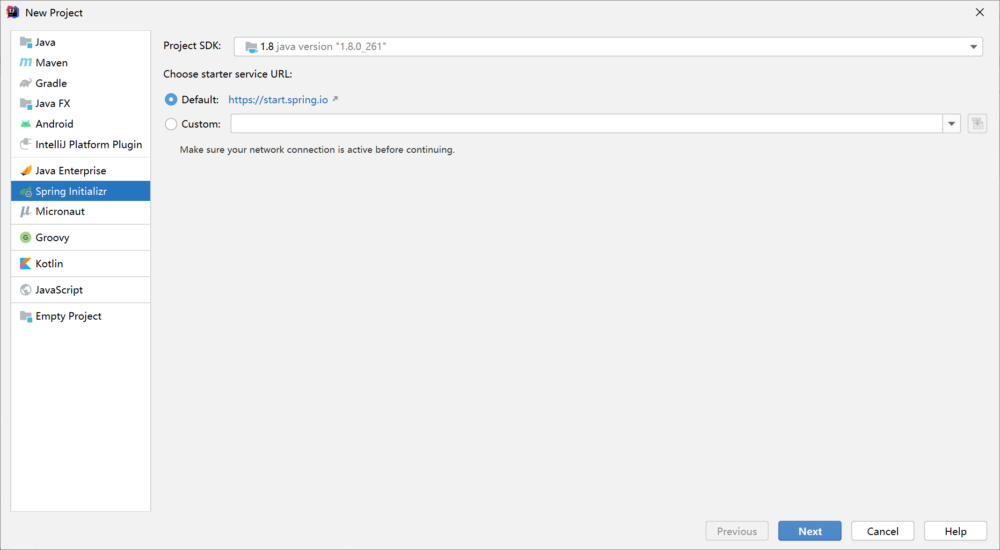

按照习惯配置

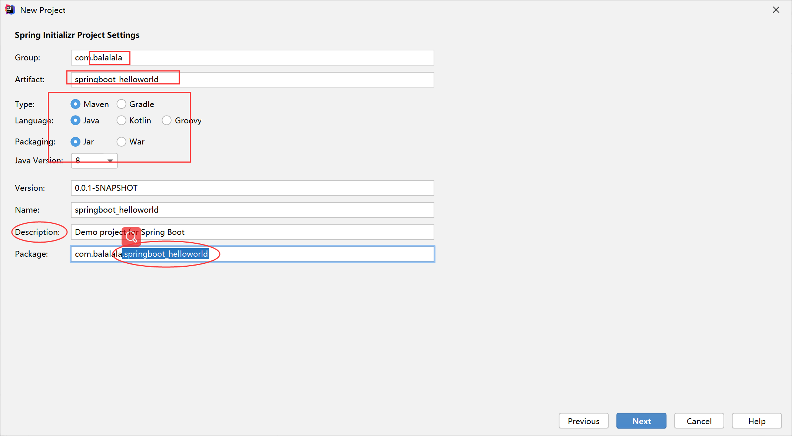

可以直接添加一些依赖，也可以创建之后再手动加

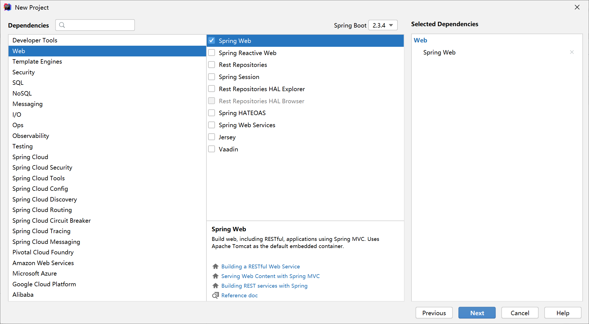

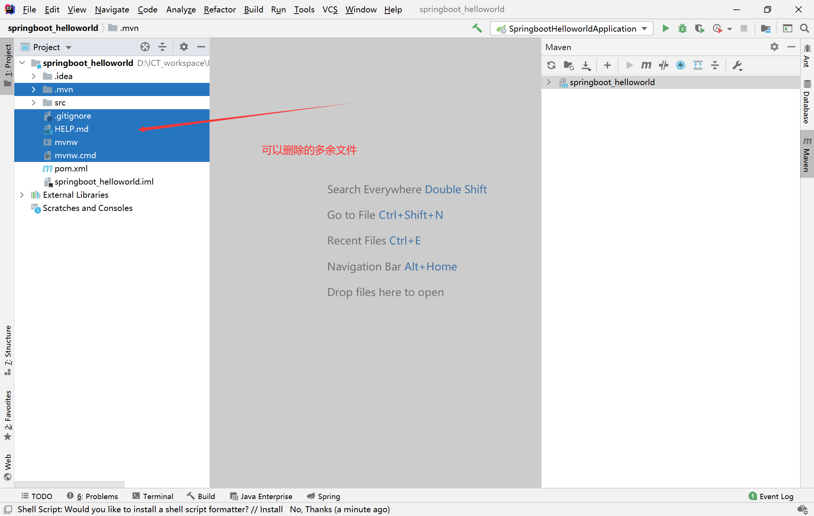

三个方框：主入口，配置文件，单元测试程序

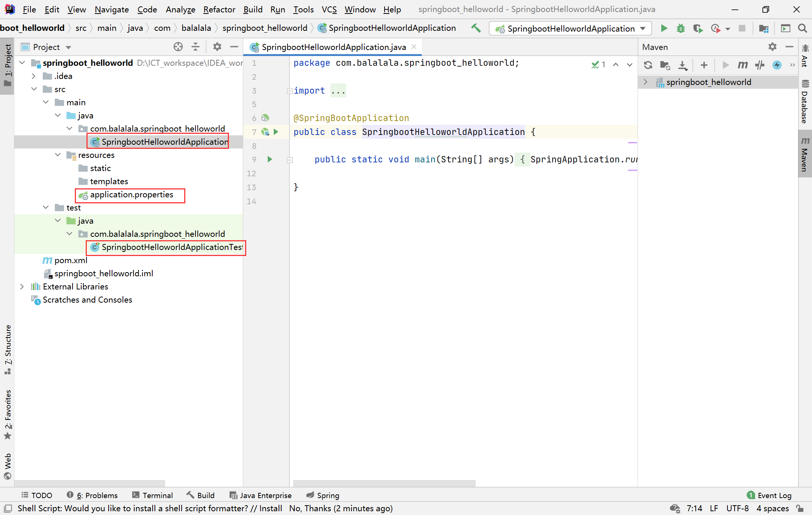


### 2.3 Hello World测试

main的同级目录下建包

```
1、Application.java 建议放到根目录下面,主要用于做一些框架配置
2、model 目录主要用于实体与数据访问层（Repository）
3、service 层主要是业务类代码
4、controller 负责页面访问控制
```


controller包内新建一个class，写一个接口

`@RestController` 的意思就是 Controller 里面的方法都以 json 格式输出，不用再写什么 jackjson 配置的了


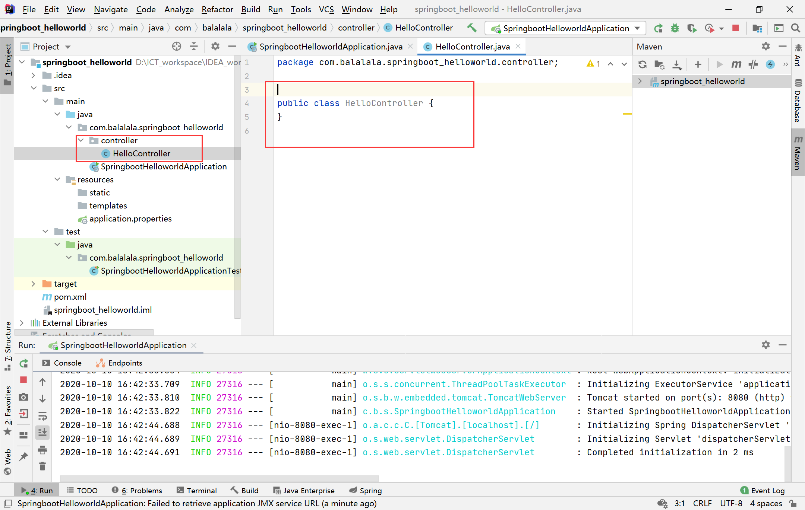

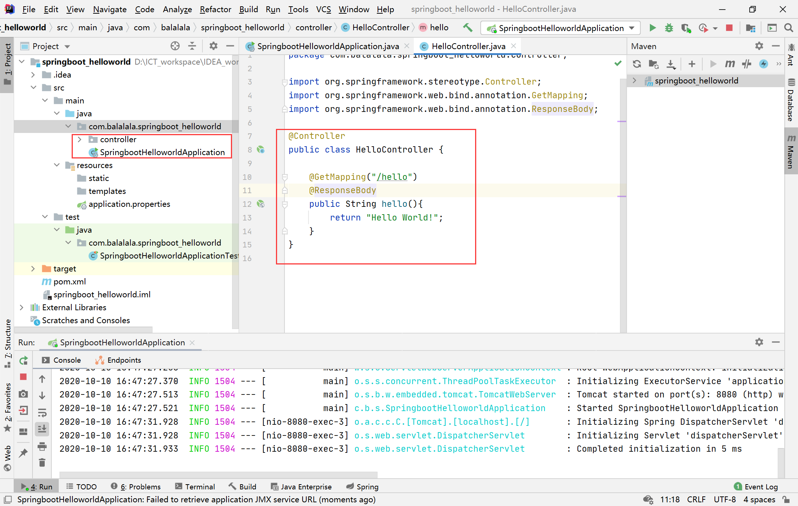


启动主程序，打开浏览器访问 `http://localhost:8080/hello`，就可以看到效果了

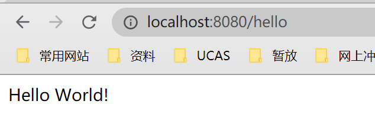


###  2.4 jar包打包并脱离IDEA执行

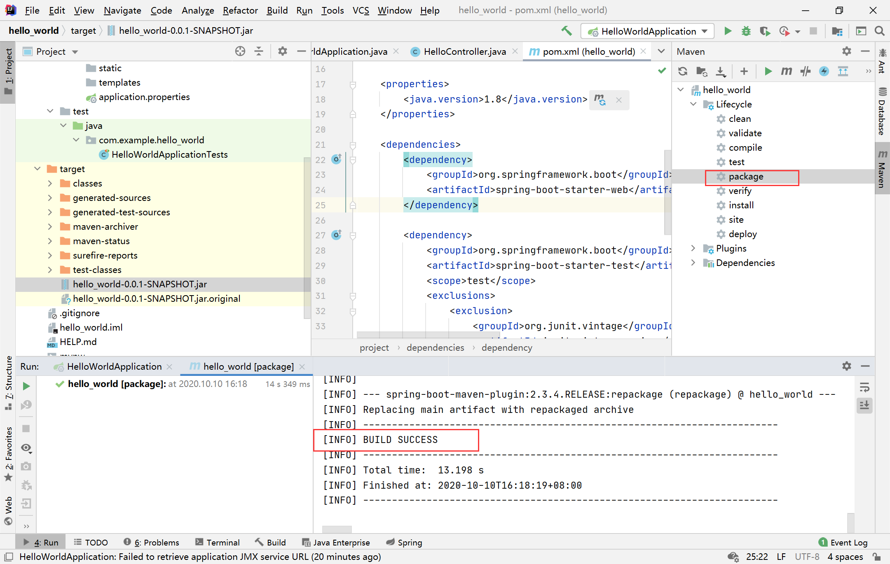

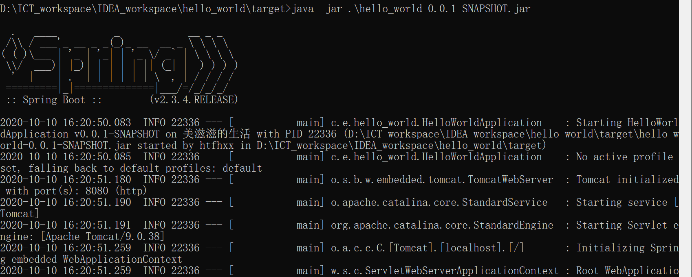


修改端口

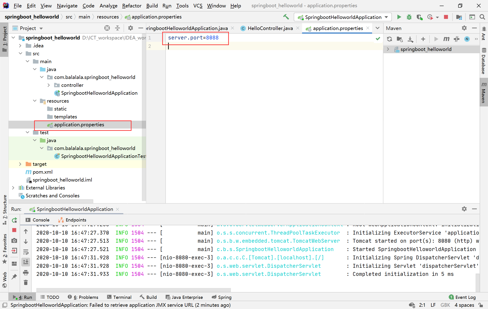

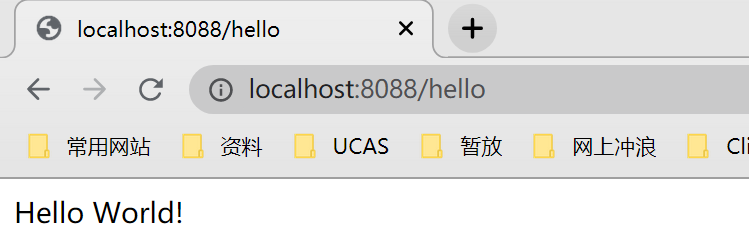


修改banner

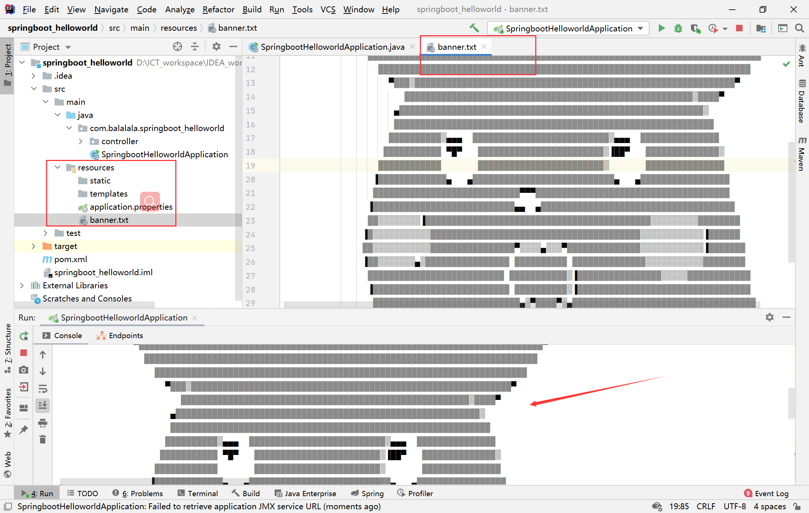


## 3 SpringBoot 入门

### 3.1 SpringBoot自动装配原理

pom.xml

* ```
  spring-boot-starter-parent   spring-boot-dependencies: 核心依赖在父工程中
  在引入一些springBoot依赖时，不需指定版本，因为有对应的版本仓库
  ```

* ```
  启动器，就是springboot的启动场景
          <dependency>
              <groupId>org.springframework.boot</groupId>
              <artifactId>spring-boot-starter-web</artifactId>
          </dependency>
  自动导入所有依赖。springboot会将所有场景都变成一个个的启动器
  想使用什么功能，就找对应的启动器 `starter` 
  ```

主程序

* ```
  SpringApplication.run(SpringbootHelloworldApplication.class, args); 启动命令
  注解：@SpringBootApplication  标注这个类是一个springboot的应用
  这是一个组合注解：包括配置，导入等
  ```

  

### 3.2 Yaml语法

两种配置方式 用于修改默认配置：

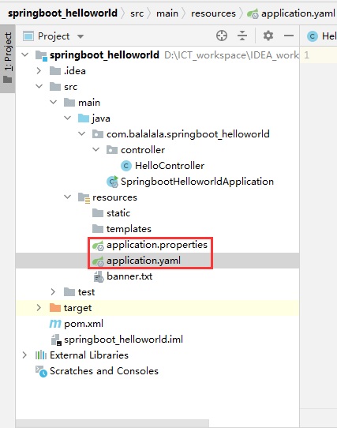


properties基本语法（只能保存key-value对）

```
server.port=8080
```

yaml基本语法

```
server.port:8080

yaml 还能存对象
student:   （对空格要求敏感）
  name: balala
  age: 18
存对象的行内写法： student:{ name: balala, age: 18}

存数组
pets: [cat, dog, pig]
```


### 3.3 给属性赋值的方法

编写一个实体类，用 @Value 给bean注入属性值的！

```
@Component  //注册bean到容器中
public class Dog {
    @Value("阿肖")
    private String name;
    @Value("18")
    private Integer age;
    @Override
    public String toString() {
        return "Dog{" +
                "name='" + name + '\'' +
                ", age=" + age +
                '}';
    }
}
```


在SpringBoot的测试类下注入狗狗输出一下；

```
@SpringBootTest
class SpringbootHelloworldApplicationTests {
    @Autowired //将狗狗自动注入进来
    Dog dog;
    @Test
    void contextLoads() {
        System.out.println(dog); //打印看下狗狗对象
    }
}
```

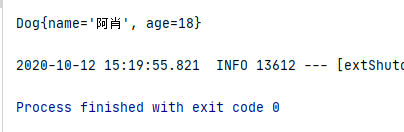


使用yaml配置的方式进行注入

```
编写一个Person类，更复杂一些
@Component //注册bean到容器中
public class Person {
    private String name;
    private Integer age;
    private Boolean happy;
    private Date birth;
    private Map<String,Object> maps;
    private List<Object> lists;
    private Dog dog;
    @Override
    public String toString() {
        return "Person{" +
                "name='" + name + '\'' +
                ", age=" + age +
                ", happy=" + happy +
                ", birth=" + birth +
                ", maps=" + maps +
                ", lists=" + lists +
                ", dog=" + dog +
                '}';
    }
}
```

application.yml中：

````
person:
  name: qinjiang
  age: 3
  happy: false
  birth: 2000/01/01
  maps: {k1: v1,k2: v2}
  lists:
    - code
    - girl
    - music
  dog:
    name: 阿肖
    age: 3
````


缺少的依赖可以添加：

方框处是将属性注入类中

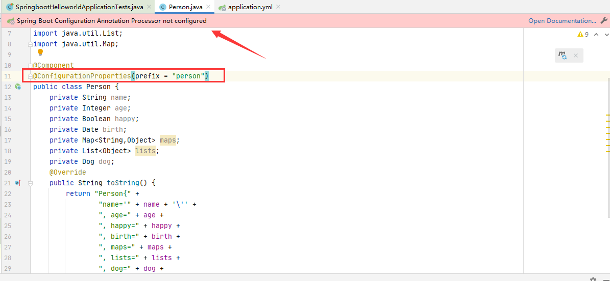


## 4 SpringBoot Web开发

Spring Boot Web 开发包括常用的 json 输出、filters、property、log 等

### 4.1 json 接口开发

只需要为类添加 @RestController ，类中的方法都会以json的格式返回

```
@RestController
public class HelloController {
    @GetMapping("/hello")
    public String hello(){
        return "Hello World!";
    }
}

```


### 4.2 自定义 Filter

1. 实现 Filter 接口，实现 Filter 方法
2. 添加`@Configuration` 注解，将自定义Filter加入过滤链


### 4.3 配置文件Property

application.properties 中：

```
com.neo.title=纯洁的微笑
com.neo.description=分享生活和技术
```

自定义配置类

```
@Component
public class NeoProperties {
	@Value("${com.neo.title}")
	private String title;
	@Value("${com.neo.description}")
	private String description;
	}
```


### 4.4 log配置

```
logging.path=/user/local/log
logging.level.com.favorites=DEBUG
logging.level.org.springframework.web=INFO
logging.level.org.hibernate=ERROR
```

path 为本机的 log 地址，`logging.level` 后面可以根据包路径配置不同资源的 log 级别


### 4.5 数据库操作

添加jar包（第一个暂时没添加上）

````
<dependency>
    <groupId>org.springframework.boot</groupId>
    <artifactId>spring-boot-starter-data-jpa</artifactId>
</dependency>
 <dependency>
    <groupId>mysql</groupId>
    <artifactId>mysql-connector-java</artifactId>
</dependency>
````


