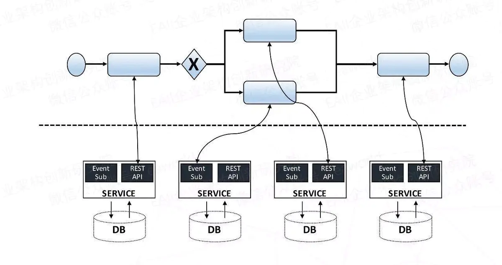
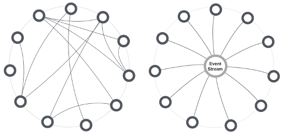
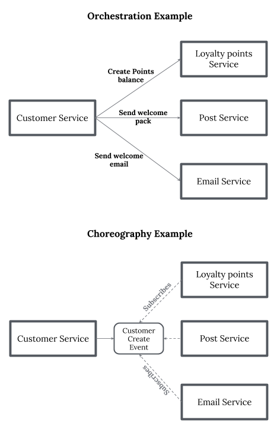
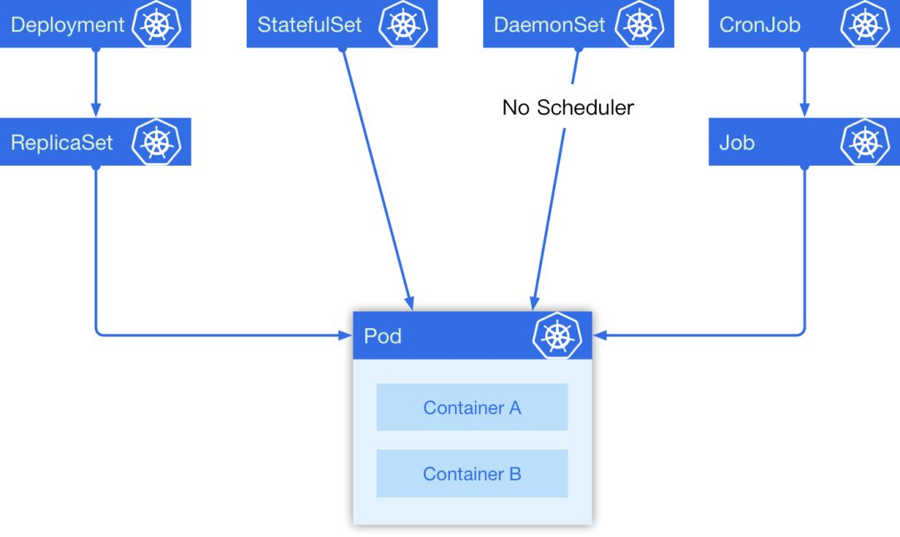
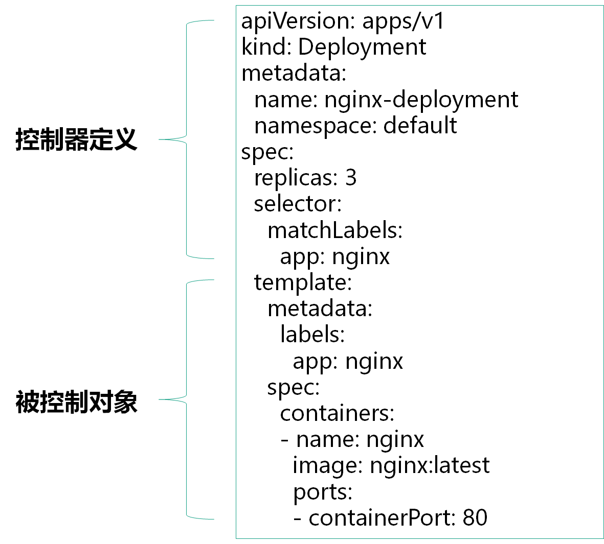

## 1 服务编排

### 1.1 服务编排

在微服务体系结构中，可以将应用分解为多个更小颗粒度的服务, 各个服务可以由不同的团队并行独立开发、部署。

当一个系统采用了微服务架构后，原有的业务可能并没有发生变化，但系统已被拆分成了很多新的微服务，与传统架构相比，微服务架构下会更依赖通过**各微服务之间的协作**来实现一个完整的业务流程，这种**协作**就是**服务编排**。

具体来说，**服务编排**指的是可以通过一个请求来依次调用多个微服务，并对每个服务的返回结果做数据处理，最终整合成一个大的结果返回给前端。

### 1.2 服务编排与容器编排

服务编排大多指的是不通过编程，在容器云平台通过配置、映射等方法来实现服务间的调用、组合，部署成为一个新的服务或应用的过程。

容器编排是根据规则对容器进行调度、配置、组合、部署、回收、迁移等，以提供应用部署、维护、拓展机制等功能。容器编排主要是K8S等容器编排调度框架要考虑的问题。

**目前大多是通过容器编排的方式来实现服务编排。**

## 2 微服务的编排方式

### 2.1 Orchestration 编制

**面向可执行的流程**：通过一个可执行的流程来协同内部及外部的服务交互，通过流程来控制总体的目标、涉及的操作、服务调用顺序。

有一个**流程控制服务**，该服务接收请求，依照业务逻辑规则，依次调用各个微服务，并最终完成处理逻辑。

**优点**：
 流程控制服务时时刻刻都知道每一笔业务究竟进行到了什么地步，监控业务成了相对简单的事情。
 **缺点**：
 1）流程控制服务很容易控制了太多的业务逻辑，耦合度过高，变得臃肿。
 2）各个微服务退化为单纯的增删改查，失去自身价值。

### 2.2 Choreography 编排

**面向合作**：通过消息的交互序列来控制各个部分资源的交互，参与交互的资源都是对等的，没有集中的控制

Choreography可以看作一种**消息驱动模式**，或者说是订阅发布模式，每笔业务到来后，各个监听该事件的服务，会主动获取消息，处理，并可以按需发布自己的消息。可以把不同队列看作不同种类的消息，微服务看作消息处理函数。

Choreography实现方案多是**异步**的。

优点： 自由，灵活，耦合度低，每个服务都可以各司其职
缺点：

* 难于调试。业务流程是通过订阅的方式来体现的，很难直接监控每笔业务的处理，因此难于调试。
* 无法保证流程正确性。由于没有预定义流程，所以很难在事前保证流程正确性，基本靠事后分析数据来判断。
* 维护困难。当一个业务流程会嵌入到多个服务中时，维护会很困难。

左图编制、右图编排：

两个单独的例子：

## 3 K8S 服务编排

### 3.1 K8S 编排背景

* 编排基础
  Kubernetes虽然提供了多种容器编排对象，例如Deployment, DaemonSet, Job等，还有多种基础资源封装例如ConfigMap、Secret、Serivce等，但是一个应用往往有多个服务，有的可能还要依赖持久化存储，这些服务之间直接互相依赖，需要有一定的组合的情况。

* 现状
  Kubernetes 已经为我们对大量常用的基础资源进行了抽象和封装，我们可以非常灵活地组合、使用这些资源来解决问题，同时它还提供了一系列自动化运维的机制:如 HPA, VPA, Rollback, Rolling Update 等帮助我们进行弹性伸缩和滚动更新，而且上述所有的功能都可以用 **YAML 声明式**进行部署。

* 编排工具使用背景
  但是这些还是在容器层面的，对于一个大型的应用而言，需要组合大量的 Kubernetes 原生资源，需要非常多的 Services, Deployments, StatefulSets 等，这里面用起来就会比较繁琐，而且其中服务之间的依赖关系需要用户自己解决，缺乏统一的依赖管理机制，所以就可能需要服务编排工具。

服务编排管理工具就是构建在kubernetes的基础[object](https://jimmysong.io/kubernetes-handbook/concepts/objects.html)之上，统筹各个服务之间的关系和依赖的。目前常用到的工具是 [Helm](https://github.com/helm/helm)。

### 3.2 K8S编排基础

在 Kubernetes 中有 5 种我们经常会用到的控制器来帮助我们进行容器编排，它们分别是 Deployment, StatefulSet, DaemonSet, CronJob, Job。

在这 5 种常见资源中，Deployment 经常被作为无状态实例控制器使用; StatefulSet 是一个有状态实例控制器; DaemonSet 可以指定在选定的 Node 上跑，每个 Node 上会跑一个副本，它有一个特点是它的 Pod 的调度不经过调度器，在 Pod 创建的时候就直接绑定 NodeName；最后一个是定时任务，它是一个上级控制器，和 Deployment 有些类似，当一个定时任务触发的时候，它会去创建一个 Job ，具体的任务实际上是由 Job 来负责执行的。

他们之间的关系如下图：

- 无状态应用 = Services + Volumes + Deployment
- 有状态应用 = Services + Volumes + StatefulSet
- 守护型应用 = Services + Volumes + DaemonSet
- 批处理应用 = Services + Volumes + CronJob/Job

### 3.3 YAML编排方式 - 自动化运维

YAML 是一种简洁的非标记语言。

在K8S部署一个应用的YAML内容大致分为两部分：

控制器定义：定义控制器属性

被控制对象：Pod模板，定义容器属性

一般情况下，沿用模板进行部署和编排（扩容等操作）即可，具有多种命令可以编写yaml文件。

### 3.4 编排工具——Helm

Helm 是 Kubernetes 的软件包管理工具。

Helm 由客户端组件 helm 和服务端组件 Tiller 组成, 能够将一组K8S资源打包统一管理, 是查找、共享和使用为Kubernetes构建的软件的最佳方式。

#### 3.4.1 Helm解决的问题

在 Kubernetes中部署一个可以使用的应用，需要涉及到很多的 Kubernetes 资源的共同协作。

Helm是一个用于kubernetes的包管理器。每个包称为一个Chart，一个Chart是一个目录（一般情况下会将目录进行打包压缩，形成name-version.tgz格式的单一文件，方便传输和存储）。

对于应用发布者而言，可以通过Helm打包应用，管理应用依赖关系，管理应用版本并发布应用到软件仓库。

对于使用者而言，使用Helm后不用需要了解Kubernetes的Yaml语法并编写应用部署文件，可以通过Helm下载并在kubernetes上安装需要的应用。

除此以外，Helm还提供了kubernetes上的软件部署，删除，升级，回滚应用的强大功能。

#### 3.4.2 Helm相关组件

Helm三个主要部件：Chart、Repoistory、Release

* Chart：为Kubernetes中应用程序所需要的资源的定义。所谓chart就是一系列文件, 它描述了一组相关的 k8s 集群资源
* Repoistory：Helm chart 的仓库，Helm 客户端通过 HTTP 协议来访问存储库中 chart 的索引文件和压缩包
* Release： Kubernetes中运行的chart实例，每个chart可多次安装，每次安装都是一个新版本；使用 helm install 命令在 Kubernetes 集群中部署的 Chart 称为 Release

Helm有两部分组成：Helm客户端、Tiller服务端

- Helm是一个命令行下的客户端工具。主要用于Kubernetes应用程序Chart的创建、打包、发布以及创建和管理本地和远程的Chart仓库。

- Tiller是Helm的服务端，部署在Kubernetes集群中，Tiller用于接受Helm的请求，并根据Chart生成Kubernetes的部署文件，然后提交给kubernetes创建应用。Tiller还提供了Release的升级、删除、回滚等一系列功能。

  

## Reference

https://www.jianshu.com/p/54e2e223dbac

https://baijiahao.baidu.com/s?id=1647990186917649762&wfr=spider&for=pc

https://cloud.tencent.com/developer/article/1080207

https://zhuanlan.zhihu.com/p/36062500

https://www.jianshu.com/p/4bd853a8068b

https://blog.csdn.net/weixin_45186298/article/details/104594539

http://www.docin.com/p-2133339881.html

