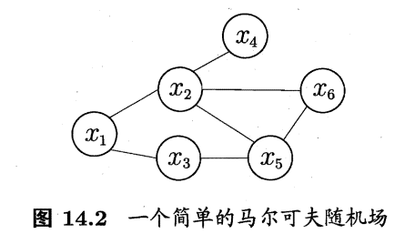
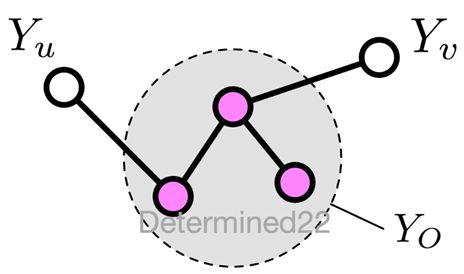
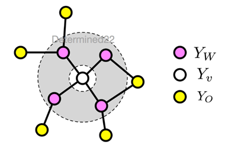
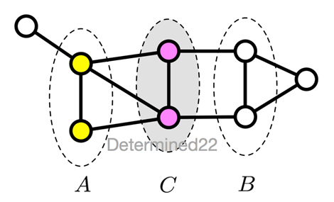
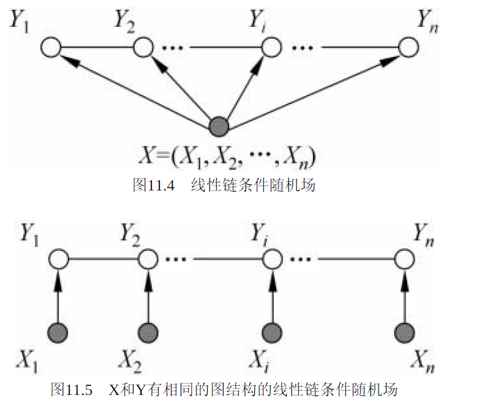

[TOC]

## 1 马尔可夫随机场MRF

马尔可夫随机场是典型的马尔可夫网，即一个无向图模型。

马尔可夫随机场表示的随机变量之间具有马尔可夫性

1. 成对马尔可夫性：给定Yo的条件下，Yu和Yv条件独立

2. 局部马尔可夫性

3. 全局马尔可夫性

 

## 2 条件随机场CRF

条件随机场是给定随机变量X，输出随机变量Y的马尔可夫随机场，一种判别式无向图模型。

CRF的特点是假设输出随机变量构成马尔可夫随机场。

 ## 3 条件随机场的参数化形式

设P(Y|X)为线性链条件随机场，则在随机变量X取值为x的条件下，随机变量Y取值为y的条件概率具有如下形式：
$$
\begin{aligned} P(y | x) &=\frac{1}{Z(x)} \exp \sum_{k=1}^{K} w_{k} f_{k}(y, x) \\ Z(x) &=\sum_{y} \exp \sum_{k=1}^{K} w_{k} f_{k}(y, x) \end{aligned}
$$
条件随机场定义条件概率的方式与隐马尔可夫模型类似，但是需要定义特征函数$f_k$

## 4 HMM与CRF的区别

 一个是生成模型，一个是判别模型

用于标注问题的生成模型 and 由输入对输出进行预测的判别模型

HMM是一个特殊的CRF，CRF是HMM的一般化的形式