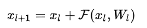
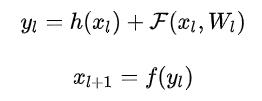
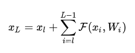
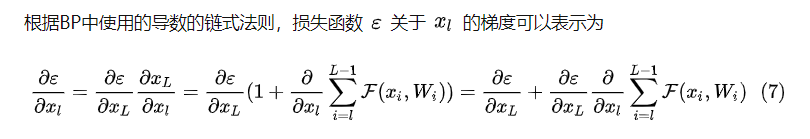

[TOC]

## 1 BERT

BERT论文：

《BERT: Pre-training of Deep Bidirectional Transformers for Language Understanding》

## 2 主要结构

### 2.1 输入

​		Encoder端每个大模块接收的输入是不一样的，第一个大模块(最底下的那个)接收的输入是输入序列的embedding，其余大模块接收的是其前一个大模块的输出，最后一个模块的输出作为整个Encoder端的输出。  

### 2.2 Transformer Encoder

​		Encoder部分有两个sub-layer，**Multi-Head Attention**和**Feed Forward**。上图的Add代表残差网络，由图可知在每个sub-layer都加入了残差项。其中的Norm是Layer Normalization。

​		Multi-Head Attention是Transformer Encoder的核心，主要是self Attention；Feed Forward是一个全连接前馈神经网络。

#### 2.21 Multi-Head Attention

​		

​		对于self-attention来讲，Q(Query), K(Key), V(Value)三个矩阵均来自同一输入。单个Multi-Head Attention层的输入进行处理得到QKV，通过线性变换输入到Scaled Dot-Product Attention，得到多组结果进行concat并加权后，作为Encoding后的结果。

​		整个过程的公式：
$$
\begin{aligned} \text { MultiHead }(Q, K, V) &\left.=\text { Concat (head }_{1}, \ldots, \text { head }_{\mathrm{h}}\right) W^{O} \\ \text { where head }_{\mathrm{i}} &=\text { Attention }\left(Q W_{i}^{Q}, K W_{i}^{K}, V W_{i}^{V}\right) \end{aligned}
$$
#### 2.22 Self-Attention

Q和K计算相似度，此处使用点积的方法；防止结果过大，除以${\sqrt{d_{k}}}$，其中${\sqrt{d_{k}}}$是K的维度；进行softmax归一化得到Q和K的Attention；Attention与V相乘，得到self-Attention的结果。

#### 2.23 Scaled Dot-Product Attention

​		Scaled Dot-Product Attention是Transformer较为重要的核心部分，整个过程：
$$
\text { Attention }(Q, K, V)=\operatorname{softmax}\left(\frac{Q K^{T}}{\sqrt{d_{k}}}\right) V
$$

1. Q和K计算相似度，此处使用点积的方法；
2. 防止结果过大，除以${\sqrt{d_{k}}}$，其中${d_{k}}$是K的维度；（内积太大的话softmax后就非0即1了,不够“soft”了）（为什么除以${\sqrt{d_{k}}}$: 让qk的方差与dk无关，从${d_{k}}$变为1，参考：https://blog.csdn.net/qq_37430422/article/details/105042303）
3. 经过一个Mask操作； Q，K长度是不定时，进行补齐操作，将补齐的数据设置为负无穷
4. 进行softmax归一化得到Q和K的Attention；
5. Attention与V相乘，得到self-Attention的结果。

​		这里的QKV论文里没有详细展开，现有的博客文章很少提到，本文引用的第二篇博客中有段话写的很好。Attention机制中，将Source中看做是由一系列的(Key,Value)对构成，此时给定某元素Query，计算Query和各个Key的相关性，得到每个Key对应Value的权重系数，然后对Value进行加权求和，即得到了最终的Attention数值。所以本质上Attention机制是对Source中元素的Value值进行加权求和，而Query和Key用来计算对应Value的权重系数。

​		而对于本文的self-Attention来说，key、value和query都是其本身，也就是上一层的输出，作为下一层的输入。

#### 2.4 残差

**残差是啥？**

一般表示：

通用表示：

h一般是直接映射，f一般是relu这种激活函数。

**残差有啥好处？**

1. 不会出现梯度消失
2. 第L层的梯度可以传到任何一个浅层。
3. 意义：能够很好的消除 层数加深所带来的信息损失问题，信息可以非常畅通的在高层和低层之间相互传导

第L层和第l层的关系就是，L层可以表示为任意一个比它浅的l层和他们之间的残差部分之和。

ps: 如果两层的shape不一样，例如feature_map数量不一样，就需要使用诸如1×1卷积来升维或降维。

### 2.3 Position-wise Feed-Forward Networks

​		除了Attention子层之外，其他子层都包含了一个全连接的前馈网络。包括两个线性变换，中间有一个ReLU：
$$
\mathrm{FFN}(x)=\max \left(0, x W_{1}+b_{1}\right) W_{2}+b_{2}
$$

### 

## 3 Forward过程整理

BERT-Forward

* 输入：[batch_size, seq_len]
* Embedding层：[batch_size, seq_len] -> [batch_size, seq_len, hidden_size]
* Multi-head Attention: [batch_size, seq_len, hidden_size] ->  [batch_size, seq_len, hidden_size]
  * 计算QKV: [batch_size, seq_len, hidden_size] -> [batch_size, seq_len, hidden_size/num_head] 
  * 计算A并缩放+softmax:  [batch_size, seq_len, hidden_size/num_head] -> [batch_size, seq_length, seq_length]
  * 计算单头：[batch_size, seq_len, hidden_size/num_head] 
  * 合并多头：[batch_size, seq_len, hidden_size] 
  * 再过一个非线性层：[batch_size, seq_len, hidden_size] 
* Feed Forward: [batch_size, seq_len, hidden_size] ->  [batch_size, seq_len, hidden_size]

NSP：  [batch_size, 1, hidden_size] ->  [batch_size, hidden_size] ->  [batch_size, 2]

MLM: 

* 全连接：[batch_size, seq_len, hidden_size] -> [batch_size, seq_len, hidden_size] 
* embedding矩阵转置的映射：[batch_size, seq_len, hidden_size] -> [batch_size, seq_len, vocab_size]
* 计算概率： [batch_size, seq_len, vocab_size] -> [batch_size, seq_len, vocab_size]

## 4 参数量计算

base模型：

（30522+512 + 2）* 768 +  12 * （768 *（768 / 12） * 3 * 12   + 768 *  768 + 768 * 3072 * 2 ） =  23,835,648 + 84,934,656 =  108,770,304

large模型：

（30522+512 + 2）* 1024 +  24 * （1024 *（1024 / 16） * 3 * 16   + 1024 *  1024  + 1024 * 3072 * 2 ） = 31,780,864 + 24 * （3,145,728 + 1,048,576 + 6,291,456）= 31,780,864 +  251,658,240 = 283,439,104  ？？？

### 4.1 Embedding参数

[seq_len] -> [seq_len, hidden_size]

词向量包括三个部分的编码：vocab向量参数，position_id向量参数，segment_id参数

Bert采用：

* vocab_size=30522
* hidden_size=768
* max_position_embeddings=512
* token_type_embeddings=2

embedding参数 = （30522+512 + 2）* 768 = 23,835,648

### 4.2 Encoder参数

[seq_len, hidden_size] -> [seq_len, hidden_size]

1. Multi-heads1: 计算QKV:  768 * （768 / 12）* 3 * 12  * 12
2. Multi-heads2: concat后还有个非线性层:  768 *  768 * 12
3. FeedForward: 两层relu连接的前馈： 768 * 3072 * 2  * 12

12层一共有：（768 *（768 / 12） * 3 * 12  + 768 *  768 + 768 * 3072 * 2 ） * 12 = （1,769,472 +  589,824 + 4,718,592）*12 = 7,077,888 * 12 = 84,934,656

## 5 常见问题总结

## Reference

https://blog.csdn.net/weixin_43922901/article/details/102602557

http://www.sniper97.cn/index.php/note/deep-learning/note-deep-learning/3810/

