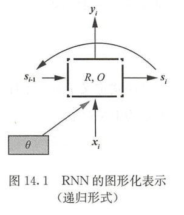
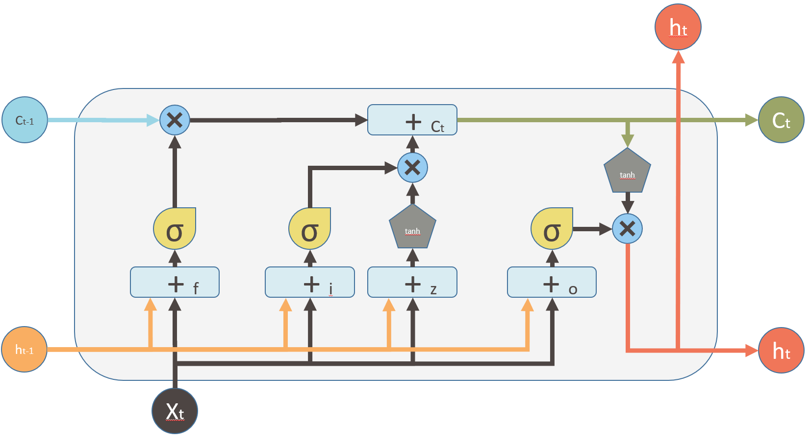
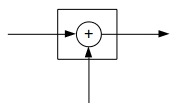
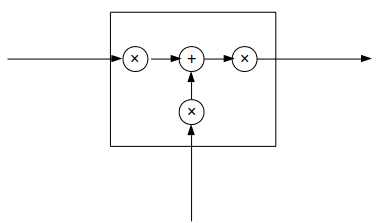
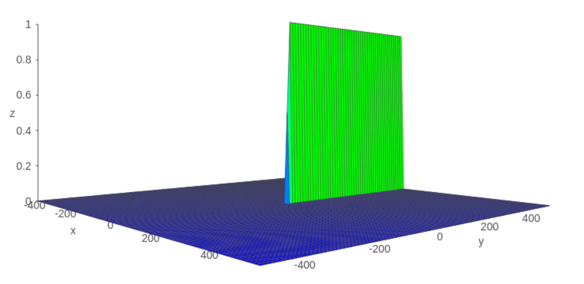

[TOC]

## 1 CNN

卷积神经网络：是一种专门用来处理具有类似网格结构数据的神经网络。

### 1.1 卷积神经网络结构

| CNN层次结构 | 作用                                                         |
| ----------- | ------------------------------------------------------------ |
| 输入层      | 卷积网络的**原始输入**，可以是原始或预处理后的像素矩阵       |
| 卷积层      | 参数共享、局部连接，利用平移不变性**从全局特征图提取局部特征** |
| 激活层      | 将卷积层的输出结果进行**非线性映射**，首选 Relu              |
| 池，化层    | **进一步筛选特征**，可以有效**减少**后续网络层次所需的**参数量** |
| 全连接层    | 用于把该层之前提取到的**特征综合起来**。                     |


### 1.2 卷积层的内容


原理上其实是对两个矩阵进行**点乘求和**的数学操作

**参数**：

*  width：卷积核的尺寸       
  
* stride：步长

* padding：填充

* channel：通道数，包括输入和输出通道数

* **单一维度尺寸计算公式**：
  $$
  \text {output}=\left\lfloor\frac{(\text {input}-\text {width}+2 * \text {pad})}{\text {stride}}\right\rfloor+ 1
  $$


对文本做卷积的例子：

```
class CNN(nn.Module):
    def __init__(self, num_keynel, kernel_width, embedd_size):
        super(CNN, self).__init__()
        self.conv = nn.Conv2d(in_channels=1, out_channels=num_keynel, kernel_size=[kernel_width, embedd_size], stride=1 ,padding=[1, 0])
    def forward(self, input):
        return self.conv(input)

if __name__ == '__main__':
    x = torch.rand(3, 20, 200) # [batch_size, seq_length, embedd_size]
    model = CNN(num_keynel=50, kernel_width=3, embedd_size=200)

    y = model(x.unsqueeze(1))  # [batch_size, 50, seq_length, 1]
    y = F.tanh(y.squeeze(3)) # [batch_size, 50, seq_length]
    y = F.avg_pool1d(y, kernel_size=20, padding=0, stride=1) # [batch_size, 50, 1]
    y = y.squeeze(2) # [batch_size, 50]
```


### 1.3 常见问题

* 卷积和池化的区别

|        |                 卷积层                 |              池化层              |
| :----: | :------------------------------------: | :------------------------------: |
|  结构  |   零填充时输出维度不变，而通道数改变   |    输出维度会降低，通道数不变    |
| 稳定性 | 输入特征发生细微改变时，输出结果会改变 | 感受域内的细微变化不影响输出结果 |
|  作用  |        感受域内提取局部关联特征        |  感受域内提取泛化特征，降低维度  |
| 参数量 |      与卷积核尺寸、卷积核个数相关      |          不引入额外参数          |

* 为什么需要padding
  1. 防止图像变小
  2. 防止边缘像素点关注过少

* 为什么卷积核都是奇数尺寸

  1. 保证像素点中心位置，避免位置信息偏移
  2. 填充边缘时能保证两边都能填充，原矩阵依然对称

* CNN的特性有哪些作用

  1. 稀疏交互：卷积核尺度远小于输入的尺度。每个输出神经网络仅与前一层神经元存在连接权重

  > - 提高模型的统计效率：原本一幅图像只能提供少量特征，现在每一块像素区域都可以提供一部分特征
  > - 使得参数大量减少，优化的时间复杂度也会减小几个数量级，过拟合情况也得到改善。 
  > - 稀疏交互的意义在于，**先从局部的特征入手，再将局部特征组合起来形成更复杂和抽象的特征**。

  2. 参数共享：参数共享指的是**同一个模型的不同模块中使用相同的参数**。参数共享的意义在于使得卷积层具有**平移等特性**。

  > - 权重共享一定程度上能增强参数之间的联系，获得更好的**共性特征**。
  > - 很大程度上降低了网络的参数，**节省计算量和计算所需内存**。
  > - 权重共享能起到**很好正则的作用**。正则化的目的是为了降低模型复杂度，防止过拟合，而权重共享则正好降低了模型的参数和复杂度。

  3. 平移不变性：（局部）平移不变性是一个很有用的性质，尤其是当我们关心某个特征**是否出现**而不关心它出现的具体位置时。平移不变性是由于参数共享 和池化 所带来的。

* CNN有什么不足
  1. 信息损失问题
  2. 忽略了位置信息
* 1乘1卷积核的作用
  1. 特征图大小不变，但是通道数可以改变，减小参数量
  2. 增加非线性，后面有激活函数
  3. 可以用于实现跨通道的信息交互，例如这一层有1乘1卷积核和3乘3卷积核同时存在


## 2 RNN

循环神经网络（Recurrent Neural Network）是一种递归神经网络（Recursive Neural Network）。

其以序列数据为输入，在序列的演进方向进行递归且所有节点按链式连接的。**将序列输入翻译成定长向量**



R、O决定网络类型，普通的RNN中：
$$
s_i=tanh(W_xx_i+W_ss_{i-1}+b)
\\y_i=W_ys_i+b
$$


## 3 LSTM	

* LSTM解决的问题：
  1. 梯度消失，使得 RNN 很难有效地训练 。
  2. RNN 难以捕捉到长距离依赖信息。

* LSTM的构成：输入门 i、遗忘门 f、输出门 o

$$
\begin{aligned} c_{j} &=f \odot c_{j-1}+i \odot z \\ h_{j} &=o \odot \tanh \left(c_{j}\right) \\ i &=\sigma\left(x_{j} W^{x i}+h_{j-1} W^{h i}+b_i\right) \\ f &=\sigma\left(x_{j} W^{x f}+h_{j-1} W^{h f}+b_f\right) \\ o &=\sigma\left(x_{j} W^{x o}+h_{j-1} W^{h o}+b_o\right) \\ z &=\tanh \left(x_{j} W^{x z}+h_{j-1} W^{x z}+b_z\right)  \end{aligned}
$$

- - **时刻 j 的状态**：两个向量组成：**记忆状态$c_j$ 和 隐藏状态$h_j$**
  - **记忆状态$c_j$ ：**由经过遗忘门的上一个记忆状态$c_{j-1}$ 和经过输入门的更新候选项$z$
  - **更新候选项$z$：**由当前输入$x_j$和前一个状态 $h_{j-1}$ 加一个tanh决定
  - **输入门 i、遗忘门 f、输出门 o：**门的值由当前输入$x_j$和前一个状态 $h_{j-1}$ 加一个sigmoid决定
- LSTM的hidden和cell存储的信息是什么？
  hidden存储到当前时间步的所有信息，cell存储将来的时间步中可能需要的特定信息。




## 4 LSTM如何解决RNN梯度消失问题

### 4.1 RNN为什么会出现梯度消失问题

RNN单元有三个w参数矩阵，分别控制输入$x_i$，上一个状态$S_{i-1}$，以及输出$y_i$
$$
S_i=tanh(W_xx_i+W_ss_{i-1}+b)
\\O_i=W_ys_i+b
$$

* 前向传播过程（假设序列长度为3：）

$$
\begin{array}{l}{S_{1}=W_{x} X_{1}+W_{s} S_{0}+b_{1}} \\ {S_{2}=W_{x} X_{2}+W_{s} S_{1}+b_{1}} \\ {S_{3}=W_{x} X_{3}+W_{s} S_{2}+b_{1} \\  O_{3}=W_{o} S_{3}+b_{2}}\end{array}
$$

* 反向传播（假设损失为$L_3$）

$$
\begin{array}{l}{\frac{\partial L_{3}}{\partial W_{0}}=\frac{\partial L_{3}}{\partial O_{3}} \frac{\partial O_{3}}{\partial W_{o}}} \\ {\frac{\partial L_{3}}{\partial W_{x}}=\frac{\partial L_{3}}{\partial O_{3}} \frac{\partial O_{3}}{\partial S_{3}} \frac{\partial S_{3}}{\partial W_{x}}+\frac{\partial L_{3}}{\partial O_{3}} \frac{\partial O_{3}}{\partial S_{3}} \frac{\partial S_{3}}{\partial S_{2}} \frac{\partial S_{2}}{\partial W_{x}}+\frac{\partial L_{3}}{\partial O_{3}} \frac{\partial O_{3}}{\partial S_{3}} \frac{\partial S_{3}}{\partial S_{2}} \frac{\partial S_{2}}{\partial S_{1}} \frac{\partial S_{1}}{\partial W_{x}}} \\ {\frac{\partial L_{3}}{\partial W_{s}}=\frac{\partial L_{3}}{\partial O_{3}} \frac{\partial O_{3}}{\partial S_{3}} \frac{\partial S_{3}}{\partial W_{s}}+\frac{\partial L_{3}}{\partial O_{3}} \frac{\partial O_{3}}{\partial S_{3}} \frac{\partial S_{3}}{\partial S_{2}} \frac{\partial S_{2}}{\partial W_{s}}+\frac{\partial L_{3}}{\partial O_{3}} \frac{\partial O_{3}}{\partial S_{3}} \frac{\partial S_{3}}{\partial S_{2}} \frac{\partial S_{2}}{\partial S_{1}} \frac{\partial S_{1}}{\partial W_{s}}}\end{array}
$$

* 任意时刻对$w_s,w_x$的偏导为：

$$
\frac{\partial L_{t}}{\partial W_{x}}=\sum_{k=0}^{t} \frac{\partial L_{t}}{\partial O_{t}} \frac{\partial O_{t}}{\partial S_{t}}\left(\prod_{j=k+1}^{t} \frac{\partial S_{j}}{\partial S_{j-1}}\right) \frac{\partial S_{k}}{\partial W_{x}}
$$

* 由于tanh的累乘极限为0，则序列较长时梯度消失出现


#### 4.2 LSTM是怎么解决的

LSTM与RNN本质是相同的，其公式为：
$$
\begin{aligned} c_{j} &=f \odot c_{j-1}+i \odot z \\ h_{j} &=o \odot \tanh \left(c_{j}\right) \\ i &=\sigma\left(x_{j} W^{x i}+h_{j-1} W^{h i}+b_i\right) \\ f &=\sigma\left(x_{j} W^{x f}+h_{j-1} W^{h f}+b_f\right) \\ o &=\sigma\left(x_{j} W^{x o}+h_{j-1} W^{h o}+b_o\right) \\ z &=\tanh \left(x_{j} W^{x z}+h_{j-1} W^{x z}+b_z\right)  \end{aligned}
$$
RNN，LSTM可以抽象为下图：





根据其思想，其本质上是：
$$
s_j=tanh(f \odot s_{j-1} + i \odot x)
$$
其反向传播公式也是如同RNN的形式，限制其梯度消失的因素中：
$$
\prod_{j=k+1}^{t} \frac{\partial S_{j}}{\partial S_{j-1}}  = \prod_{j=k+1}^{t} tanh'\sigma(y)
$$
LSTM与RNN区别就在于tanh变成了$$tanh'\sigma(x)$$，他的图像如下，大部分的数值要么0要么1：



则反向传播的结果中，相当于一部分保留一部分消失。

**即解决的本质上是：RNN中导致梯度消失的项替换为0或1，使多项式一部分消失一部分保留**


## 5 GRU

GRU是一种LSTM的替代方案。

GRU 也基于门机制，但是总体上使用了更少的门并且网络不再额外给出记忆状态


$$
\begin{aligned} s_{j}=R_{\mathrm{GRU}}\left(s_{j-1}, x_{j}\right) &=(1-z) \odot x_{j-1}+z \odot \tilde{s_{j}} \\ z &=\sigma\left(x_{j} W^{xz}+s_{j-1} W^{s z}\right) \\ r &=\sigma\left(x_{j} W^{xr}+s_{j-1} W^{s r}\right) \\ \tilde{s_{j}} &=\tanh \left(x_{j} W^{x_{j}}+\left(r \odot s_{j-1}\right) W^{xg}\right) \\ y_{j}=O_{\mathrm{GRU}}\left(s_{j}\right) &=s_{j} \end{aligned}
$$

- * 更新门z：由前一时刻的状态和输入决定
  * 重置门r：由前一时刻的状态和输入决定

- - s_j~ ：由重置门r、输入、前一个状态决定
  - 当前状态s_j：由更新门、输入、s_j~决定


LSTM 中的输入与遗忘门对应于 GRU 的更新门，重置门直接作用于前面的隐藏状态。


因为目前为止并没有一个很普适一致的观点，来说明到底那一个更好，哪一个在哪方面更加适用。

GRU，简单有效 ，效率更高

LSTM，灵活，复杂导致过拟合风险高


## Reference

《统计学习方法》

《深度学习》 （花书）

https://github.com/NLP-LOVE/ML-NLP
https://github.com/htfhxx/NLPer-Interview
https://www.cnblogs.com/jins-note/p/10853788.html
https://zhuanlan.zhihu.com/p/44163528

https://pytorch.org/docs/stable/generated/torch.nn.Conv2d.html?highlight=nn%20conv2d#torch.nn.Conv2d

