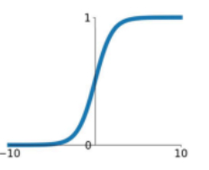
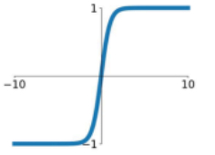
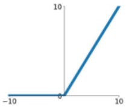

[TOC]

# 1 激活函数

### 1.1 为什么需要激活函数

如果不使用非线性激活函数，那么每一层输出都是上层输入的**线性组合**

此时无论网络有多少层，其整体也将是线性的


### 1.2 常用的激活函数

#### 1.2.1 sigmoid


$$
\begin{aligned} a &=g(x)=\frac{1}{1+e^{-x}} \\ g(x)^{\prime} &=\frac{d}{d x} g(z)=\alpha(1-\alpha) \end{aligned}
$$

缺点：

1. 梯度消失和梯度爆炸
   如果我们初始化神经网络的权值为[0,1]之间的随机数，由反向传播算法的数学推导可以知道，梯度从后向前传播时，每传递一层梯度值都会下降为原来原来的0.25倍，如果神经网络层比较多是时，那么梯度会穿过多层之后变得接近于0，也就出现梯度消失问题，当权值初始化为 [1,+]期间内的值时，则会出现梯度爆炸问题；

2. 非0均值
   后果：会导致后一层的神经元将得到上一层输出的非0均值的信号作为输入。 产生的一个结果就是：x>0, f=wTx+b那么对w求局部梯度则都为正，这样在反向传播的过程中w要么都往正方向更新，要么都往负方向更新，导致有一种捆绑的效果；

#### 1.2.2 tanh(双曲正切)



相当于sigmoid向下平移和伸缩变形
$$
\begin{array}{l}{a=g(x)=\tanh (x)=\frac{e^{x}-e^{-x}}{e^{x}+e^{-x}}} \\ {g(x)^{\prime}=\frac{d}{d z} g(x)=1-(\tanh (x))^{2}}\end{array}
$$

解决 sigmoid 非0均值问题

弊端：梯度消失梯度爆炸、幂函数计算慢

#### 1.2.3 Relu



- 一定程度上缓解了梯度问题：其导数始终为一个常数
- **计算速度非常快：** 求导不涉及浮点运算，所以速度更快
- **减缓过拟合：** `ReLU` 在负半区的输出为 0，不会产生梯度/不会被训练，造成了网络的稀疏性——**稀疏激活**， 这有助于减少参数的相互依赖，缓解过拟合问题的发生

解决梯度消失问题、计算速度快

弊端：dead relu problem 有些神经元参数永远不会更新

#### 1.2.4 softmax

softmax将所有的输入归一化，多用于多分类问题
$$
P(i) = \frac{e^{a_i}}{\sum_{k=1}^T e^{a_k}} \in [0,1]
$$
softmax的损失：
$$
L = - \sum_{j=1}^T y_j \, log \, s_j
$$


### 1.3 如何选择激活函数

- 经验：如果是二分类0-1的问题：sigmoid，其余选Relu
- 一般隐层采用Relu， 有时也要试试 tanh


### 1.4 常见问题

为何 tanh 比 sigmoid 收敛快？导数值域大
$$
tanh^{'}(x)=1-tanh(x)^{2}\in (0,1) \\
sigmoid^{'}(x)=sigmoid(x)*(1-sigmoid(x))\in (0,\frac{1}{4}]
$$


# 2. 损失函数

## 2.1 常见的损失函数

### 0-1损失

0-1损失是指预测值和目标值不相等为1， 否则为0:


### 绝对值损失

绝对值损失函数是计算预测值与目标值的差的绝对值：


### 平方损失函数


### **log对数损失函数**


### Hinge 损失函数


### 交叉熵损失(Cross-entropy)

交叉熵损失应该算作是log损失的一个特例

二分类的情况：


```
 Y and P are lists of labels and estimations
 loss = -np.sum(Y * np.log(P) + (1 - Y) * np.log(1 - P)) / len(Y)
```

多分类的情况：


## 2.2 常问问题

**交叉熵函数与最大似然函数的联系和区别**

交叉熵函数可以由最大似然函数在**伯努利分布**的条件下推导出来

最小化交叉熵函数的本质就是对数似然函数的最大化。


**二分类为什么用交叉熵，而不用均方误差**

二分类大多用sigmoid，大部分值趋近于0或1，导致均方误差的结果小，更新慢


# 3. 评估指标


## 3.1 分类模型

### 二分类、多分类

- 二分类
  - Accuracy
  - F1
  - AUC，单开一节说

- 多分类
  - micro-F1 
    - 将N分类看作N个二分类，计算所有分类的TP/FP/TN/FN，相加得到最终的TP/FP/TN/FN
    - 根据最终的TP/FP/TN/FN，计算precision、recall、f1
  - macro（n分类拆成n个二分类，求各个类别的f1平均值）
    - 将N分类看作N个二分类，计算所有分类的TP/FP/TN/FN，得到每个类别的P值/R值/F1值
    - 取平均后得到的P值/R值/F1值，就是Macro的P值/R值/F1值
  - weighted-F1
    - 将N分类看作N个二分类，计算所有分类的TP/FP/TN/FN，得到每个类别的P值/R值/F1值
    - 计算每个类别的样本数量（按照真实值），作为权重
    - 加权求和后得到的P值/R值/F1值，就是weighted的P值/R值/F1值


### * AUC

对于二分类任务，单个样本的正样本概率为P，划定阈值可得预测标签

**混淆矩阵**


True Positive Rate（真阳率）、False Positive（伪阳率）：


**ROC曲线**：y = TP-rate和x = FP-rate的曲线

ROC曲线是通过**遍历所有阈值**来绘制整条曲线的，例如：


随着阈值的降低，更多的样本被预测为正样本，TP↑，FP↑，TN↓，FN↓。

当阈值越来越小，导致所有样本都预测为正样本时，TP-rate和FP-rate都为1.


**AUC**同时考虑了分类器对于正例和负例的分类能力，在样本不平衡的情况下，依然能够对分类器作出合理的评价。

通俗的讲，AUC值是指模型将正样本排列在负样本之上的概率：


相当于卡一个阈值，阈值右边全都预测为正，阈值左边全都预测为负，随着阈值的降低，RUC升高的越快，说明正样本排列的越靠右，效果就越好。

```
labels = np.array([1,1,1,1,1,0,0,0,0,0])
preds = np.array([0.9, 0.4, 0.7, 0.6, 0.5,  0.4, 0.3, 0.2, 0.6, 0.1])
# 根据预测概率值排名后的样本真实值： [1,1,1,0,1,0,1,0,0,0]
# AUC = 22/25 = 0.88
```


优点：

- AUC不需要手动设定阈值，是一种整体上的衡量方法。
- AUC对正负样本均衡并不敏感，在样本不均衡的情况下，也可以做出合理的评估。
- AUC衡量的是一种排序能力，因此特别适合排序类业务；

缺点：

- 忽略了预测的概率值和模型的拟合程度；
- AUC反应了太过笼统的信息。无法反应召回率、精确率等在实际业务中经常关心的指标；
- 它没有给出模型误差的空间分布信息，AUC只关注正负样本之间的排序，并不关心正样本内部，或者负样本内部的排序，这样我们也无法衡量样本对于好坏客户的好坏程度的刻画能力；


**具体计算方法**

1. 计算ROC曲线下的面积。可以近似计算ROC曲线一个个小梯形的面积。比较直接的一种方法，但几乎不会用
2. 从AUC统计意义去计算。
   1. 所有的正负样本对中，正样本排在负样本前的pair对数 所占 全部正负样本对（M\*N）的比例
   2. 随机的一个正样本排在随机的一个负样本前面的概率，即这个概率值。


```
# 不排序，直接对比分数对pair对计数
def calcu_auc2(labels, preds):
    pos_dix = [i for i in range(len(labels)) if labels[i] == 1]
    neg_dix = [i for i in range(len(labels)) if labels[i] == 0]
    auc = 0
    for i in pos_dix:
        for j in neg_dix:
            if preds[i] > preds[j]:
                auc += 1
            elif preds[i] == preds[j]:
                auc += 0.5
    return auc / (len(pos_dix) * len(neg_dix))


# 先排序，再计算数量。没有考虑相等的预测值的排序带来的影响
def calcu_auc3(labels, preds):
    sorted_turple = sorted(zip(preds, labels), key=lambda x: x[0])
    s = 0
    total_true = sum(labels)
    total_false = len(labels) - sum(labels)
    false_cnt = 0
    for i in sorted_turple:
        if i[1]:
            s += false_cnt
        else:
            false_cnt += 1
    return s / (total_true * total_false)

if __name__ == '__main__':
    labels = np.array([1,1,1,1,1,0,0,0,0,0])
    preds = np.array([0.9, 0.4, 0.7, 0.6, 0.5,    0.4, 0.3, 0.2, 0.6, 0.1])
    # 根据预测概率值排名后的样本真实值： [1,1,1,0,1,0,1,0,0,0]

    print("AUC score of sklearn:",roc_auc_score(labels, preds))
    print("AUC score of calcu_auc2:", calcu_auc2(labels, preds))
    print("AUC score of calcu_auc3:", calcu_auc3(labels, preds))
```


### 多标签分类

和多分类一致的，只不过时有的样本被多次计算了（在计算N个类别时）

* micro-F1 
* macro-F1 
* weighted-F1 

 

### 回归模型评估


| 指标                     | 描述         | metrics方法                                     |
| ------------------------ | ------------ | ----------------------------------------------- |
| Mean Absolute Error(MAE) | 平均绝对误差 | from sklearn.metrics import mean_absolute_error |
| Mean Square Error(MSE)   | 均方误差     | from sklearn.metrics import mean_squared_error  |
| R-Squared                | R决定系数    | from sklearn.metrics import r2_score            |


平均绝对误差：预测值与真实值之间平均差


均方误差：预测值与真实值之间差的平方和 的平均值


R决定系数：预测数据和原始数据的差的平方和 与 原始数据的离散程度的比值


## 3.2 文本生成

### 准确度：BLEU

BLEU（Bilingual Evaluation Understudy），总体思想就是N-gram的准确率

给定标准译文reference，模型生成的句子是candidate（长度N）：那么candidate中有m个字符出现在reference，m/N就是bleu的1-gram的计算公式：


通俗解释：


举个例⼦，假设标签序列为A、B、C、D、E、F，预测序列为A、B、B、C、D，那么：

预测序列一元词组：A/B/C/D，都在标签序列里存在，所以P1=4/5，以此类推，p2 = 3/4, p3 = 1/3, p4 = 0。


短句子、残缺的准确句子的BLEU分数会偏高，因此引入长度惩罚因子


Wn一般是均匀权重


### 准确度：Rouge

Rouge（Recall-Oriented Understudy for Gisting Evaluation）

可以看做是BLEU 的改进版，专注于**召回率而非精度**。

- ROUGE-N （将BLEU的精确率优化为召回率） 
  

- ROUGE-L （将BLEU的n-gram优化为公共子序列）
  

  

 C: a cat is on the table

 S1: there is a cat on the table

例子的 ROUGE-1 和 ROUGE-2 分数如下：


### 多样性：Dist

去重后的N-gram

与

全部的N-gram

的数量比例

### 流畅度：困惑度

用一个语言模型来评估句子的概率：


### 其他

- METEOR  需要wordnet

- CIDEr   参考句与评测句的TFIDF向量余弦值

- 人工评测

- - Coherence
  - Informativeness
  - Fluency


# Reference

https://zhuanlan.zhihu.com/p/58883095

https://zhuanlan.zhihu.com/p/223048748

https://www.cnblogs.com/by-dream/p/7679284.html

https://blog.csdn.net/shawroad88/article/details/105639148

https://blog.csdn.net/sinat_16388393/article/details/91427631

https://www.zhihu.com/question/39840928

https://zhuanlan.zhihu.com/p/360765777