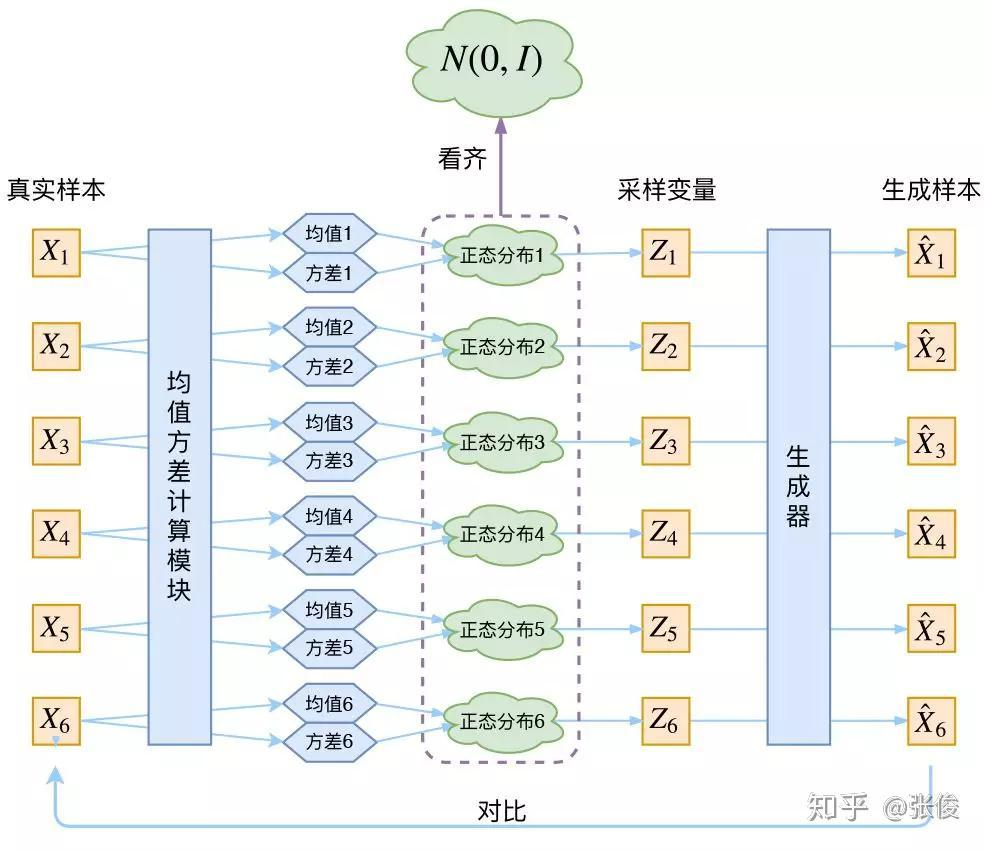
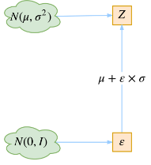

VAE的论文光看摘要就看的脑壳痛，网上很多关于VAE的资料都花里胡哨的，讲的特别乱。一是任务定义和模型的目的都没讲清楚就开始balabala了，二是只乱堆公式让人一头雾水，我来整理一下吧。（真是脑壳痛）

有部分词句是从文末的引用摘过来的，侵删~

## 1. 自编码器 (Auto-Encoder)

想搞明白VAE是啥，得先知道Auto-Encoder是啥。

自编码器（Auto-Encoder），就是一种利用反向传播算法使得输出值等于输入值的神经网络。

它现将输入压缩成潜在空间表征，然后将这种表征重构为输出。Auto-Encoder的目的在于训练一个神经网络，用于信号降维，同时降维之后的信号能够很好地重建原信号。Auto-Encoder的核心价值就在于这种经编码器压缩后的潜在空间表征，以此为基础开展一些工作。

AE可以只能做到input=output，但是无法生成额外的类似input的其他数据。

VAE的流程与Auto-Encoder一样，都是重构文本。但目的不一样，VAE想要得到样本的概率分布，生成所有其他可能的样本。

## 2. VAE(Auto-Encoding Variational Bayes)

### 2.1 VAE的目的与假设

有一批数据样本$X:\{X_1,…,X_n\}$，我们想要得到 $p(X)$ 的概率分布，对$p(X)$进行采样从而生成所有样本。

但是$p(X)$很难直接得到，因此我们退而求其次，对于每一个$X_i$，我们假设有一个专属于$X_i$的分布$P(Z_i|X_i)$，如果能得到这个分布$P(Z_i|X_i)$，然后从中采样出来的$Z_i$还原为$X$，也能达到我们的目的。

对于这些分布$P(Z_i|X_i)$，我们假设其为正态分布，那么求得这个分布就是求得正态分布的均值和方差，采样就是从这个正态分布中随机采样。

那么VAE就很明确了，第一部分是通过样本求得样本对应的正态分布，第二部分是通过正态分布中采样得到的$Z_i$，求得生成样本。

如果使用深度学习，那么我们需要拟合两个模型，第一部分是可以得到$P(Z|X_i)$的$f_1(X_i)$，目标函数是让求得的Z所属的分布接近一个正态分布；第二部分是$g(X_i'|Z)$，目标函数是生成的样本与真实样本之间的“距离”。

### 2.2 得到正态分布与隐含变量

1. 假设$$p(Z|X_i)$$是正态分布时，这时候对应每一个 $X_i$都配上了一个对应的正态分布。

2. 构建两个神经网络去得到他们具体的分布，$μ_i=f_1(X_i)$，$log{σ_i^2}=f_2(X_i) $，求得均值和方差，即求得了要采样出$Z_k$的分布。

3. 采样是不可导的，解决办法就是模拟采样的结果。采样一个服从$N(\mu,\sigma^2)$分布的$Z_i$ ，相当与从标准正态分布中采样的结果通过参数变换（均值和方差变换）得到。这就是原论文里提到的重参数技巧。

   

### 2.3 重构样本过程的学习

1. 得到$Z_i$的采样结果后，再经过一个生成模型$X_i^{+}=g(Z_i)$，这个生成模型的主要损失函数是最小化$X_i'$与$X_i$的差别
2. 最后将$Z_k$的分布$N(\mu,\sigma^2)$ 趋近标准正态分布，方法是在原损失函数中加入了额外的loss项，两个分布的KL散度。

最终的损失函数：

​														$$\mathcal{L}(x, \hat{x})+\sum_{j} K L\left(p(z | x) \| N(0 , 1)\right)$$		

在重构过程中，从正态分布采集样本（而不使用固定的样本）的策略是作为噪声，赋予生成结果一定的随机性。然后让$p(Z|X)$逼近标准正态分布，防止了噪声为0。

如果所有的$p(Z|X)$都接近正态分布的话，$p(Z)$也是接近正态分布的：

​						$$p(Z)=\sum_{X} p(Z | X) p(X)=\sum_{X} \mathcal{N}(0, I) p(X)=\mathcal{N}(0, I) \sum_{X} p(X)=\mathcal{N}(0, I)$$

这样就可以放心的通过标准正态分布的采样，去生成。

## 3. CVAE(Conditional Auto-Encoding Variational Bayes)

## Reference

https://arxiv.org/pdf/1312.6114.pdf

https://www.bilibili.com/video/BV15E411w7Pz?from=search&seid=10893615105081729770

https://zhuanlan.zhihu.com/p/34998569

https://www.sohu.com/a/287128531_455817

https://zhuanlan.zhihu.com/p/62139750

https://blog.csdn.net/weixin_40955254/article/details/82315909

https://www.jeremyjordan.me/variational-autoencoders/

https://spaces.ac.cn/archives/5253