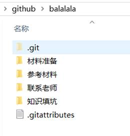
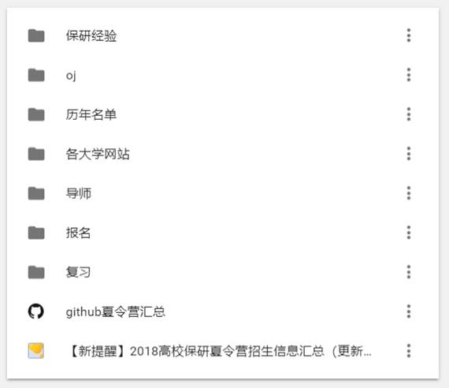

[TOC]

此文章适用于希望保研的大一大二大三学弟学妹们，尤其是刚入学的新生

文章的开头，对帮助过我的非常nice的学长学姐老师们表达感谢。

 

​       在我初高中，甚至更小的时候，我就听说了“考研”这个词，被父母和周围人灌输了考研可以获得更高的学历。而大学刚入学，就接触到了几个大我几届的学长，第一次听说了“保研”这个词。

​       现在基本所有的前985、211高校和一些重点本科高校，都会有教育部划拨的保送名额，在几年前，保研意味着你不需要考试，就可以留在“本校“读研，而随着最近几年政策的逐渐放开，“外推”成为了更普遍的保研出路。而我只针对当下的政策和形式进行解读，不排除今后保研政策改变的可能。记住，询问他人得到的结果远远不如带有印章的政策文件来的踏实。

 

​       保研，应该说是：推荐免试研究生。与考研作对比，考研需要初试（全国硕士研究生入学统一考试）和复试（考生在通过初试的基础上，对考生业务水平和实际能力的进一步考察）。而保研只需要通过学校对你的考核，不再需要全国统一的考试，就可以去目标学校读研。

​       

## 1 保研介绍

### 1.1   保研名额的获取

保研的第一步是获得本校的保研资格，而这个保研资格是根据学校制定的政策，同专业进行竞争得来得。每年教育部会给各大高校划拨保研名额，根据之前制定的保研政策，一些相对优秀的同学通过成绩或者竞赛等加权得来。

以东北大学15级学生为例，参照《东北大学学生手册》，东北大学关于推荐优秀应届本科毕业生免试攻读研究生工作办法。大致分为两种：具有突出竞赛奖项的、学业成绩（GPA）较高的。当然18级新生的保研政策已经修改，仔细研读文件即可，这里不再赘述。注意：不要道听途说，以政策文件为准。

 

### 1.2 外推过程

​       拿到了本校的保研名额，还需要意向学校的接收。最终保研的结果，是在9月末学信网上的填报系统为准，那些夏令营、九月推免都是为了让意向高校预录取你的过程。

​       大致的外推途径有：

1. 各高校某些学院举办的夏令营（大多在6、7月份）
2. 各高校各大学院举办的预面试（九月中下旬，俗称九月推免）
3. 一些独立实验室的招生（例如南大的lamda，哈工大SCIR等）
4.  一些较差学校的补录（填报完系统之后，对于层次较高的院校基本不涉及）。

这几个阶段如果被学校预录取，就坐等九月末填报系统就ok了。

 

### 1.3  夏令营和九月推免

大多数夏令营一般是在6-7月份，计算机相关的夏令营大多在7月上旬和中旬。夏令营难度大、竞争极强。但是会有很多的机会拿到好导师好学校的offer。

九月推免竞争相对较少，对于举办过夏令营的高校和学院基本就是补补漏，好导师好方向已经没坑了；对于没有举办夏令营的高校和学院，竞争也是较大的。

对于计算机相关来说，夏令营和九月推免的考核大同小异，面试+机试（可能没有）+笔试（可能没有）。之后在准备那里会详述。

 

 

## 2. 保研准备

为了保送到较好的高校，早做准备是非常值得的。

### 2.1 本校的保研资格

​       首先，为了拿到本校的保研资格，你需要好好考试、提高绩点、参加竞赛等等，尽自己的努力去拿到这个名额。

​       例如：排名尽可能的高、去争取学校认可的国家级比赛一等奖等等。做哪些取决于保研资格认定的需要。例如争取双优（如果不懂，参考学生手册）等等。

​       

### 2.2 外校的接收

​       本校的保研资格，在政策上写的清清楚楚，但是如何拿到外校的资格，网上的信息就比较眼花缭乱了。

​       那么，在夏令营和九月推免期间哪些是体现自己竞争力的点呢？这里我以计算机相关学科为例（排名有先后）：

1. 学校背景。不管怎么样，本科背景是最重要的，但也是目前的你改变不了的。如果本科牌子够响就能争取到更多的机会，不够响，就只能通过自己的实力让导师刮目相看。

2. 专业绩点排名比例。绩点排名是体现综合水平最直观的指标，是你跨入各大高校的门槛，也是考核时的重要参考依据之一。同一个高校不同专业排名的同学的去向是真的会差很多的。

3. 科研&项目。我把这项放在竞赛之前，是因为这一点会涉及到你的知识域，任何一个老师都会喜欢一个已经学会很多内容的学生，而不是需要从0开始的学生。如果能跟着实验室的老师发paper（论文）就更好了。

4. 竞赛。竞赛放到后面，不是因为含金量小，是因为面试的时候可以说的内容较少。当然一块ACM金牌银牌这种含金量的比赛肯定是要放在3之前，但是一般的比赛例如数学建模、蓝桥杯等等含金量还是不如一些科研和竞赛的。其实换个角度讲，做一些能说的出来的比赛，例如一些算法大赛、kaggle和天池的数据竞赛等等也还是很有帮助的。

5. 英语四六级。至少得过，不过六级会过不了很多学校的初筛，一些经管类的六级分数要求也是特高的。

   最重要的是你的表达能力。如何将你的优秀展示出来，如何展示自己的亮点在众同学中脱颖而出，如果言语得体有礼貌并获得老师的好感，这才是最重要的。

 

于是，我们可以看到，在拿到本校的保研名额后，如果想保送到较好的学校，你需要在大学的前三年，去：提高绩点、尽可能的参加学校实验室的科研or项目、尽可能的去参加省级国家级的比赛、提高四六级成绩甚至考个雅思托福等等。

 

### 2.3 临近保研的准备

​       在前三年，不论是绩点、竞赛还是其他什么，该有的也都有了。但是很多同学都比较迷，自己的水平应该申请怎样的学校。

对我们人数较多的大专业而言，同专业学长学姐的去向非常有参考价值。我从学院官网和学长那里得来了他们的排名和去向，写几行代码merge了一下，得到如下：

这些学长学姐很多都有很有含金量的竞赛、科研等等，因此也并不是排名越高去向越好，但是基本锁定了自己想去并且能去的高校区间。

 

院校定下来之后，就要考虑自己想读什么方向，这方面就根据自己的兴趣和行业发展去选择并大胆申请就好了。

​       在院校的选择上，有些人不惜牺牲学校档次追求导师水平，有些人追求名校光环不care导师和方向。在这些选择上，仁者见仁智者见智，追求自己想要的就好。当然，如果想要导师、方向、院校兼顾也未尝不可，提升自己的竞争力就ok了。

 

### 2.4 保研材料的准备

我所做的准备如下：

1. 材料准备

包括：

材料证明（成绩单、证书、排名证明、四六级成绩单、身份证等等，建议用扫描全能王app拍下来保存，打印也方面）、简历和个人陈述（简历很重要！）、夏令营要准备的材料（分各个学校，按照文件要求打包整理）、

2. 参考材料

各个学校各大学院的招生简章和政策、同专业学长的排名和去向、各个学校各大学院历年招收的名单（用于参考）等

3. 联系老师

各个相中的老师资料、跟每个老师要发的不同的邮件内容（在框架上加一些具体的信息针对不同的老师去发邮件）

4. 知识填坑

参加夏令营前要复习的基础知识的整理、所做项目的整理等等

5. 网站收藏

 

很直白了，自己看吧

 

其实，最最重要的还是你的简历。怎么更好的展示自己，怎么让你被导师吸引，怎么体现你的闪光点，怎么让你脱颖而出。基本缕清简历，就缕清了自己的竞争力。我的简历经过大大小小几十次改版，也慢慢变得完善。在此再次感谢帮助过我的学长学姐和老师。

 

 

保研，虽说是保送，但如果大学期间不好好努力，保研期间不好好准备，就会浪费掉很好的深造机会。

早点了解、早点准备总归是好事，但愿你们不会像我一样发出：“我要是早点开始准备就能balabala”这种感叹。

最后，预祝大家保研顺利，将来都能被理想的学校录取！~

再次感谢帮助我支持我的人！

 