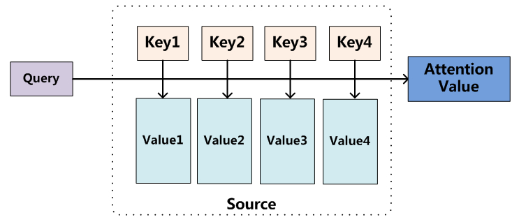

[TOC]

## 1 Basic Attention

### 1.1 Attention 定义

对于Attention机制的整个计算过程，可以总结为以下三个过程：

- **socre 函数：** 根据 Query 与 Key 计算两者之间的相似性或相关性， 即 socre 的计算。
- **注意力权重计算：**通过一个softmax来对值进行归一化处理获得注意力权重值， 即$a_{i,j}$ 的计算。
- **加权求和生成注意力值：**通过注意力权重值对value进行加权求和， 即 $c_i$ 的计算。

$$
\alpha_{i,j} = \frac{e^{score(Query, Key(j))}}{\sum_{k=1}^t e^{score(Query, Key(k))}} \\
c_i= \sum_{i=1}^n = \alpha_{i,j} h_j
$$

### 1.2 Score函数的选择

常见的方式主要有以下三种：

- 求点积：学习快，适合向量再同一空间中，如 Transformer 。

$$
score(Query, Key(j)) = Query \cdot Key(j)
$$

- Cosine 相似性

$$
score(Query, Key(j)) = \frac{Query \cdot Key(j)}{||Query|| \cdot ||Key(j)||}
$$

- MLP网络

$$
score(Query, Key(j)) = MLP(Query,  Key(j)) \\
general: score(Query, Key(j)) = Query \, W \, Key(j) \\
concat: score(Query, key(j)) = W \, [Query;Key(j) ]
$$

一般情况下，采用MLP网络更加灵活一些，且可以适当的扩展层以及改变网络结构，这对于一些任务来说是很有帮助的。

### 1.3 Self-Attention

Self-Attention 的本质就是**自己注意自己**， 粗暴点来说，就是，**Q，K，V是一样的**，即：
$$
Attention \, value = Attention(W_QX,W_KX,W_VX)
$$
它的内部含义是对序列本身做 Attention，来获得序列内部的联系。 

## 2 Seq2Seq+Attention

- 传统的Seq2Seq
  $$
  \begin{array}{c}{s_{i}=f\left(y_{i-1}, s_{i-1}, c\right)} \\ {p\left(y_{i} | y_{1}, y_{2} \ldots y_{i-1}\right)=g\left(y_{i-1}, s_{i}, c\right)}\end{array}
  $$
  $s_{i-1}$是decoder中的上一个隐状态；$y_{i-1}$是decoder中上一个预测得到的输出，在下一步进行输入；c是encoder得到的编码信息

- 加入Attention的Seq2Seq：**原公式中encoder的编码信息c变成了$c_{i}$**
  $$
  {p\left(y_{i} | y_{1}, y_{2}, \ldots, y_{i-1}\right)=g\left(y_{i-1}, s_{i-1}, c_{i}\right)}
  $$
$$
  
  - 其中，对encoder得到的编码信息做了处理：语境权重加入到encoder的隐藏向量得到编码信息
$$
$$
c_{i}=\sum_{j=1}^{T_{x}} \alpha_{i j} h_{j}
$$

$$
- 语境权重是decoder中的上一个隐状态与所有的encoder中的隐藏向量计算得到（例如内积）
$$
$$
\begin{aligned} \alpha_{i j}=& \frac{\exp \left(e_{i j}\right)}{\sum_{k=1}^{T_{x}} \exp \left(e_{i k}\right)} \\ e_{i j}=& a\left(s_{i-1}, h_{j}\right) \end{aligned}
$$

