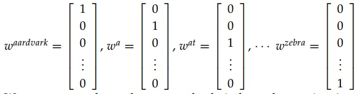
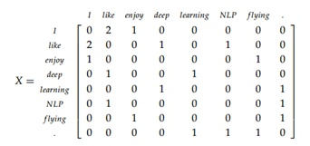
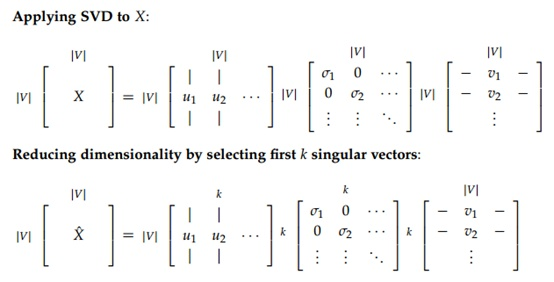
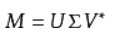
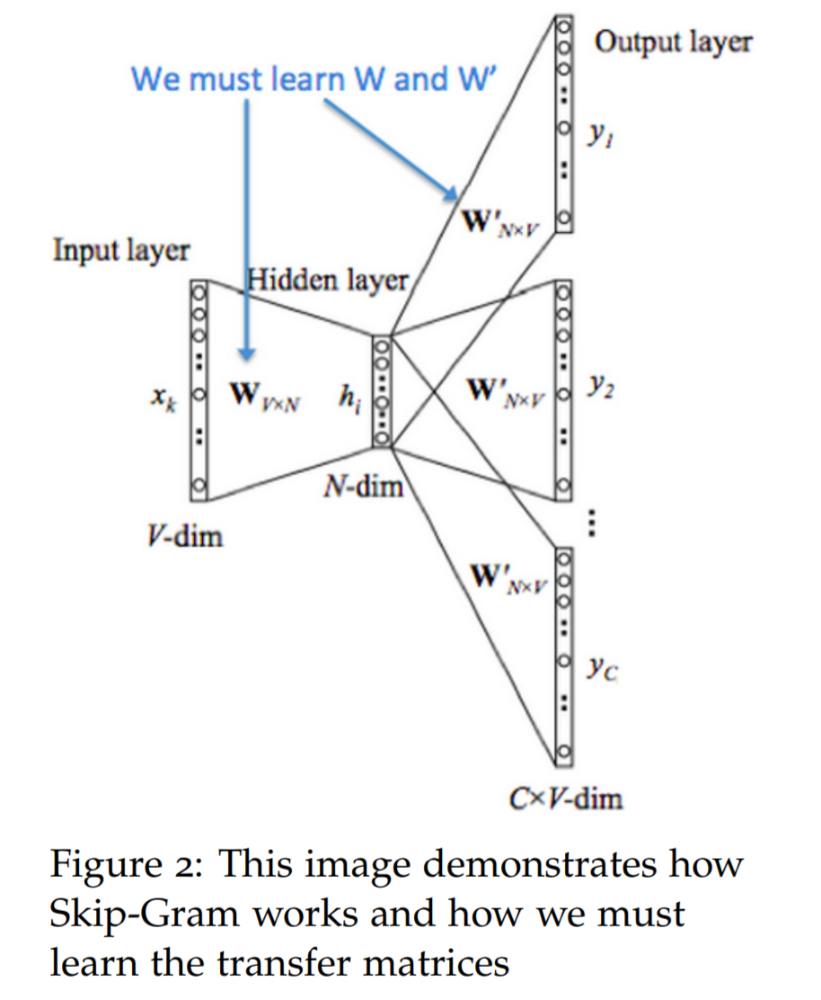
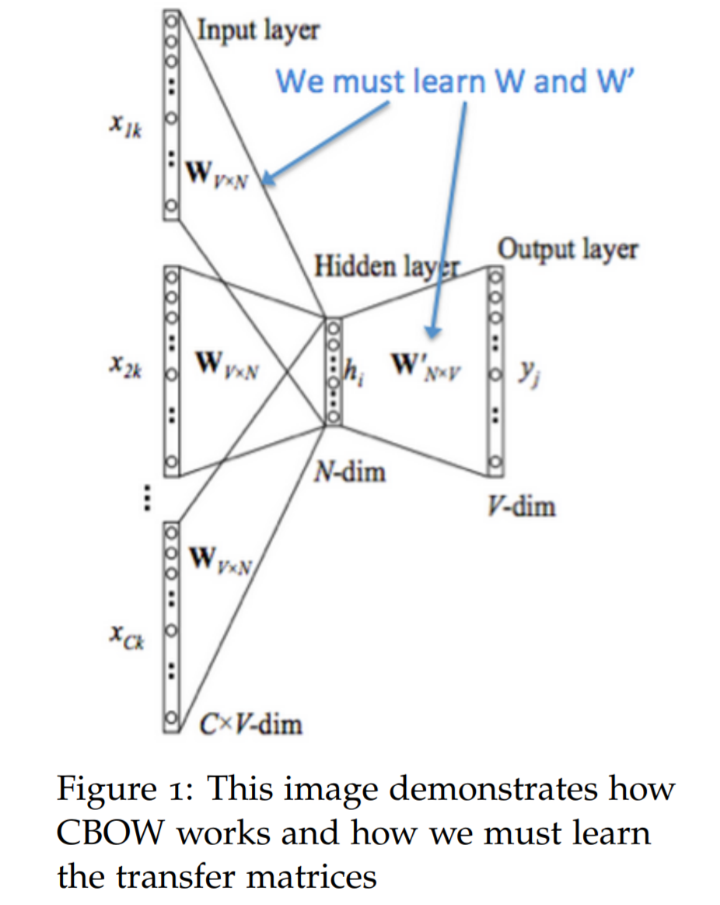
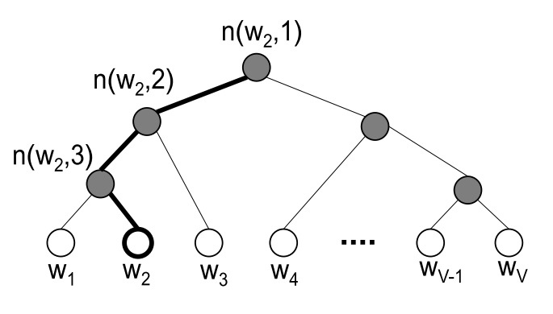

[TOC]

## 1 One-hot vector

将每个单词用N维的长向量表示，N是一个很大的数字。

缺点是：

1. 每个单词都是单独的，无法计算单词之间的相似性，因为他们的乘积为0
2. 并且维度较高，计算成本较大

## 2 基于SVD奇异值分解的词向量表示方法

通过包含若干句话的语料库：

1. I enjoy flying. 
2. I like NLP. 
3. I like deep learning

我们可以得到一个共现矩阵，矩阵的各个数值代表词前后所跟其他词汇的频率统计：

我们可以把这个矩阵进行处理（降维），得到维度较小的词向量矩阵。

最终得到的矩阵USV，U就是我们想要得到的词向量。

它达到了降维的目的，有效的编码语义和语法信息，U的V个行向量就分别是各个单词的词向量了。

奇异值分解（Singular Value Decomposition）是线性代数中一种重要的矩阵分解，是特征分解（方阵分解）在任意矩阵上的推广，最大目的是数据的降维。

但是它依然有很多的问题：

1. 矩阵维度变化频繁（语料库的词数改变）
2. 矩阵过于稀疏
3. 矩阵维度依然很大
4. 计算SVD的效率问题

## 3 Word2vec

通过神经网络，把ont-hot转换成低维的能体现相似性词向量的方法。

有两种算法，原理都差不太多：

1. Skip-grams (SG) ：通过当前词预测上下文
2. Continuous Bag of Words (CBOW)：通过上下文预测当前词

### 3.1 Skip-grams (SG)

1. **输入层：**输入当前词的one-hot 向量$x_{k}$。词表大小为V，则ont-hot向量的维度为V
2. **输入层到隐藏层：**第一个目标是训练出V行N列的矩阵W。 N是要训练出来的词向量的长度。这个矩阵就代表着最终训练得到的中心词的词向量矩阵。通过W与$x_k$的相乘，这个词的ont-hot转化为向量。
3. **隐藏层：**Skip-gram的隐藏层不做任何处理，输入即输出：$h_i$
4. **隐藏层到输出层：**第二个目标是训练出V行N列的矩阵W'。 通过隐层的输出与W'的点积，得到进行下一步
5. **输出层：**通过隐层的输出$h_i$与W'的点积，得到一个V*1的向量，每一行的值代表着输入的中心词与矩阵W’中各个词的相似度。通过softmax将这个值转化成概率，损失函数则是真实概率与输出概率的差值，当概率越接近，得到的W和W’结果就越好。

得到的W和W’就是我们将one-hot转化成的新的词向量矩阵。

### 3.2 CBOW

**与skip-gram相反，CBOW**通过上下文信息预测中心词wt。

1. **输入层：**输入若干上下文词的one-hot 向量$x_{1k},x_{2k},...,x_{Ck}$。词表大小为V，则ont-hot向量的维度为V
2. **输入层到隐藏层：**第一个目标是训练出V行N列的矩阵W。 N是要训练出来的词向量的长度。这个矩阵就代表着最终训练得到的中心词的词向量矩阵。通过W与$x_k$的相乘，这些词的ont-hot转化为向量。
3. **隐藏层：**CBOW的隐藏层是词袋模型，得到$h_{i}$
4. **隐藏层到输出层：**第二个目标是训练出V行N列的矩阵W'。 通过隐层的输出与W'的点积，得到进行下一步
5. **输出层：**通过隐层的输出$h_i$与W'的点积，得到一个V*1的向量，每一行的值代表着输入的中心词与矩阵W’中各个词的相似度。通过softmax将这个值转化成概率，损失函数则是真实概率与输出概率的差值，当概率越接近，得到的W和W’结果就越好。

word2Vec 模型训练带来了两个词嵌入矩阵 ， 分别代表中心词和上下文矩阵 。 上下文词嵌入会在训练后被丢弃，但保留了中心词词嵌入矩阵。

### 3.3 Hierarchical Softmax

Skip-gram和cbow在输出层到隐藏层每次分别更新1行、C行的权重，但在隐藏层到输出层要更新所有权重，效率不行。

层次Softmax直接丢掉了第二个矩阵W'，直接将隐藏层的输出$h_{i}$直接处理：

根据词表构建一个哈夫曼树，之前要对V个词计算相似度，现在只需要最多计算$log(V)$次线就可以得到

### 3.4 Negative Sampling

在 Word2Vec 中， 对于输出层来说，我每一个输出节点都要预测词表中所有词在当前位置的概率，在动辄几万甚至几十万大的词表中，用softmax 计算真的十分困难。 

但我们的目的不在于训练一个精准的语言模型，而只是为了训练得到语言模型的副产物-词向量，那么我们可不可以把输出压缩呢，将几万的输出压缩到几十程度，这计算量是成几何倍数的下降。

负采样的思路很简单，**不直接让模型从整个词表中找最可能的词，而是直接给定这个词（正例）和几个随机采样的噪声词（负例），然后模型能够从这几个词中找到正确的词，就算达到目的了。**

那么如何对负例进行采样呢？作者直接使用**基于词频的权重分布**来获得概率分布进行抽样：
$$
weight(w) = \frac{count(w)^{0.75}}{\sum_u count(w)^{0.75}}
$$
然后选取权重最大的一些词语作为负采样的样本

## reference

http://cs224d.stanford.edu/lecture_notes/notes1.pdf

https://github.com/NLP-LOVE/ML-NLP