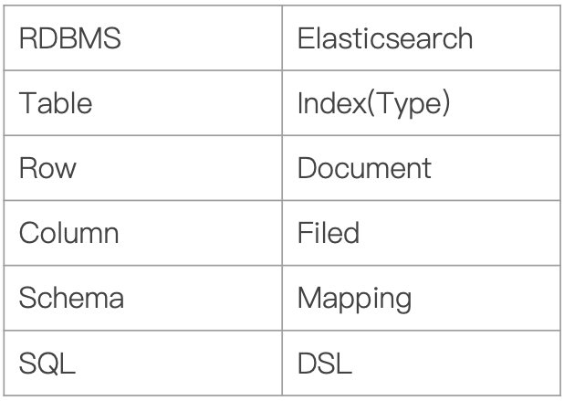
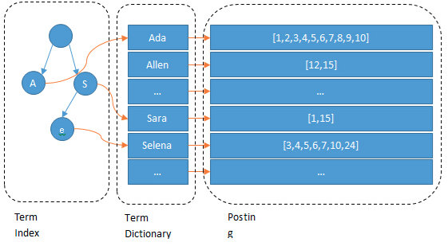
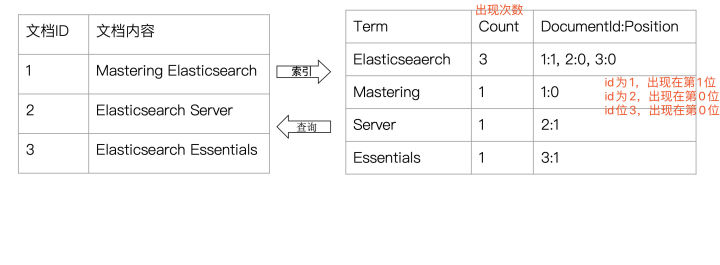
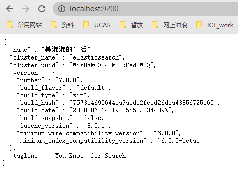
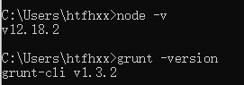
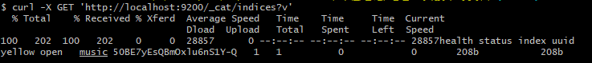
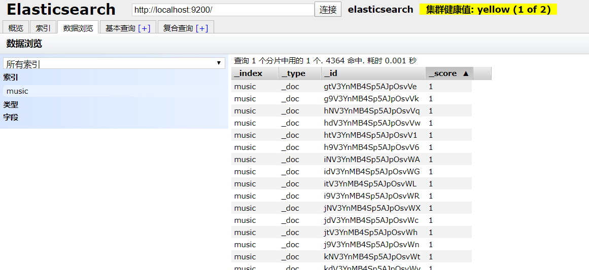
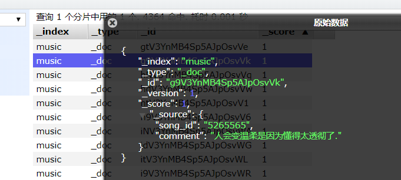

2020.07.18再次完善

本文倾向于讨论涉及ES检索应用过程的原理和特性，对底层和架构不过多关注。


## 1. ElasticSearch

Elasticsearch 是一个实时的分布式存储、搜索、分析的引擎。

相比于数据库为什么要用Elasticsearch：Elasticsearch的强大之处就是可以**模糊查询**


### 1.1 术语

**Index**：相当于数据库的Table

**Document**：Document相当于数据库的一行记录

**Field**：相当于数据库的Column的概念

**Mapping**：相当于数据库的Schema的概念

**DSL**：相当于数据库的SQL




### 1.2 DSL

包括query（查询）、size（返回数量）等，最常用的还是query

#### 1.2.1 简单单一查询

* match（匹配查询）
* range（范围查询）
* term（确切查询）
* ...

简单单一查询 - 匹配查询 - match：

```
# 检索product_name字段包含“toothbrush'的数据
dsl_1 = {
  "query": {
    "match": {
      "product_name": "toothbrush"
    }
  }
}
```

```
# 检索product_name字段包含“PHILIPS”或“toothbrush'的数据，越多越靠前
dsl_2 = {
  "query": {
    "match": {
      "product_name": "PHILIPS toothbrush"
    }
  }
}
# 检索product_name字段包含“PHILIPS toothbrush"的数据 - match_phrase
dsl_3 = {
  "query": {
    "match_phrase": {
      "product_name": "PHILIPS toothbrush"
    }
  }
}
本质上dsl_3等价于以下dsl_4，dsl_4的and改为or等价于dsl_2
dsl_4 = {
  "query": {
    "match": {
      "product_name": {
        "query": "PHILIPS toothbrush",
        "operator": "and"
      }
     }
   }
}
```

简单单一查询 - 范围匹配 - range：

```
# 检索price字段包含>=30的数据：
dsl = {
  "query": {
    "range": {
      "price": {
        "gte": 30
      }
    }
  }
}
```

简单单一查询 - 完全匹配 - term terms：

```
# 检索product_name字段等于“PHILIPS'的数据
dsl_1 = {
  "query": {
    "term": {
      "product_name": "PHILIPS"
    }
  }
}
# 检索product_name字段等于“PHILIPS'或“Shell"的数据
dsl_1 = {
  "query": {
    "terms": {
      "product_name": [
          "PHILIPS",
          "Shell"
      ]
    }
  }
}
```

还有很多，比如match_all、multi_match、match_phrase、exists、missing、prefix等等


#### 1.2.2 复合查询

复合查询 - bool

* must（必须满足）

* must_not（必须不满足）

* should（尽量满足）

* filter（筛选） ： filter底下本质上也是个query，其下的是单一查询字段match、range、term等

* ...

  

```

dsl = {
	'query': {
		'bool': {
		    "must": {
				"product_name": "toothbrush"
			},
			"must_not": {
          		"match": {
            		"product_ID": "HX6730"
          		}
        	},
        	"should": {
          		"match": {
            		"product_desc": "刷头"
          		}
        	}
			"filter": {
        		"range": {
                    "price": {
                            "gt": 400
                    }
        		}
        		"term": {
      				"product_name": "PHILIPS"
    			}
			}
		}
	}
}
```


### 1.3 检索原理

#### 1.3.1 底层数据原理

底层数据结构基于 树状的term+倒排索引





插入数据时，先对数据进行分词，分出来的词的集合叫Term Dictionary；

Term Dictionary抽象出一个词前缀 Term Index，放入内存中，方便查找且速度快。

每个term会对应一个文档列表Posting list， 会根据一些编码技术等对数据压缩和求交并集等；


#### 1.3.2 结构化查询原理

结构化查询（Structured search） 是指对那些具有内在结构数据的查询，是对查询的另外一个层次划分

比如日期、时间和数字都是结构化的，因为它们有精确的格式，常用于范围以及值大小的比较查询

有些文本在某些场景下也是结构化的，是有限的离散的词语的集合，比如性别只有”男“和”女“

结构化查询的结果：要么存于集合之中，要么存在集合之外

结构化查询没有”相似“的概念，所以一般情况下不会给该类查询进行打分，提高性能


#### 1.3.3 词项查询原理

词项查询大概有以下查询：

```text
1. Term Query：词项精确匹配
2. Range Query：范围查询
3. Exists Query: 是否存在判断查询
4. Prefix Query：前缀查询
5. Wildcard Query：通配符查询
```

在 ES 中 ，词项查询不做分词处理，会直接将输入作为一个整体去倒排索引中查询

词项查询是对倒排索引的词项精确匹配，它不会对词的多样性进行处理，比如大小写转换之类的


#### 1.3.4 全文查询原理

全文查询大概有以下查询：

```text
1. Match Query：匹配查询，拆分成多个独立的词进行查询然后汇总
2. Match Phrase Query：语句查询
3. Query String Query：通过在 URL 中使用 q 参数进行查询，相关说明参考上一篇文章 [Elasticsearch 入门学习](https://zhuanlan.zhihu.com/p/104215274)
4. Match Phrase Prefix Query：和 Match Phrase Query 类似，只是在匹配时，容许对最后一个词的前缀进行匹配 
5. Multi Match Query：同时对多个字段搜索匹配
```

基于全文的查询，索引和搜索时都会进行分词，待查询字符串会先由分词器进行分词然后生成一个供查询的词项列表

**全文的查询会对分词项列表中每个分词进行底层查询，最后在上层进行结果的合并，并为每个查询到的文档生成一个算分**


拿一个例子看出是怎么整合的：

```
dsl = {
	"size": 1,
	'query': {
		'bool': {
			"must": {
				"match": {"content": "我 靠"}
			}
		}
	}
}
hits = es.search(index="qa_data", body=dsl, explain=True)
print(hits)   # 自己整理换行真是难受，早知道整个小工具用了

{
	'took': 2, 
	'timed_out': False, 
	'_shards': {
		'total': 1, 
		'successful': 1, 
		'skipped': 0, 
		'failed': 0
	},
	'hits': {
	'total': {
		'value': 10000, 
		'relation': 'gte'
	}, 
	'max_score': 9.72023, 
	'hits': [{
		'_shard': '[qa_data][0]', 
		'_node': '256T2YHuTJCxS4X2uW-hMA', 
		'_index': 'qa_data', 
		'_type': '_doc',
		'_id': 'ROaF0XUBY0Yp--9b1MZE', 
		'_score': 9.72023,
		'_source': {'pid': 'qid_4791148485424909447', 
		'content': '我们若靠圣灵得生，就当靠圣灵行事，不随从肉体行事，不犯罪'},
		'_explanation': {
			'value': 9.72023, 
			'description': 'sum of:', 
			'details': [{
				'value': 2.1879215, 
				'description': 'weight(content:我 in 236854) [PerFieldSimilarity], result of:',
				'details': [{
					'value': 2.1879215, 'description': 'score(freq=1.0), computed as boost * idf * tf from:',
					'details': [
						{'value': 2.2, 'description': 'boost', 'details': []}, 
						{'value': 2.1715496,'description': 'idf, computed as log(1 + (N - n + 0.5) / (n + 0.5)) from:',
							'details': [
								{'value': 31505,'description': 'n, number of documents containing term','details': []},
								{'value': 276361,'description': 'N, total number of documents with field','details': []}
							]
						},
						{
						'value': 0.4579724,
						'description': 'tf, computed as freq / (freq + k1 * (1 - b + b * dl / avgdl)) from:',
						'details': [
							 {'value': 1.0, 'description': 'freq, occurrences of term within document',
							  'details': []},
							 {'value': 1.2, 'description': 'k1, term saturation parameter',
							  'details': []},
							 {'value': 0.75, 'description': 'b, length normalization parameter',
							  'details': []},
							 {'value': 25.0, 'description': 'dl, length of field', 'details': []},
							 {'value': 25.465807, 'description': 'avgdl, average length of field',
							  'details': []}
							]
						}
					]
				}]
			},
			{
			'value': 7.532309, 
			'description': 'weight(content:靠 in 236854) [PerFieldSimilarity], result of:',
			'details': [{
				'value': 7.532309, 'description': 'score(freq=2.0), computed as boost * idf * tf from:',
				'details': [
					{'value': 2.2, 'description': 'boost', 'details': []}, 
					{'value': 5.4498615,'description': 'idf, computed as log(1 + (N - n + 0.5) / (n + 0.5)) from:',
					'details': [
						{'value': 1187,'description': 'n, number of documents containing term','details': []},
						{'value': 276361,'description': 'N, total number of documents with field','details': []}]},
						{'value': 0.6282319, 'description': 'tf, computed as freq / (freq + k1 * (1 - b + b * dl / avgdl)) from:',
						     'details': [
							 {'value': 2.0, 'description': 'freq, occurrences of term within document',
							  'details': []},
							 {'value': 1.2, 'description': 'k1, term saturation parameter',
							  'details': []},
							 {'value': 0.75, 'description': 'b, length normalization parameter',
							  'details': []},
							 {'value': 25.0, 'description': 'dl, length of field', 'details': []},
							 {'value': 25.465807, 'description': 'avgdl, average length of field',
							  'details': []}
						      ]
						}
				]}
			]}

      ]}}]}}
```

从上面的结果可以看出来，使用”我靠“来检索得到：“我们若靠圣灵得生，就当靠圣灵行事，不随从肉体行事，不犯罪”

主要是算出，“我”字的TF-IDF值与“靠”字TF-IDF值的加和，其中TF-IDF值是按照boost * idf * tf 来计算得到的。


## 2. Python对接ES检索应用

### 2.1 windows下环境搭建

#### 2.1.1 安装Java SE环境

安装jdk：https://www.oracle.com/java/technologies/javase-downloads.html

windows下配置**JAVA_HOME**环境变量（自行百度）


#### 2.1.2 安装ES

官方下载中心：https://www.elastic.co/cn/downloads/elasticsearch

安装后打开bin目录下的elasticsearch.bat，浏览器输入http://localhost:9200后显示如下信息即为安装成功




#### 2.1.3 安装head插件(可选，建议安装)

1. 安装node.js：https://nodejs.org/en/   node -v可以检测是否成功

2. 在elasticsearch-head-master目录下执行 npm install -g grunt-cli
   grunt 是基于Node.js的项目构建工具，可以进行打包压缩、测试、执行等等的工作，head插件就是通过grunt启动。 grunt -version可以检测是否成功‘
   

3. 下载并解压elasticsearch-head-master 到安装目录下，例如我的D:\software\elasticsearch-7.8.0-windows-x86_64\elasticsearch-7.8.0\elasticsearch-head-master
   elasticsearch-head-master 的可用版本： https://codeload.github.com/mobz/elasticsearch-head/zip/master 

4. 配置 elasticsearch-7.8.0\config\elasticsearch.yml

   ```
   network.host: 0.0.0.0   # 设成0.0.0.0让任何人都可以访问(个人使用没事，线上服务别这样)
   http.port: 9200
   http.cors.enabled: true   # 解决elasticsearch-head 集群健康值: 未连接问题
   http.cors.allow-origin: "*"
   ```

5. 在elasticsearch-head-master目录下执行**npm install** 安装依赖（windows 下用git bash）

6. 修改elasticsearch-head-master配置，修改服务器监听地址:**Gruntfile.js** 

```
connect: {
            server: {
                options: {
                    port: 9100,
                    base: '.',
                    keepalive: true,
                    hostname: '*'
                }
            }
        }
```

7. 继续在git bash,该目录下执行**grunt server** 命令，启动head服务

8. 访问head管理页面，地址:http://localhost:9100/ 

   

上面的都是跟着reference某篇顺着下来的，一切顺利没遇到别的情况。


#### 2.1.4 python依赖安装

pip install elasticsearch

启动服务--安装目录下的bin目录下，cmd中：

D:\software\elasticsearch-7.8.0-windows-x86_64\elasticsearch-7.8.0\bin

```
启动   elasticsearch-service.bat start   
停止   elasticsearch-service.bat stop
```

或者单机该文件和关闭cmd来启动和停止


#### 2.1.5 再次使用

```
D:\software\elasticsearch-7.8.0-windows-x86_64\elasticsearch-7.8.0\elasticsearch-head-master

**grunt server** 命令，启动head服务
```


### 2.2 python 操作

```
from elasticsearch import Elasticsearch
```

#### 2.2.1 index操作

index是必须的，类似数据库名。

**创建一个Index**

```python
#  by default we connect to localhost:9200
es = Elasticsearch()   
# create an index in elasticsearch, ignore status code 400(index already exists)
result = es.indices.create(index='songname', ignore=400)
print(result)
```

运行结果：

```
# 成功则为：{'acknowledged': True, 'shards_acknowledged': True, 'index': 'news'}
# 由于index已经存在了，重新运行则为：{'error': {'root_cause': [{'type': 'resource_already_exists_exception', 'reason': 'index [news/K_gOfdJHRb2_BenLKPQNug] already exists', 'index_uuid': 'K_gOfdJHRb2_BenLKPQNug', 'index': 'news'}], 'type': 'resource_already_exists_exception', 'reason': 'index [news/K_gOfdJHRb2_BenLKPQNug] already exists', 'index_uuid': 'K_gOfdJHRb2_BenLKPQNug', 'index': 'news'}, 'status': 400}
```


**删除一个index**

```
result = es.indices.delete(index='songname', ignore=[400, 404])
```


可以通过在git bash 中运行‘ curl -X GET 'http://localhost:9200/_cat/indices?v'  ’ 查看当前index




#### 2.2.2 插入数据

这是插入数据or更新数据的命令，可以自定义id，也可以分配。

```
es.index(index='music', body = {'song_id':song_id,'comment':comment }) 
es.index(index='music', id=123, body = {'song_id':song_id,'comment':comment }) 
```

然后可以在head端看到已经导入的数据





#### 2.2.3 查询数据

直接无条件查询，可以搜索到所有结果

```
result = es.search(index='news')
print(result) # 会得到一个字典，里面包含各种信息，以及最终的结果
```


我这里的例子是一个song_id对应一堆comment，我存入的数据的数据结构为：

```
{
    song_id : song_id,
    comment : comment
}
```

通过更复杂一点的dsl 查询办法，限制song_id的对应，然后再通过lyric去检索comment

```
dsl = {
	"size": 5,
    'query': {
    	'bool': {
    		'filter': [{"term": {"song_id": song_id}}],
    		"must": {
   				"match": {"comment": ''.join(lyric)}
   			}
    	}
    }
}
result = es.search(index='music', body=dsl)
for hit in result['hits']['hits']:
	sorted_comment.append(hit['_source']['comment'])
print(sorted_comment)
```


最终搞定一个简单的检索应用，也达到了我的要求。

因为数据结构很简单，所以并没有涉及太多复杂的内容，之后再用到再来补充。


## Reference

https://github.com/elastic/elasticsearch-py

https://blog.csdn.net/wufaliang003/article/details/81368365

https://www.cnblogs.com/gangle/p/9328257.html

http://www.ruanyifeng.com/blog/2017/08/elasticsearch.html

https://www.zhihu.com/question/323811022

https://www.cnblogs.com/sddai/p/11061412.html

https://zhuanlan.zhihu.com/p/46400723

https://zhuanlan.zhihu.com/p/104631505

https://my.oschina.net/stanleysun/blog/1594220