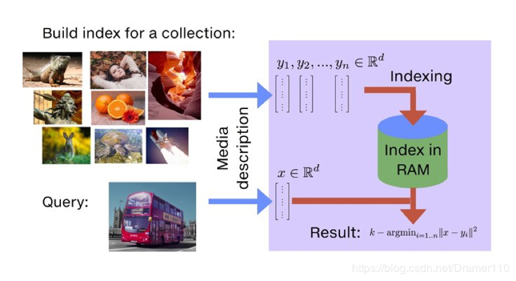

需求是，基于句子级别的向量，从海量候选项中挑选最合适的候选。

一般情况下，是求出query的向量，以及所有候选的向量，计算他们之间的相似度，得到top1。

奈何太慢~

## 1. Faiss

Faiss是一个高效的相似性搜索和稠密向量聚类库。

它包含的算法可以在任意大小的向量集中搜索，只要内存够大向量集就可以多大。

Faiss用C++编写，带有Python／Numpy的完整包装。一些最有用的算法是在GPU上实现的。它是由Facebook人工智能研究所开发的。

包括几种相似性搜索方法，欧几里得距离或点积、余弦相似度等来比较。

暂时不适合当前使用场景，之后用到再看

